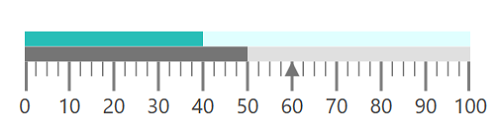

# Getting Started

This section explains the steps required to configure the [`LinearGauge`](https://help.syncfusion.com/cr/cref_files/wpf/Syncfusion.Gauge.WPF~Syncfusion.Windows.Gauge.LinearGauge.html) control in a real-time scenario and provides a walk-through on its customization features.

## Adding gauge references

Refer to this [article](https://help.syncfusion.com/wpf/add-syncfusion-controls) to learn how to add Syncfusion controls to Visual Studio projects in various ways. You can also refer to [this](https://help.syncfusion.com/wpf/control-dependencies) link to know about the assemblies required for adding gauge to your project.

### Initialize gauge

Import  the [`LinearGauge`](https://help.syncfusion.com/cr/cref_files/wpf/Syncfusion.Gauge.WPF~Syncfusion.Windows.Gauge.LinearGauge.html) namespace to your respective Window as in the following.





xmlns:gauge ="clr-namespace:Syncfusion.UI.Xaml.Gauges;assembly=Syncfusion.SfGauge.Wpf"





using Syncfusion.UI.Xaml.Gauges;





You can initialize an empty [`LinearGauge`](https://help.syncfusion.com/cr/cref_files/wpf/Syncfusion.Gauge.WPF~Syncfusion.Windows.Gauge.LinearGauge.html) control.





    <gauge:SfLinearGauge/>





SfLinearGauge sfLinearGauge = new SfLinearGauge();

this.Content = sfLinearGauge;





### Configuring scale

You can configure the [`LinearScale`](https://help.syncfusion.com/cr/cref_files/wpf/Syncfusion.Gauge.WPF~Syncfusion.Windows.Gauge.LinearScale.html) elements using the following APIs available in the [`LinearGauge`](https://help.syncfusion.com/cr/cref_files/wpf/Syncfusion.Gauge.WPF~Syncfusion.Windows.Gauge.LinearGauge.html) control:

•	ScaleDirection

•	ScaleBarStroke

•	ScaleBarSize

•	ScaleBarLength

•	ScaleBarBorderThickness

•	Interval

•	Minimum

•	Maximum





    <gauge:SfLinearGauge>

    <gauge:SfLinearGauge.MainScale>

    <gauge:LinearScale ScaleBarStroke="#E0E0E0" MajorTickStroke="Gray"
    MinorTickStroke="Gray" LabelStroke="#424242"                                
    ScaleBarSize="10" MinorTicksPerInterval="3"/>

    </gauge:SfLinearGauge.MainScale>

    </gauge:SfLinearGauge>





            SfLinearGauge sfLinearGauge = new SfLinearGauge();
           
            LinearScale linearScale = new LinearScale();

            linearScale.ScaleBarStroke = new SolidColorBrush(Color.FromRgb(224, 224, 224));

            linearScale.MajorTickStroke = new SolidColorBrush(Colors.Gray);

            linearScale.MinorTickStroke = new SolidColorBrush(Colors.Gray);

            linearScale.LabelStroke = new SolidColorBrush(Color.FromRgb(66, 66, 66));

            linearScale.ScaleBarSize = 10;

            linearScale.MinorTicksPerInterval = 3;

            sfLinearGauge.MainScale = linearScale;





### Adding ranges

The scale values can be categorized using the start and end values in `LinearRange`. You can add multiple ranges to a scale using the `Ranges` property.





    <gauge:SfLinearGauge>

    <gauge:SfLinearGauge.MainScale>

    <gauge:LinearScale>

    <gauge:LinearScale.Ranges>

    <gauge:LinearRange StartValue="0" EndValue="40" RangeStroke="#27BEB7"  StartWidth="10"
    EndWidth="10" RangeOffset="0.4" />

    <gauge:LinearRange StartValue="40" EndValue="100" RangeStroke="LightCyan" RangeOffset="0.4"
    StartWidth="10"  EndWidth="10"/>

    </gauge:LinearScale.Ranges>

    </gauge:LinearScale>

    </gauge:SfLinearGauge.MainScale>

    </gauge:SfLinearGauge>





           SfLinearGauge sfLinearGauge = new SfLinearGauge();
           
            LinearScale linearScale = new LinearScale();

            LinearRange linearRange = new LinearRange();

            linearRange.StartValue = 0;

            linearRange.EndValue = 40;

            linearRange.RangeStroke = new SolidColorBrush(Color.FromRgb(39, 190, 183));

            linearRange.StartWidth = 10;

            linearRange.EndWidth = 10;

            linearRange.RangeOffset = 0.4;

            linearScale.Ranges.Add(linearRange);

            LinearRange linearRange1 = new LinearRange();

            linearRange1.StartValue = 40;

            linearRange1.EndValue = 100;

            linearRange1.RangeStroke = new SolidColorBrush(Colors.LightCyan);

            linearRange1.RangeOffset = 0.4;

            linearRange1.StartWidth = 10;

            linearRange1.EndWidth = 10;

            linearScale.Ranges.Add(linearRange1);

            sfLinearGauge.MainScale = linearScale;





### Adding a symbol pointer

`SymbolPointer` is a shape that can be placed to mark the pointer value in gauge.




 
    <gauge:SfLinearGauge>

    <gauge:SfLinearGauge.MainScale>

    <gauge:LinearScale>

    <gauge:LinearScale.Pointers>

    <gauge:LinearPointer PointerType="SymbolPointer" Value="60"SymbolPointerHeight="10" SymbolPointerWidth="10"
    SymbolPointerPosition="Below" SymbolPointerStroke="#757575"/>

    </gauge:LinearScale.Pointers>

    </gauge:LinearScale>

    </gauge:SfLinearGauge.MainScale>

    </gauge:SfLinearGauge>





           SfLinearGauge sfLinearGauge = new SfLinearGauge();
           
            LinearScale linearScale = new LinearScale();

            LinearPointer linearPointer = new LinearPointer();

            linearPointer.PointerType = LinearPointerType.SymbolPointer;

            linearPointer.Value = 60;

            linearPointer.SymbolPointerHeight = 10;

            linearPointer.SymbolPointerWidth = 10;

            linearPointer.SymbolPointerPosition = LinearSymbolPointersPosition.Below;

            linearPointer.SymbolPointerStroke = new SolidColorBrush(Color.FromRgb(117, 117, 117));

            linearScale.Pointers.Add(linearPointer);

            sfLinearGauge.MainScale = linearScale;





### Adding a bar pointer

`BarPointer` is used to mark the scale values. This starts at the beginning of gauge and ends at the pointer value.





    <gauge:SfLinearGauge>

    <gauge:SfLinearGauge.MainScale>

    <gauge:LinearScale>

    <gauge:LinearScale.Pointers>
                        
    <gauge:LinearPointer PointerType="BarPointer" Value="50" BarPointerStroke="#757575"
    BarPointerStrokeThickness="10"/>

    </gauge:LinearScale.Pointers>

    </gauge:LinearScale>

    </gauge:SfLinearGauge.MainScale>

    </gauge:SfLinearGauge>





            SfLinearGauge sfLinearGauge = new SfLinearGauge();
           
            LinearScale linearScale = new LinearScale();
 
            LinearPointer linearPointer1 = new LinearPointer();

            linearPointer1.PointerType = LinearPointerType.BarPointer;

            linearPointer1.Value = 50;

            linearPointer1.BarPointerStroke = new SolidColorBrush(Color.FromRgb(117, 117, 117));

            linearPointer1.BarPointerStrokeThickness = 10;

            linearScale.Pointers.Add(linearPointer1);

            sfLinearGauge.MainScale = linearScale;





The following code example is the complete code of the previous configurations.





    <Window x:Class="Gauge_GettingStarted.MainWindow"
    xmlns="http://schemas.microsoft.com/winfx/2006/xaml/presentation"
    xmlns:x="http://schemas.microsoft.com/winfx/2006/xaml"
    xmlns:d="http://schemas.microsoft.com/expression/blend/2008"
    xmlns:mc="http://schemas.openxmlformats.org/markup-compatibility/2006"
    xmlns:local="clr-namespace:Gauge_GettingStarted"
    mc:Ignorable="d"
    xmlns:gauge ="clr-namespace:Syncfusion.UI.Xaml.Gauges;assembly=Syncfusion.SfGauge.Wpf">
    <Grid>

    <gauge:SfLinearGauge>

    <gauge:SfLinearGauge.MainScale>

    <gauge:LinearScale ScaleBarStroke="#E0E0E0" MajorTickStroke="Gray"MinorTickStroke="Gray" LabelStroke="#424242"         ScaleBarSize="10" MinorTicksPerInterval="3" ScaleBarLength="300">

    <gauge:LinearScale.Pointers>

    <gauge:LinearPointer PointerType="SymbolPointer" Value="60"SymbolPointerHeight="10" SymbolPointerWidth="10"
    SymbolPointerPosition="Below" SymbolPointerStroke="#757575"/>

    <gauge:LinearPointer PointerType="BarPointer" Value="50" BarPointerStroke="#757575" BarPointerStrokeThickness="10"/>

    </gauge:LinearScale.Pointers>

    <gauge:LinearScale.Ranges>

    <gauge:LinearRange StartValue="0" EndValue="40" RangeStroke="#27BEB7"  StartWidth="10"
    EndWidth="10" RangeOffset="0.4" />

    <gauge:LinearRange StartValue="40" EndValue="100"RangeStroke="LightCyan" RangeOffset="0.4"
    StartWidth="10"  EndWidth="10"/>

    </gauge:LinearScale.Ranges>

    </gauge:LinearScale>

    </gauge:SfLinearGauge.MainScale>

    </gauge:SfLinearGauge>

    </Grid>

    </Window>





using System.Windows;

using System.Windows.Media;

using Syncfusion.UI.Xaml.Gauges;

namespace Gauge_GettingStarted

{
    
    public partial class MainWindow : Window

    {
        public MainWindow()
        {
            InitializeComponent();

            SfLinearGauge sfLinearGauge = new SfLinearGauge();
           
            LinearScale linearScale = new LinearScale();

            linearScale.ScaleBarStroke = new SolidColorBrush(Color.FromRgb(224, 224, 224));

            linearScale.MajorTickStroke = new SolidColorBrush(Colors.Gray);

            linearScale.MinorTickStroke = new SolidColorBrush(Colors.Gray);

            linearScale.LabelStroke = new SolidColorBrush(Color.FromRgb(66, 66, 66));

            linearScale.ScaleBarSize = 10;

            linearScale.ScaleBarLength = 300;

            linearScale.MinorTicksPerInterval = 3;

            //Adding symbol pointer

            LinearPointer linearPointer = new LinearPointer();

            linearPointer.PointerType = LinearPointerType.SymbolPointer;

            linearPointer.Value = 60;

            linearPointer.SymbolPointerHeight = 10;

            linearPointer.SymbolPointerWidth = 10;

            linearPointer.SymbolPointerPosition = LinearSymbolPointersPosition.Below;

            linearPointer.SymbolPointerStroke = new SolidColorBrush(Color.FromRgb(117, 117, 117));

            linearScale.Pointers.Add(linearPointer);

            //Adding bar pointer

            LinearPointer linearPointer1 = new LinearPointer();

            linearPointer1.PointerType = LinearPointerType.BarPointer;

            linearPointer1.Value = 50;

            linearPointer1.BarPointerStroke = new SolidColorBrush(Color.FromRgb(117, 117, 117));

            linearPointer1.BarPointerStrokeThickness = 10;

            linearScale.Pointers.Add(linearPointer1);

            //Adding Range

            LinearRange linearRange = new LinearRange();

            linearRange.StartValue = 0;

            linearRange.EndValue = 40;

            linearRange.RangeStroke = new SolidColorBrush(Color.FromRgb(39, 190, 183));

            linearRange.StartWidth = 10;

            linearRange.EndWidth = 10;

            linearRange.RangeOffset = 0.4;

            linearScale.Ranges.Add(linearRange);

            LinearRange linearRange1 = new LinearRange();

            linearRange1.StartValue = 40;

            linearRange1.EndValue = 100;

            linearRange1.RangeStroke = new SolidColorBrush(Colors.LightCyan);

            linearRange1.RangeOffset = 0.4;

            linearRange1.StartWidth = 10;

            linearRange1.EndWidth = 10;

            linearScale.Ranges.Add(linearRange1);

            sfLinearGauge.MainScale = linearScale;

            this.Content = sfLinearGauge;
        }
    }
}





The following screenshot illustrates the result of the previous codes.

You can find the complete getting started sample from this [`link`](http://www.syncfusion.com/downloads/support/directtrac/general/ze/Gauge_GettingStarted23380559).

