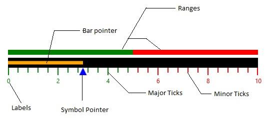

# Key Features

A linear gauge is composed of **MainScale** which is the central UI component. The view of the linear gauge can be changed by setting the **Orientation** of the linear gauge. **MainScale** is a linear scale that comprises of the following components:

* Ticks
* Labels
* Ranges
* Pointers

**Ticks**

Linear gauge scales are designed with the following two kinds of ticks: 

* **Major Ticks**—are the primary scale indicators.
* **Minor Ticks**—are the secondary scale indicators that falls between the major ticks.

**Labels**

Labels are quantified to specify the numeric values for major ticks based upon the interval of the linear scale.

**Ranges**

Linear scale can contain one or more ranges. A range shows the start and end values of the inner divisions within the linear scale’s whole range. Each range could show different zones or regions of the same metrics: like high, low and average temperature range.  

**Pointers**

Pointer is a key element of the linear scale which points a value or measure on that scale. A linear scale can have one or more pointers that can be used to measure different values for different criteria. Each pointer has a **Value** property which specifies the current value of the linear scale based upon its measurement. 

**Easy to use**

**SfLinearGauge** is available in Visual Studio toolbox itself, you can easily drag and drop the control from toolbox. Linear gauge is a highly customizable control with more APIs to modify the look and feel of the control without any hurdles of editing template. The Customizable elements of linear gauge such as Ranges, Ticks, Labels and Pointers are easy to use.

**Linear Gauge Elements**

