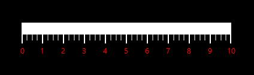
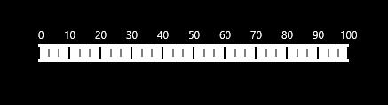

# Labels

Labels of the linear scale provide a numeric value to the major ticks that are specified according to the range of the scale.

## Customizing Labels

The foreground of the label is customized by setting **LabelStroke** of the linear scale. By making use of the **LabelSize** property, the font size of the labels is personalized. The labels can be positioned far away from the ticks by using the **LabelOffset** property.




    <Gauges:SfLinearGauge Name="linearGauge" Orientation="Horizontal">
            <Gauges:SfLinearGauge.MainScale>
                <Gauges:LinearScale LabelStroke="Red" Minimum="0" Maximum="10" Interval="1"  LabelSize="13"  LabelOffset="5">
                </Gauges:LinearScale>
            </Gauges:SfLinearGauge.MainScale>
        </Gauges:SfLinearGauge>





            SfLinearGauge lineargauge = new SfLinearGauge();
            LinearScale _mainScale = new LinearScale();
            _mainScale.Minimum = 0;
            _mainScale.Maximum = 10;
            _mainScale.LabelStroke = new SolidColorBrush(Colors.Red);
            _mainScale.LabelSize = 13;
            _mainScale.LabelOffset = 5;
            lineargauge.MainScale = _mainScale;
            this.Grid.Children.Add(lineargauge);




## Label Position

The labels in the scale can be placed above or below the linear scale by choosing the following options that are available in the **LabelPosition** property. The default value of **LabelPosition** is below.

1. Above
2. Below (Default)




    <Gauges:SfLinearGauge>
            <Gauges:SfLinearGauge.MainScale>
                <Gauges:LinearScale LabelPosition="Above">
                </Gauges:LinearScale>
            </Gauges:SfLinearGauge.MainScale>
        </Gauges:SfLinearGauge>





            SfLinearGauge lineargauge = new SfLinearGauge();
            LinearScale _mainScale = new LinearScale();
            _mainScale.LabelPosition = LinearLabelsPosition.Above;
            lineargauge.MainScale = _mainScale;
            this.Grid.Children.Add(lineargauge); 




