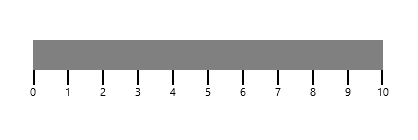
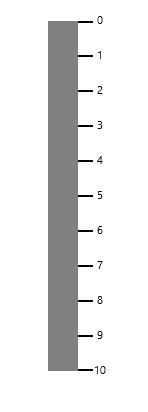

# Orientation

The orientation of the linear gauge can be changed by setting the **Orientation** property of the SfLineraGauge. By default orientation of SfLinearGauge is Horizontal.




    <Gauges:SfLinearGauge Name="linearGauge" Orientation="Horizontal"/>
    




    SfLinearGauge lineargauge = new SfLinearGauge();
    lineargauge.Orientation = Orientation.Horizontal;
    this.Grid.Children.Add(lineargauge);




<table>
<tr>
<td>
{{''| markdownify }}
</td><td>
{{''| markdownify }}
</td></tr>
</table>
