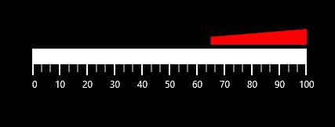

# Ranges

Ranges of the linear scale are a collection of the linear range. A linear range is a visual element which starts at a specified **StartValue** and ends at a specified **EndValue** within the linear scale. These start and end values are mentioned with the help of **LinearRange** class. 

## Customizing Ranges

A range shows the start and end values of the inner divisions within the linear scale’s whole range. The ranges UI element is customized by changing **RangeStroke** of the linear range. The appearance of linear range is customized by setting the **StartWidth** and **EndWidth** properties. With the help of the **RangeOffset** property, the linear range can be positioned with respect to the linear scale. By setting **RangeOpacity** of LinearRange**,** the opacity of the range can be modified.




        <Gauges:SfLinearGauge>
            <Gauges:SfLinearGauge.MainScale>
                <Gauges:LinearScale>
                    <Gauges:LinearScale.Ranges>
                        <Gauges:LinearRange StartValue="0" EndValue="35" 
                                            StartWidth="25" EndWidth="10" 
                                            RangeOffset="5" RangeOpacity="1"
                                            RangeStroke="Green"/>
                        <Gauges:LinearRange StartValue="65" EndValue="100" 
                                            StartWidth="10" EndWidth="25" 
                                            RangeOffset="5" RangeOpacity="1"
                                            RangeStroke="Red"/>
                    </Gauges:LinearScale.Ranges>
                </Gauges:LinearScale>
            </Gauges:SfLinearGauge.MainScale>
        </Gauges:SfLinearGauge>





           SfLinearGauge lineargauge = new SfLinearGauge();
            LinearScale _mainScale = new LinearScale();
            _mainScale.Ranges.Add(new LinearRange()
            {
                StartValue = 0,
                EndValue = 35,
                StartWidth = 25,
                EndWidth = 10,
                RangeOffset = 5,
                RangeOpacity = 1,
                RangeStroke = new SolidColorBrush(Colors.Green)
            });
            _mainScale.Ranges.Add(new LinearRange()
            {
                StartValue = 65,
                EndValue = 100,
                StartWidth = 10,
                EndWidth = 25,
                RangeOffset = 5,
                RangeOpacity = 1,
                RangeStroke = new SolidColorBrush(Colors.Red)
            });
            lineargauge.MainScale = _mainScale;
            this.Grid.Children.Add(lineargauge);
            



## Binding RangeStroke to Ticks and Labels

User can bind the range’s stroke to the tick lines and labels within its range by setting the BindWithRangeStrokeToLabels, the stroke of the labels can be set related to the stroke of the specified ranges. Similarly, by setting **BindWithRangeStrokeToTicks**, the stroke of the ticks can be set related to the stroke of the specified ranges.




       <Gauges:SfLinearGauge>
            <Gauges:SfLinearGauge.MainScale>
                <Gauges:LinearScale BindRangeStrokeToLabels="True"
                                    BindRangeStrokeToTicks="True">
                    <Gauges:LinearScale.Ranges>
                        <Gauges:LinearRange StartValue="0" EndValue="35" 
                                            StartWidth="15" EndWidth="15" 
                                            RangeOffset="5" RangeStroke="Green"/>
                        <Gauges:LinearRange StartValue="35" EndValue="65" 
                                            StartWidth="15" EndWidth="15" 
                                            RangeOffset="5" RangeStroke="Yellow"/>
                        <Gauges:LinearRange StartValue="65" EndValue="100" 
                                            StartWidth="15" EndWidth="15" 
                                            RangeOffset="5" RangeStroke="Red"/>
                    </Gauges:LinearScale.Ranges>
                </Gauges:LinearScale>
            </Gauges:SfLinearGauge.MainScale>
        </Gauges:SfLinearGauge>





           SfLinearGauge lineargauge = new SfLinearGauge();
            LinearScale _mainScale = new LinearScale();
            _mainScale.BindRangeStrokeToLabels = true;
            _mainScale.BindRangeStrokeToTicks = true;
            _mainScale.Ranges.Add(new LinearRange()
            {
                StartValue = 0,
                EndValue = 35,
                StartWidth = 15,
                EndWidth = 15,
                RangeOffset = 5,
                RangeStroke = new SolidColorBrush(Colors.Green)
            });
            _mainScale.Ranges.Add(new LinearRange()
            {
                StartValue = 35,
                EndValue = 65,
                StartWidth = 15,
                EndWidth = 15,
                RangeOffset = 5,
                RangeStroke = new SolidColorBrush(Colors.Yellow)
            });
            _mainScale.Ranges.Add(new LinearRange()
            {
                StartValue = 65,
                EndValue = 100,
                StartWidth = 25,
                EndWidth = 10,
                RangeOffset = 5,
                RangeStroke = new SolidColorBrush(Colors.Red)
            });
            lineargauge.MainScale = _mainScale;
            this.Grid.Children.Add(lineargauge);
            



## Range Position

The range can be placed above or below the scale by choosing the options available in the **RangePosition** property.

They are:

1. Above(Default)
2. Below




       <Gauges:SfLinearGauge>
            <Gauges:SfLinearGauge.MainScale>
                <Gauges:LinearScale RangePosition="Above">                      
                    <Gauges:LinearScale.Ranges>
                        <Gauges:LinearRange StartValue="65" EndValue="100" 
                                            StartWidth="10" EndWidth="25" 
                                            RangeOffset="5" RangeOpacity="1"
                                            RangeStroke="Red"/>
                    </Gauges:LinearScale.Ranges>
                </Gauges:LinearScale>
            </Gauges:SfLinearGauge.MainScale>
        </Gauges:SfLinearGauge>





           SfLinearGauge lineargauge = new SfLinearGauge();
            LinearScale _mainScale = new LinearScale();
            _mainScale.ScaleBarLength = 300;
            _mainScale.RangePosition = LinearRangesPosition.Above;
            _mainScale.Ranges.Add(new LinearRange()
            {
                StartValue = 65,
                EndValue = 100,
                StartWidth = 10,
                EndWidth = 25,
                RangeOffset = 5,
                RangeOpacity = 1,
                RangeStroke = new SolidColorBrush(Colors.Red)
            });
            lineargauge.MainScale = _mainScale;
            this.Grid.Children.Add(lineargauge);




