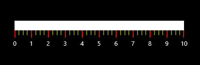
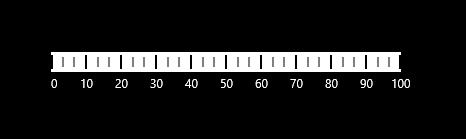

# Ticks

Ticks are of two types: major and minor. These ticks are arranged with respect to the specified frequency i.e., **Interval** of the linear scale. The minor ticks are displayed by using the **MinorTicksPerInterval** property.

## Customizing Ticks

By setting **MajorTickStroke** and **MinorTickStroke**, the stroke of the major ticks and minor ticks are personalized. With the help of **MajorTickStrokeThickness** and **MinorTickStrokeThickness**, the stroke thickness of the major and minor ticks is customized. The size of the major ticks and minor ticks can be modified by using the **MajorTickSize** and **MinorTickSize** properties.




    <Gauges:SfLinearGauge Name="linearGauge">
            <Gauges:SfLinearGauge.MainScale>
                <Gauges:LinearScale MinorTicksPerInterval="3"
                                    MajorTickSize="15" MinorTickSize="10"
                                    MajorTickStroke="Red" 
                                    MinorTickStroke="Yellow"          
                                    MajorTickStrokeThickness="2" 
                                    MinorTickStrokeThickness="1">
                </Gauges:LinearScale>
            </Gauges:SfLinearGauge.MainScale>
        </Gauges:SfLinearGauge>





            SfLinearGauge lineargauge = new SfLinearGauge();
            LinearScale _mainScale = new LinearScale();
            _mainScale.MinorTicksPerInterval = 3;
            _mainScale.MajorTickSize = 15;
            _mainScale.MinorTickSize = 10;
            _mainScale.MajorTickStroke = new SolidColorBrush(Colors.Red);
            _mainScale.MinorTickStroke = new SolidColorBrush(Colors.Yellow);
            _mainScale.MajorTickStrokeThickness = 2;
            _mainScale.MinorTickStrokeThickness = 1;
            lineargauge.MainScale = _mainScale;
            this.Grid.Children.Add(lineargauge);




## Tick Position

The ticks in the scale can be placed above, below, or in between the scale by choosing the following options that are available in the **TickPosition** property.

1. Above
2. Below (Default)
3. Cross




     <Gauges:SfLinearGauge>
            <Gauges:SfLinearGauge.MainScale>
                <Gauges:LinearScale TickPosition="Cross">     
				</Gauges:LinearScale>
            </Gauges:SfLinearGauge.MainScale>
        </Gauges:SfLinearGauge>





            SfLinearGauge lineargauge = new SfLinearGauge();
            LinearScale _mainScale = new LinearScale();
            _mainScale.TickPosition = LinearTicksPosition.Cross;
            lineargauge.MainScale = _mainScale;
            this.Grid.Children.Add(lineargauge);




