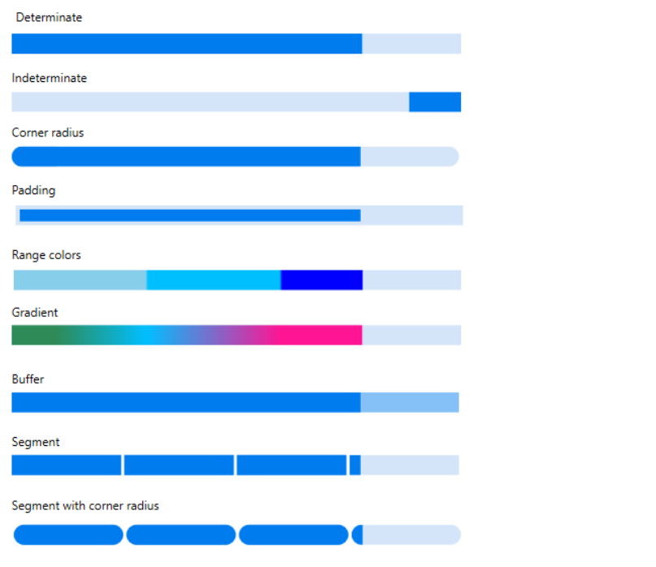

# Overview

The SfLinearProgressBar control for WPF provides a customizable visual to indicate the progress of an operation and let users know the remaining time for completion.

SfLinearProgressBar 
{:.caption}

## Key features

### Determinate and indeterminate
Determinate shows specific quantity of progress that occurred and indeterminate shows a redundant animations of linear progress.

### Corner radius
It customizes to frame rounded edges in the linear ProgressBar.

### Padding
Padding generates space between track bar and progress bar in linear ProgressBar.

### Ranges
Specifies the start position and end position to visualize multiple ranges with different colors that are mapped to each range.

### Gradient 
Gradient shows change in intensity of the colors during the linear progress.

### Segments
Segment splits the ProgressBar into multiple segments and indicates the progress.

### Segment with corner radius
Segment with corner radius splits the linear ProgressBar into multiple segments with the rounded edges at the corner.

