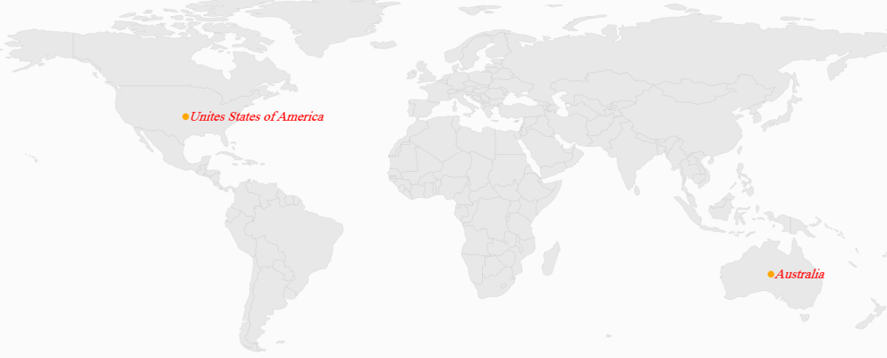

# Annotations

Annotations are notes that are used to leave some message on the map. In Maps, annotations are denoted by the MapAnnotations. MapAnnotation has two major parts:

1. AnnotationLabel
2. AnnotationSymbol

AnnotationLabel is a “Text” that shows some information in the text format. 

AnnotationSymbol is a “VisualObject” that shows a note symbolically.

AnnotationLabel’s appearance is customized by the following properties:

1. AnnotationLabelForeground: Get or sets the foreground color of the annotation label.
2. AnnotationLabelFontStyle: Gets or sets the font style of the annotation label.
3. AnnotationLabelBackground: Gets or sets the background color of the annotation label.
4. AnnotationLabelFontFamily: Gets or sets the font family for the annotation label.
5. AnnotationLabelFontSize: Gets or sets the annotation label font size.

[XAML]

&lt;syncfusion:SfMap &gt;         

&lt;syncfusion:SfMap.Layers&gt;

&lt;syncfusion:ShapeFileLayer   Uri="MapApp.world1.shp"&gt;                    

&lt;syncfusion:ShapeFileLayer.Annotations&gt;

&lt;syncfusion:MapAnnotations Latitude="-22" Longitude="132" AnnotationLabel="Australia" AnnotationLabelFontFamily="Times New Roman" AnnotationLabelFontSize="20" AnnotationLabelFontStyle="Oblique" AnnotationLabelForeground="Red" &gt;

&lt;syncfusion:MapAnnotations.AnnotationSymbol&gt;

&lt;Ellipse Fill="Orange" Height="10" Width="10"&gt;                                    

&lt;/Ellipse&gt;

&lt;/syncfusion:MapAnnotations.AnnotationSymbol&gt;

&lt;/syncfusion:MapAnnotations&gt;

&lt;syncfusion:MapAnnotations Latitude="40" Longitude="-98" AnnotationLabel="Unites States of America" AnnotationLabelFontFamily="Times New Roman" AnnotationLabelFontSize="20" AnnotationLabelFontStyle="Oblique" AnnotationLabelForeground="Red" &gt;

&lt;syncfusion:MapAnnotations.AnnotationSymbol&gt;

&lt;Ellipse Fill="Orange" Height="10" Width="10"&gt;

&lt;/Ellipse&gt;

&lt;/syncfusion:MapAnnotations.AnnotationSymbol&gt;

&lt;/syncfusion:MapAnnotations&gt;

&lt;/syncfusion:ShapeFileLayer.Annotations&gt;

&lt;syncfusion:ShapeFileLayer.ShapeSettings&gt;

&lt;syncfusion:ShapeSetting&gt;

&lt;/syncfusion:ShapeSetting&gt;

&lt;/syncfusion:ShapeFileLayer.ShapeSettings&gt;

&lt;/syncfusion:ShapeFileLayer&gt;

&lt;/syncfusion:SfMap.Layers&gt;

&lt;/syncfusion:SfMap &gt;

{  | markdownify }
{:.image }

Positioning a MapAnnotation

MapAnnotation can be positioned anywhere on the map based on latitude and longitude. MapAnnotation has two properties called “Latitude” and “Longitude” that are string types used to set co-ordinates of the MapAnnotation in the form of latitude and longitude. 

Customizing the Annotation Template

The default appearance of the annotation can be customized by using the AnnotationTemplate property. The annotation template property is available in the ShapeFileLayer.

About the AnnotationTemplate Property

AnnotationTemplateis a DataTemplate type, used to customize or override the default template of MapAnnotations.

[XAML]

&lt;syncfusion:SfMap &gt;

            &lt;syncfusion:SfMap.Layers&gt;

                &lt;syncfusion:ShapeFileLayer   Uri="MapApp.world1.shp"&gt;

                    &lt;syncfusion:ShapeFileLayer.AnnotationTemplate&gt;

                        &lt;DataTemplate&gt;

                            &lt;Grid Margin="-50,-20,0,0"&gt;

                                &lt;ContentPresenter Content="{Binding AnnotationSymbol}"/&gt;

                                &lt;TextBlock Text="{Binding AnnotationLabel}" HorizontalAlignment="Center" VerticalAlignment="Center"/&gt;

                            &lt;/Grid&gt;

                        &lt;/DataTemplate&gt;

                    &lt;/syncfusion:ShapeFileLayer.AnnotationTemplate&gt;

                    &lt;syncfusion:ShapeFileLayer.Annotations&gt;

                        &lt;syncfusion:MapAnnotations Latitude="-22" Longitude="132" AnnotationLabel="Australia"  &gt;

                            &lt;syncfusion:MapAnnotations.AnnotationSymbol&gt;

                                &lt;Image Height="100" Width="100" Source="note.jpg" /&gt;

                            &lt;/syncfusion:MapAnnotations.AnnotationSymbol&gt;

                        &lt;/syncfusion:MapAnnotations&gt;

                        &lt;syncfusion:MapAnnotations Latitude="40" Longitude="-98" AnnotationLabel="USA"&gt;

                            &lt;syncfusion:MapAnnotations.AnnotationSymbol&gt;

                                &lt;Image Height="100" Width="100" Source="note.jpg" /&gt;

                            &lt;/syncfusion:MapAnnotations.AnnotationSymbol&gt;

                        &lt;/syncfusion:MapAnnotations&gt;

                    &lt;/syncfusion:ShapeFileLayer.Annotations&gt;

                    &lt;syncfusion:ShapeFileLayer.ShapeSettings&gt;

                        &lt;syncfusion:ShapeSetting&gt;

                        &lt;/syncfusion:ShapeSetting&gt;

                    &lt;/syncfusion:ShapeFileLayer.ShapeSettings&gt;

                &lt;/syncfusion:ShapeFileLayer&gt;

            &lt;/syncfusion:SfMap.Layers&gt;

        &lt;/syncfusion:SfMap &gt;

{  | markdownify }
{:.image }

