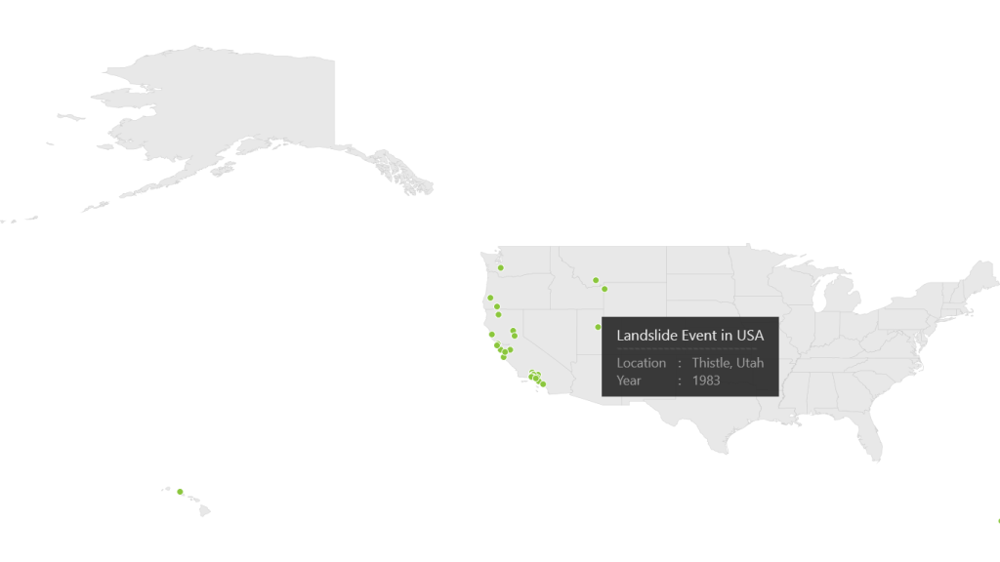

# Map Points

Points are one of the record type in shape file layer. Points are used to specify the specific point in the map. For example used to specify the capital of countries. Points in the shape file given as latitude and longitude coordinates in the shapes file. Those points should be converted as map points.

Customizing the MapPoint

The default appearance of the MapPoint can be customized by using the MapPointTemplate property. The MapPointTemplate property is available in the ShapeFileLayer.

About MapPointTemplate Property

MapPointTemplate is a DataTemplate type, used to customize or override the default template of MapPoints.

[XAML]

&lt;syncfusion:SfMap&gt;

     &lt;syncfusion:SfMap.Layers&gt;

         <syncfusion:ShapeFileLayer ShapeIDPath="NAME"  ShapeIDTableField="Continent"                                                         

                                    EnableSelection="True”                                                                                                                   

                                    Uri=" MapApp.ShapeFiles.continent.shp">

                 &lt;syncfusion:ShapeFileLayer.MapPointTemplate&gt;

                     &lt;DataTemplate&gt;

                            <Ellipse Height="10" Width="10” Stroke="White"      

                                                 Fill="#8AC63C"/>

                      &lt;/DataTemplate&gt;

                 &lt;/syncfusion:ShapeFileLayer.MapPointTemplate&gt;

         &lt;/syncfusion:ShapeFileLayer&gt;

      &lt;/syncfusion:SfMap.Layers&gt;

&lt;/syncfusion:SfMap&gt;                     

MapPointPopup

MapPointPopup is a popup, displayed when the point is moved on MapPoint. It shows additional information from the object bounded with the MapPoint. You can get the object from dbf file.

MapPointPopupTemplate

MapPointPopupTemplate is a DataTemplate used to expose the template for the MapPoint. 

[XAML]

&lt;syncfusion:SfMap &gt;

     &lt;syncfusion:SfMap.Layers&gt;

         <syncfusion:ShapeFileLayer Background="White" EnableSelection="True" 

                                    Uri="MapApp.ShapeFiles.states.shp">

              &lt;syncfusion:ShapeFileLayer.SubShapeFileLayers&gt;

                 <syncfusion:SubShapeFileLayer   EnableSelection="True" 

                                    Uri="MapApp.ShapeFiles.landslide.shp">

                  &lt;syncfusion:SubShapeFileLayer.MapPointPopupTemplate&gt;

                        &lt;DataTemplate&gt;

                             <Border Background="#FF252525" Opacity="0.9"  Height="110"

                                     BorderThickness="0.5">

                               &lt;StackPanel Margin="10,5,20,0"&gt;

                                   &lt;StackPanel&gt;

                                       <TextBlock Text="Landslide Event in USA"  

                                         Margin="10,5,0,0" Foreground="White" 

                                         FontSize="20"  FontFamily="Segoe UI" />

                                    &lt;/StackPanel&gt;

                            &lt;Grid Margin="10,5,10,0"&gt;

                               <Rectangle Stroke="#FF505050" StrokeDashArray="6 2" 

                                          Height="2"  VerticalAlignment="Center" />

                            &lt;/Grid&gt;

                            &lt;Grid Margin="10,5,0,0" &gt;

                               &lt;Grid.ColumnDefinitions&gt;

                                    &lt;ColumnDefinition Width="0.41*"/&gt;

                                    &lt;ColumnDefinition Width="0.1*"/&gt;

                                    &lt;ColumnDefinition Width="0.49*"/&gt;

                                &lt;/Grid.ColumnDefinitions&gt;

                                &lt;Grid.RowDefinitions&gt;

                                     &lt;RowDefinition/&gt;

                                     &lt;RowDefinition/&gt;

                                &lt;/Grid.RowDefinitions&gt;

                             <TextBlock Foreground="#FFACACAC" Grid.Column="0" 

                                         Grid.Row="0" FontFamily="Segoe UI" 

                                         FontWeight="Normal" FontSize="18" 

                                         Text="Location" />

                             <TextBlock Foreground="#FFACACAC" Grid.Column="1" 

                                         Grid.Row="0" FontFamily="Segoe UI" 

                                         FontWeight="Normal" FontSize="18" Text=" : " />

                             <TextBlock Foreground="#FFACACAC" Margin="5,0,0,0" 

                                        Grid.Column="2" Grid.Row="0" FontFamily="Segoe 

                                        UI" FontWeight="Normal" FontSize="18" 

                                        Text="{Binding [LOCALITY]}" />

                             <TextBlock Foreground="#FFACACAC" Grid.Column="0" 

                                        Grid.Row="1" FontFamily="Segoe UI" 

                                        FontWeight="Normal" FontSize="18" Text="Year" />

                             <TextBlock Foreground="#FFACACAC" Grid.Column="1" 

                                        Grid.Row="1" FontFamily="Segoe UI" 

                                        FontWeight="Normal" FontSize="18" Text=" : " />

                             <TextBlock Foreground="#FFACACAC" Margin="5,0,0,0" 

                                        Grid.Column="2" Grid.Row="1" FontFamily="Segoe 

                                        UI" FontWeight="Normal" FontSize="18" 

                                        Text="{Binding [YEAR]}" />

                          &lt;/Grid&gt;

                       &lt;/StackPanel&gt;

                    &lt;/Border&gt;

                  &lt;/DataTemplate&gt;

              &lt;/syncfusion:SubShapeFileLayer.MapPointPopupTemplate&gt;

              &lt;syncfusion:SubShapeFileLayer.MapPointTemplate&gt;

                 &lt;DataTemplate&gt;

                      <Ellipse Height="10" Width="10" Margin="-10,-10,0,0" Stroke="White" 

                                                                         Fill="#8AC63C"/>

                 &lt;/DataTemplate&gt;

              &lt;/syncfusion:SubShapeFileLayer.MapPointTemplate&gt;

           &lt;/syncfusion:SubShapeFileLayer&gt;

       &lt;/syncfusion:ShapeFileLayer.SubShapeFileLayers&gt;

     &lt;/syncfusion:ShapeFileLayer&gt;

   &lt;/syncfusion:SfMap.Layers&gt;

&lt;/syncfusion:SfMap&gt;

{  | markdownify }
{:.image }

