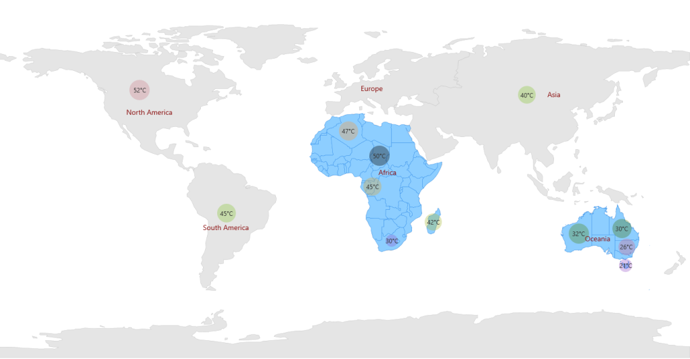

# Multilayer Support

Multilayer support allows you to load multiple shapefiles in a single container, enabling maps to display more detail.

Loading Multiple Shapefiles in a Single Container

This feature enables the map to load multiple types of shapefiles in a single container. Basically, shape files contain point shapes in a single container.

Situations arise where, any combination of available shapefiles needs to be loaded in a single container. In such situations this feature enables the map to load multiple shapelayers in a single container. 

Adding Multiple Layers in the Map

ShapeFileLayer is the core layer for the map. Multiple layers can be added in the ShapeFileLayer itself. They have to be added in SubShapeFileLayers within the ShapeFileLayer.

SubShapeFileLayers

SubShapeFileLayers is the collection of SubShapeFileLayer. SubShapeFileLayer is also a type of shapefile layer. The following code adds multiple layers in the ShapeFileLayer.

<table>
<tr>
<td>
[XAML]  &lt;syncfusion:SfMap &gt;            &lt;syncfusion:SfMap.Layers&gt;                &lt;syncfusion:ShapeFileLayer Background="White" x:Name="shapelayer" ItemsSource="{Binding MuliLayerList}" ShapeIDPath="NAME"  ShapeIDTableField="Continent"  EnableSelection="True" Uri="BubbleVisualization.ShapeFiles.continent.shp"&gt;                    &lt;syncfusion:ShapeFileLayer.BubbleMarkerSetting&gt;                        &lt;syncfusion:BubbleMarkerSetting AutoFillColor="False" MaxSize="40" MinSize="0" StrokeThickness="0" ValuePath="Weather" ColorValuePath="Weather"&gt;                            &lt;syncfusion:BubbleMarkerSetting.ColorMappings&gt;                                &lt;syncfusion:RangeColorMapping Color="#8C5FD3" To="30" From="0"/&gt;                                &lt;syncfusion:RangeColorMapping Color="#EF6AB3" To="55" From="45"/&gt;                                &lt;syncfusion:RangeColorMapping Color="#8AC63C" To="40" From="30"/&gt;                                &lt;syncfusion:RangeColorMapping Color="#8AC63C" To="45" From="40"/&gt;                            &lt;/syncfusion:BubbleMarkerSetting.ColorMappings&gt;                        &lt;/syncfusion:BubbleMarkerSetting&gt;                    &lt;/syncfusion:ShapeFileLayer.BubbleMarkerSetting&gt;                    &lt;syncfusion:ShapeFileLayer.Annotations&gt;                        &lt;syncfusion:MapAnnotations AnnotationLabelFontSize="14" AnnotationLabelFontFamily="Segoe UI" AnnotationLabelForeground="#8C1313" AnnotationLabel="North America"  Latitude="40.4230" Longitude="-112.7372" /&gt;                        &lt;syncfusion:MapAnnotations AnnotationLabelFontSize="14" AnnotationLabelFontFamily="Segoe UI" AnnotationLabelForeground="#8C1313" AnnotationLabel="Africa" Latitude="9.1021" Longitude="18.2812" /&gt;                        &lt;syncfusion:MapAnnotations AnnotationLabelFontSize="14" AnnotationLabelFontFamily="Segoe UI" AnnotationLabelForeground="#8C1313" AnnotationLabel="Europe" Latitude="53.0000" Longitude="9.0000" /&gt;                        &lt;syncfusion:MapAnnotations AnnotationLabelFontSize="14" AnnotationLabelFontFamily="Segoe UI" AnnotationLabelForeground="#8C1313" AnnotationLabel="South America" Latitude="-19.6048" Longitude="-73.0625" /&gt;                        &lt;syncfusion:MapAnnotations AnnotationLabelFontSize="14" AnnotationLabelFontFamily="Segoe UI" AnnotationLabelForeground="#8C1313" AnnotationLabel="Asia" Latitude="49.8380" Longitude="105.8203" /&gt;                        &lt;syncfusion:MapAnnotations AnnotationLabelFontSize="14" AnnotationLabelFontFamily="Segoe UI" AnnotationLabelForeground="#8C1313" AnnotationLabel="Oceania" Latitude="-25.3456" Longitude="125.4346" /&gt;                    &lt;/syncfusion:ShapeFileLayer.Annotations&gt;                    &lt;syncfusion:ShapeFileLayer.ItemsTemplate&gt;                        &lt;DataTemplate&gt;                            &lt;Border Visibility="{Binding Data.ItemsVisibility}" Background="Transparent"&gt;                                &lt;StackPanel Orientation="Horizontal"&gt;                                    &lt;TextBlock FontFamily="Segoe UI" Foreground="#FF333333" FontSize="12"  Text="{Binding Data.Weather}"/&gt;                                    &lt;TextBlock FontFamily="Segoe UI" Foreground="#FF333333" FontSize="12"  Text="°C"/&gt;                                &lt;/StackPanel&gt;                            &lt;/Border&gt;                        &lt;/DataTemplate&gt;                    &lt;/syncfusion:ShapeFileLayer.ItemsTemplate&gt;                    &lt;syncfusion:ShapeFileLayer.ShapeSettings&gt;                        &lt;syncfusion:ShapeSetting ShapeStroke="#C1C1C1" ShapeStrokeThickness="0.5" ShapeValuePath="Weather" ShapeFill="#E5E5E5"/&gt;                    &lt;/syncfusion:ShapeFileLayer.ShapeSettings&gt;                    &lt;syncfusion:ShapeFileLayer.SubShapeFileLayers&gt;                        &lt;syncfusion:SubShapeFileLayer ShapeIDPath="NAME" ItemsSource="{Binding AfricaList}"  ShapeIDTableField="Country"   Uri="BubbleVisualization.ShapeFiles.Africa.shp"&gt;                            &lt;syncfusion:SubShapeFileLayer.BubbleMarkerSetting&gt;                                &lt;syncfusion:BubbleMarkerSetting AutoFillColor="False" MaxSize="40" MinSize="20" StrokeThickness="0" ValuePath="Weather" ColorValuePath="Weather"&gt;                                    &lt;syncfusion:BubbleMarkerSetting.ColorMappings&gt;                                        &lt;syncfusion:RangeColorMapping Color="#8C5FD3" To="30" From="0"/&gt;                                        &lt;syncfusion:RangeColorMapping Color="#EF6AB3" To="35" From="30"/&gt;                                        &lt;syncfusion:RangeColorMapping Color="#8AC63C" To="40" From="35"/&gt;                                        &lt;syncfusion:RangeColorMapping Color="#F79E46" To="47" From="40"/&gt;                                    &lt;/syncfusion:BubbleMarkerSetting.ColorMappings&gt;                                &lt;/syncfusion:BubbleMarkerSetting&gt;                            &lt;/syncfusion:SubShapeFileLayer.BubbleMarkerSetting&gt;                            &lt;syncfusion:SubShapeFileLayer.ItemsTemplate&gt;                                &lt;DataTemplate&gt;                                    &lt;Border  Background="Transparent"&gt;                                        &lt;StackPanel Orientation="Horizontal"&gt;                                            &lt;TextBlock FontFamily="Segoe UI" Foreground="#FF333333" FontSize="12"  Text="{Binding Data.Weather}"/&gt;                                            &lt;TextBlock FontFamily="Segoe UI" Foreground="#FF333333" FontSize="12"  Text="°C"/&gt;                                        &lt;/StackPanel&gt;                                    &lt;/Border&gt;                                &lt;/DataTemplate&gt;                            &lt;/syncfusion:SubShapeFileLayer.ItemsTemplate&gt;                            &lt;syncfusion:SubShapeFileLayer.ShapeSettings&gt;                                &lt;syncfusion:ShapeSetting ShapeStroke="#2F8CEA" ShapeValuePath="Weather" ShapeFill="#8DCEFF"&gt;                                    &lt;syncfusion:ShapeSetting.FillSetting&gt;                                        &lt;syncfusion:ShapeFillSetting /&gt;                                    &lt;/syncfusion:ShapeSetting.FillSetting&gt;                                &lt;/syncfusion:ShapeSetting&gt;                            &lt;/syncfusion:SubShapeFileLayer.ShapeSettings&gt;                        &lt;/syncfusion:SubShapeFileLayer&gt;                        &lt;syncfusion:SubShapeFileLayer ShapeIDPath="NAME" ShapeIDTableField="ADMIN_NAME" ItemsSource="{Binding OceaniaList}" Uri="BubbleVisualization.ShapeFiles.australia.shp"&gt;                            &lt;syncfusion:SubShapeFileLayer.ShapeSettings&gt;                                &lt;syncfusion:ShapeSetting ShapeStroke="#2F8CEA" ShapeValuePath="Weather" ShapeFill="#8DCEFF"&gt;                                    &lt;syncfusion:ShapeSetting.FillSetting&gt;                                        &lt;syncfusion:ShapeFillSetting AutoFillColors="False"/&gt;                                    &lt;/syncfusion:ShapeSetting.FillSetting&gt;                                &lt;/syncfusion:ShapeSetting&gt;                            &lt;/syncfusion:SubShapeFileLayer.ShapeSettings&gt;                            &lt;syncfusion:SubShapeFileLayer.BubbleMarkerSetting&gt;                                &lt;syncfusion:BubbleMarkerSetting AutoFillColor="False" MaxSize="40" MinSize="20" StrokeThickness="0" ValuePath="Weather"&gt;                                    &lt;syncfusion:BubbleMarkerSetting.ColorMappings&gt;                                        &lt;syncfusion:RangeColorMapping Color="#8C5FD3" To="20" From="0"/&gt;                                        &lt;syncfusion:RangeColorMapping Color="#EF6AB3" To="25" From="20"/&gt;                                        &lt;syncfusion:RangeColorMapping Color="#407715" To="30" From="25"/&gt;                                        &lt;syncfusion:RangeColorMapping Color="#63A028" To="35" From="30"/&gt;                                    &lt;/syncfusion:BubbleMarkerSetting.ColorMappings&gt;                                &lt;/syncfusion:BubbleMarkerSetting&gt;                            &lt;/syncfusion:SubShapeFileLayer.BubbleMarkerSetting&gt;                            &lt;syncfusion:SubShapeFileLayer.ItemsTemplate&gt;                                &lt;DataTemplate&gt;                                    &lt;Border Background="Transparent"&gt;                                        &lt;StackPanel Orientation="Horizontal"&gt;                                            &lt;TextBlock FontFamily="Segoe UI" Foreground="#FF333333" FontSize="12"  Text="{Binding Data.Weather}"/&gt;                                            &lt;TextBlock FontFamily="Segoe UI" Foreground="#FF333333" FontSize="12"  Text="°C"/&gt;                                        &lt;/StackPanel&gt;                                    &lt;/Border&gt;                                &lt;/DataTemplate&gt;                            &lt;/syncfusion:SubShapeFileLayer.ItemsTemplate&gt;                        &lt;/syncfusion:SubShapeFileLayer&gt;                    &lt;/syncfusion:ShapeFileLayer.SubShapeFileLayers&gt;                &lt;/syncfusion:ShapeFileLayer&gt;            &lt;/syncfusion:SfMap.Layers&gt;        &lt;/syncfusion:SfMap&gt;</td></tr>
<tr>
<td>
public class Country : INotifyPropertyChanged    {        public string NAME { get; set; }        private Visibility itemsvisibility = Visibility.Visible;        public Visibility ItemsVisibility        {            get { return itemsvisibility; }            set { itemsvisibility = value; }        }        private double weather { get; set; }        public double Weather        {            get            {                return weather;            }            set            {                weather = value;            }        }        private double population { get; set; }        public double Population        {            get            {                return population;            }            set            {                population = value;                OnPropertyChanged(new PropertyChangedEventArgs("Population"));            }        }        public string PopulationFormat { get; set; }        public event PropertyChangedEventHandler PropertyChanged;        public void OnPropertyChanged(PropertyChangedEventArgs e)        {            this.PopulationFormat = (String.Format("{0:0,0}", this.Population).Trim('$'));            if (PropertyChanged != null)            {                PropertyChanged(this, e);            }        }    }    public class MapViewModel    {        public ObservableCollection<Country> MuliLayerList { get; set; }        public ObservableCollection<Country> AfricaList { get; set; }        public ObservableCollection<Country> OceaniaList { get; set; }        public MapViewModel()        {            this.OceaniaList = new ObservableCollection<Country>();            this.OceaniaList.Add(new Country() { NAME = "New South Wales", Weather = 26 });            this.OceaniaList.Add(new Country() { NAME = "Queensland", Weather = 30 });            this.OceaniaList.Add(new Country() { NAME = "Tasmania", Weather = 21 });            this.OceaniaList.Add(new Country() { NAME = "Western Australia", Weather = 32 });            this.AfricaList = new ObservableCollection<Country>();            this.AfricaList.Add(new Country() { NAME = "Algeria", Weather = 47 });            this.AfricaList.Add(new Country() { NAME = "Congo (Brazzaville)", Weather = 45 });            this.AfricaList.Add(new Country() { NAME = "Ethiopia", Weather = 50 });            this.AfricaList.Add(new Country() { NAME = "South Africa", Weather = 30 });            this.MuliLayerList = new ObservableCollection<Country>();            this.MuliLayerList.Add(new Country() { NAME = "Asia", Weather = 40 });            this.MuliLayerList.Add(new Country() { NAME = "South America", Weather = 45 });            this.MuliLayerList.Add(new Country() { NAME = "North America", Weather = 52 });            this.MuliLayerList.Add(new Country() { NAME = "Antarctica", ItemsVisibility = Visibility.Collapsed });            this.MuliLayerList.Add(new Country() { NAME = "Oceania", ItemsVisibility = Visibility.Collapsed });            this.MuliLayerList.Add(new Country() { NAME = "Europe", ItemsVisibility = Visibility.Collapsed });            this.MuliLayerList.Add(new Country() { NAME = "Africa", ItemsVisibility = Visibility.Collapsed });        }    }</td></tr>
</table>

{  | markdownify }
{:.image }

