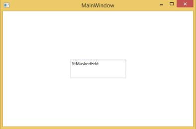
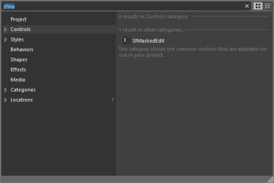
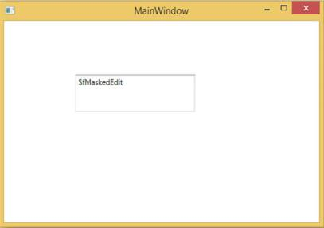

# Getting Started

## Add SfMaskedEdit to an application

Namespace : Syncfusion.Windows.Controls.Input

Assembly: Syncfusion.SfInput.WPF

Dependentassembly: Syncfusion.SfShared.WPF

### Create the SfMaskedEdit control by using XAML

Create a new WPF application in the Visual Studio and follow the steps given.

1. Drag and drop the SfMaskedEdit control from the toolbox to the designer. It generates the SfMaskedEdit as shown:

   

The following code example shows how to create the SfMaskedEdit from XAML.



<syncfusion:SfMaskedEdit HorizontalAlignment="Left" Margin="103,143,0,0" TextWrapping="Wrap" Text="SfMaskedEdit" VerticalAlignment="Top" Width="255" Height="46"/>



### Create the SfMaskedEdit control by using C#

To create a MaskedEdit control, use the following code.



SfMaskedEdit maskededit = new SfMaskedEdit() { Text = "SfMaskedEdit", Width = 150, Height = 50 };

this.Content = maskededit;



### Create the SfMaskedEdit control by using the Expression Blend

The SfMaskedEdit control can also be created and configured by using the ExpressionBlend. The following steps display this.

1. Create a WPF project in the Expression Blend and add the reference to the following assemblies.
   1. Syncfusion.SfInput.WPF
   2. Syncfusion.SfShared.WPF
2. Search for the SfMaskedEdit in the toolbox.

   

3. Now drag and drop the SfMaskedEdit into the designer. It generates the SfMaskedEdit. Then configure the properties of the SfMaskedEdit control by using the properties area.

   

This generates the SfMaskedEdit as follows:

