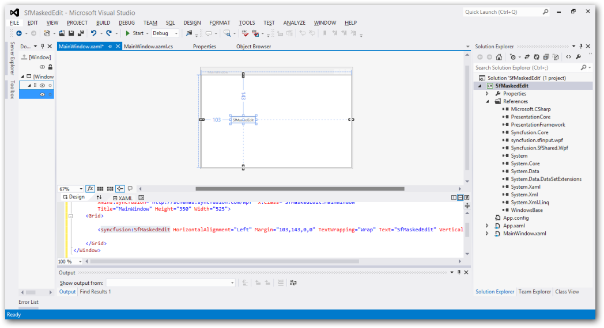
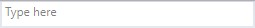

# Getting Started

## Assembly deployment

Namespace: Syncfusion.Windows.Controls.Input

Assembly: Syncfusion.SfInput.WPF

Dependent assembly: Syncfusion.SfShared.WPF

## Adding control via designer

Create a new WPF application in the Visual Studio to generate the SfMaskedEdit by dragging the `SfMaskedEdit` control from the toolbox to the designer.

## Adding control manually in XAML

The following code example shows how to create the `SfMaskedEdit` from XAML.





<syncfusion:SfMaskedEdit Width="255" Height="46"/>





## Adding control manually in C Sharp

To create a MaskedEdit control using C Sharp, follow the code.





SfMaskedEdit maskededit = new SfMaskedEdit() { Text = "SfMaskedEdit", Width = 150, Height = 50 };
this.Content = maskededit;





## Adding mask to the control

To mask the input of SfMaskedEdit, use the `MaskType` and `Mask` properties.

The `MaskType` property has different set of mask characters that are combined to form a mask expression. Based on the complexity and usage, mask types are classified as Simple, Regular, and RegEx.

The `Mask` property specifies the input without writing any custom validation logic in your application. Mask can be set based on the `MaskType` elements. The `Mask` property may contain literals and special mask characters. You can use the back-slash character to escape any special mask characters to display as literals.





<syncfusion:SfMaskedEdit MaskType="Simple" Mask="00/00/0000" Width="255" Height="46"/>




SfMaskedEdit maskededit = new SfMaskedEdit();
maskededit.MaskType=MaskType.Simple;
maskedEdit.Mask="00/00/0000";





This mask expression allows only numeric inputs in the places of 0.

## Assigning value to the control

By default, the value holds the characters without including prompt characters and the literals defined in the mask. To include the prompt characters and literals, use the ValueMaskFormat property of the control.

To set value for the control, the `Value` property can be used.





<syncfusion:SfMaskedEdit MaskType="Simple" Mask="00/00/0000" Value="14/11/2014" Width="255" Height="46"/>





SfMaskedEdit maskededit = new SfMaskedEdit();
maskededit.MaskType=MaskType.Simple;
maskedEdit.Mask="00/00/0000";
maskedEdit.Value="14/11/2014";





## Defining watermark

`Watermark` guides the end user on what should be enter in the text input. It can be displayed when the content of the SfMaskedEdit is empty and the control is not focused.

To set watermark for the control, use the `WaterMark` property.





<syncfusion:SfMaskedEdit  MaskType="Simple" Mask="00/00/0000" Watermark="Type here" Width="255" Height="46"/>





SfMaskedEdit maskededit = new SfMaskedEdit();
maskededit.MaskType = MaskType.Simple;
maskedEdit.Mask = "00/00/0000";
maskedEdit.Watermark = "Type here";



