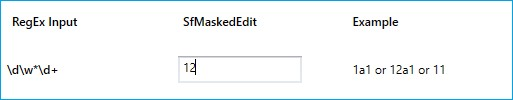
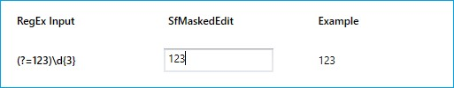

# Mask Options

Each `MaskType` has different set of mask elements that are combined to form a mask expression. Based on the complexity and usage, mask types are classified as:

1. Simple
2. Regular
3. RegEx

## Simple

Expressions generated with very simple mask elements comes under this group. This is mainly used for fixed length inputs. For example, phone number.

Mask elements in mask type are as follows.

### Simple mask elements

<table>
<tr>
<th>
Elements</th><th>
Description</th></tr>
<tr>
<td>
0</td><td>
Digit and required. These elements accepts any single digit between 0 and 9.</td></tr>
<tr>
<td>
9</td><td>
Digit or space and optional.</td></tr>
<tr>
<td>
#</td><td>
Digit or space and optional. Plus (+) and minus (-) signs are allowed.</td></tr>
<tr>
<td>
L</td><td>
Letter and required. Restricts input to the ASCII letters a-z and A-Z. These mask elements are equivalent to [a-z A-Z] in regular expressions.</td></tr>
<tr>
<td>
?</td><td>
Letter and optional. Restricts input to the ASCII letters a-z and A-Z. These mask elements are equivalent to [a-z A-Z]? in regular expressions.</td></tr>
<tr>
<td>
C</td><td>
Character and optional. </td></tr>
<tr>
<td>
A</td><td>
Alphanumeric and required.</td></tr>
<tr>
<td>
<</td><td>
Shift down. Converts all the characters to lowercase.</td></tr>
<tr>
<td> > </td><td>
Shift up. Converts all the characters to uppercase.</td></tr>
</table>





<syncfusion:SfMaskedEdit MaskType="Simple" Mask="00/00/0000" Width="255" Height="46"/>




SfMaskedEdit maskededit = new SfMaskedEdit();
maskededit.MaskType=MaskType.Simple;
maskedEdit.Mask="00/00/0000";





## Regular

Regular mask supports simple regular expression with following elements. 

### Regular mask elements

<table>
<tr>
<th>
Elements</th><th>
Description</th></tr>
<tr>
<td>
\w</td><td>
Accepts any alphabet.</td></tr>
<tr>
<td>
\d</td><td>
Accepts any digit.</td></tr>
<tr>
<td>
[0-9A-Z]</td><td>
Accepts any digit between 0-9 and character between A-Z.</td></tr>
<tr>
<td>
{n}</td><td>
Accepts input for n number of times.</td></tr>
<tr>
<td>
{n,m}</td><td>
Accepts input for n minimum number of times and m maximum number of times.</td></tr>
<tr>
<td>
?</td><td>
Optional input.</td></tr>
<tr>
<td>
+</td><td>
Accepts input for one or more times.</td></tr>
<tr>
<td>
*</td><td>
Accepts input for zero or more times.</td></tr>
</table>





<syncfusion:SfMaskedEdit MaskType="Regular" Mask="(\d{0,3})\d{3}-\d{2}-\d{2}" Width="255" Height="46"/>




SfMaskedEdit maskededit = new SfMaskedEdit();
maskededit.MaskType = MaskType.Regular;
maskedEdit.Mask = "(\d{0,3})\d{3}-\d{2}-\d{2}";





## RegEx

Extended regular expression with more complex expression which gives more usage of input data. 

Provided optional, positive, and negative lookahead support in the SfMaskedEdit control.

### Optional

“*” is a special character that denotes zero or more matches for the preceding character. 

For example, for input “\d\w*\d” – The output can be “12” or “1a1” or “123”, because the “\w*” is optional. If the user type the input “1a”, the character "a" will match with optional mask and the masked text will be “1a_”. If the mask text is “12” and if the character “3” is typed, the character “2” will be considered as optional mask and the masked text will be “123”.

### Positive Lookahead Regex

Positive lookahead Regex matches a group after the main expression without including it in the result. 

“(?=regex)” is the Positive lookahead regex. It matches only when the regex is matched with input text.

For example, for input “(?=123)\d{3}”: It allows first two digit. While entering the third digit, it will validate the regex and restrict the input. It allows the output only when the MaskText is “123” for this given input.

### Negative Lookahead Regex

Negative lookahead Regex specifies a group that cannot match after the main expression. If it matches the input text, the result will be discarded.

“(?!regex)” is the Negative lookahead regex. It validates the input on every keypress.

For example, for input “(?!55)(?!000)(?!666)\d{3}” – \d{3} denotes that the output will be of 3 character length. “(?55)” denotes the value will not begin with “55”. “(?!000)(?!666)” denotes the output cannot be “000” or “666”.

### RegEx mask elements

The RegEx mask elements are as follows.

<table>
<tr>
<th>
Elements</th><th>
Description</th></tr>
<tr>
<td>
abc|def</td><td>
Accepts any one input that matches.</td></tr>
<tr>
<td>
(a|b)+</td><td>
Accepts the matching input in one or more occurrences.</td></tr>
<tr>
<td>
[ABC]</td><td>
Accepts any single character included in the specified set of characters.</td></tr>
<tr>
<td>
[^ABC]</td><td>
Accepts any single character not included in the specified set of characters.</td></tr> 
<tr>
<td>
[A-Z]</td><td>
Accepts any character between two specified set of characters inclusive.</td></tr>
<tr>
<td>
(ABC)</td><td>
Matches a group specified within the parenthesis. </td></tr>
<tr>
<td>
\d</td><td>
Accepts any digit. Same as [0-9].</td></tr>
<tr>
<td>
\D</td><td>
Accepts any non-digit. Same as [^0-9].</td></tr>
<tr>
<td>
\w</td><td>
Accepts any word character. \w is the same as [a-zA-Z_0-9].</td></tr>
<tr>
<td>
\W</td><td>
Accepts any non-word character. \W is the same as [^a-zA-Z_0-9].</td></tr>
<tr>
<td>
\s</td><td>
Accepts any white space characters.</td></tr>
<tr>
<td>
\S</td><td>
Accepts any non-white space characters.</td></tr>
<tr>
<td>
(?=ABC)</td><td>
Matches a group after the main expression without including it in the result.</td></tr>
<tr>
<td>
(?!ABC)</td><td>
Specifies a group that cannot match after the main expression.</td></tr>
<tr>
<td>
{n}</td><td>
Accepts the input for n number of times.</td></tr>
<tr>
<td>
{n,}</td><td>
Accepts the input for 'n' and more than 'n' number of times. </td></tr>
<tr>
<td>
{n,m}</td><td>
Accepts the input for n minimum number of times and m maximum number of times.</td></tr>
<tr>
<td>
+</td><td>
Accepts one or more matches for the preceding character.</td></tr>
<tr>
<td>
*</td><td>
Accepts zero or more matches for the preceding character.</td></tr>
<tr>
<td>
?</td><td>
Optional input (Zero or one occurrence  of the matching input).</td></tr>
<tr>
<td>
|</td><td>
Acts like a Boolean OR. Matches the expression before or after the |.</td></tr>
<tr>
<td>
.</td><td>
Accepts any character. It can be changed based on culture.</td></tr>
</table>

For example, the following code example shows the validation for E-mail using Regex elements.




<syncfusion:SfMaskedEdit MaskType="RegEx" Mask="[A-Za-z0-9._%-]+@[A-Za-z0-9]+.[A-Za-z]{2,3}" Width="255" Height="46"/>




SfMaskedEdit maskededit = new SfMaskedEdit();
maskededit.MaskType = MaskType.RegEx;
maskedEdit.Mask = "[A-Za-z0-9._%-]+@[A-Za-z0-9]+.[A-Za-z]{2,3}";





