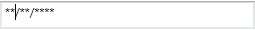

# PromptChar in Mask

## Default PromptChar in Mask

Displays prompt character for the absence of your input in mask. Its default value is ‘_’.

## Custom PromptChar

The following example shows how to customize the prompt character by using the `PromptChar` property.





<syncfusion:SfMaskedEdit  MaskType="Simple" Mask="00/00/0000" PromptChar="*" Width="255" Height="46"/>





SfMaskedEdit maskededit = new SfMaskedEdit();
maskededit.MaskType = MaskType.Simple;
maskedEdit.Mask = "00/00/0000";
maskedEdit.PromptChar = "*";





