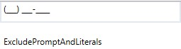
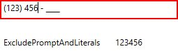
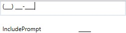
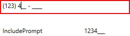
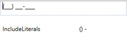
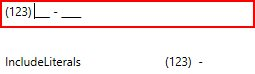
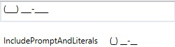

# Value Mode

The `SfMaskedEdit` allows character formatting in the `Value` property in a mask scenario (when setting the Mask property). By default, the `Value` property holds your input characters, prompt characters, and the literals defined in the mask. You can modify this and allow the `Value` property to hold the characters without prompt and literals by setting the `ValueMaskFormat` property of the control. `Value` in the `SfMaskedEdit` can be formatted by any one of the following formatting enum values :

* ExcludePromptAndLiterals
* IncludePrompt
* IncludeLiterals
* IncludePromptAndLiterals

## ExcludePromptAndLiterals
    
The `Value` property returns only the text entered by the user. It does not include prompt and literals characters.





<syncfusion:SfMaskedEdit x:Name=sfMaskedEdit Width="255" Height="50" MaskType="Simple" Mask="(000) 000-0000" ValueMaskFormat="ExcludePromptAndLiterals"/>

<Label Content="{Binding ElementName=sfMaskedEdit,Path=Value}" Width="230" Height="26"/ >





SfMaskedEdit maskededit = new SfMaskedEdit();

maskededit.MaskType=MaskType.Simple;

maskededit.Mask="(000) 000-0000";

maskededit.ValueMaskFormat=ValueMaskFormat.ExcludePromptAndLiterals;

Label label = new Label();

maskededit.ValueChanged += SfMaskedEdit_ValueChanged; 

private void SfMaskedEdit_ValueChanged(object sender, EventArgs e)
{
    label.Content = maskededit.Value;
}

label.Content = maskededit.Value;





Before entering input: It excludes prompt and literals.

After entering the input:

## IncludePrompt
    
The `Value` property returns text entered by the user as well as prompt character.





<syncfusion:SfMaskedEdit x:Name=sfMaskedEdit Width="255" Height="50" MaskType="Simple" Mask="(000) 000-0000" ValueMaskFormat="IncludePrompt"/>

<Label Content="{Binding ElementName=sfMaskedEdit,Path=Value}" Width="230" Height="26"/ >





SfMaskedEdit maskededit = new SfMaskedEdit();

maskededit.MaskType=MaskType.Simple;

maskededit.Mask="(000) 000-0000";

maskededit.ValueMaskFormat=ValueMaskFormat.IncludePrompt;

Label label = new Label();

maskededit.ValueChanged += SfMaskedEdit_ValueChanged; 

private void SfMaskedEdit_ValueChanged(object sender, EventArgs e)
{
    label.Content = maskededit.Value;
}

label.Content = maskededit.Value;





Before entering input: It excludes literals.

After entering input:

## Include literals
   
The `Value` property returns text entered by the user as well as any literal characters defined in the mask.





<syncfusion:SfMaskedEdit x:Name=sfMaskedEdit Width="255" Height="50" MaskType="Simple" Mask="(000) 000-0000" ValueMaskFormat="IncludeLiterals"/>

<Label Content="{Binding ElementName=sfMaskedEdit,Path=Value}" Width="230" Height="26"/ >





SfMaskedEdit maskededit = new SfMaskedEdit();

maskededit.MaskType=MaskType.Simple;

maskededit.Mask="(000) 000-0000";

maskededit.ValueMaskFormat=ValueMaskFormat.IncludeLiterals;

Label label = new Label();

maskededit.ValueChanged += SfMaskedEdit_ValueChanged; 

private void SfMaskedEdit_ValueChanged(object sender, EventArgs e)
{
    label.Content = maskededit.Value;
}

label.Content = maskededit.Value;





Before Entering the input:  It excludes prompt 

After entering the input:

## IncludePromptAndLiterals
    
The `Value` property returns text entered by the user as well as any literal characters defined in the mask and the prompt character.





<syncfusion:SfMaskedEdit x:Name=sfMaskedEdit Width="255" Height="50" MaskType="Simple" Mask="(000) 000-0000" ValueMaskFormat="IncludePromptAndLiterals"/>

<Label Content="{Binding ElementName=sfMaskedEdit,Path=Value}" Width="230" Height="26"/ >





SfMaskedEdit maskededit = new SfMaskedEdit();

maskededit.MaskType=MaskType.Simple;

maskededit.Mask="(000) 000-0000";

maskededit.ValueMaskFormat=ValueMaskFormat.IncludePromptAndLiterals;

Label label = new Label();

maskededit.ValueChanged += SfMaskedEdit_ValueChanged; 

private void SfMaskedEdit_ValueChanged(object sender, EventArgs e)
{
    label.Content = maskededit.Value;
}

label.Content = maskededit.Value;





Before entering input: It excludes prompt and literals.

After entering the input:

