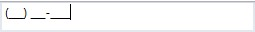
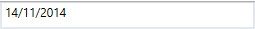

# Working with SfMaskedEdit

This section explains accessing the `SfMaskedEdit` properties and events associated with it.

## Masking the input

The Mask property may contain literals and special mask characters. You can use back-slash character to escape any special mask characters so that they are displayed as literals. Mask can be set based on MaskType elements.

For masking the input, set the MaskType and Mask properties as follows.

<table>
<tr>
<th>
Type</th><th>
MaskType</th><th>
Mask</th></tr>
<tr>
<td>
Date</td><td>
Simple</td><td>
00/00/0000</td></tr>
<tr>
<td>
Phone </td><td>
Regular</td><td>
(d{3})-\d{3}-\d{4}</td></tr>
<tr>
<td>
Email</td><td>
RegEx</td><td>
[A-Za-z0-9._%-]+@[A-Za-z0-9]+\.[A-Za-z]{2,3}</td></tr>
</table>

### Simple mask

If the MaskType is set as Simple, the mask can be created by using simple mask elements.

Example: Date

Mask = "00/00/0000";

In the previous example, you can create Mask for Date  ("dd/mm/yyyy") format. It will accept only digits. So, that element '0' and literal '/' can be used.





<syncfusion:SfMaskedEdit MaskType="Simple" Mask="00/00/0000" Width="255" Height="46"/>




SfMaskedEdit maskededit = new SfMaskedEdit();
maskededit.MaskType=MaskType.Simple;
maskedEdit.Mask="00/00/0000";





### Regular mask

If the MaskType is set as Regular, the mask can be created by using Regular Mask Elements.

Example: Phone Number

Mask = "(d{3})-\d{3}-\d{4}"

In the previous example, you can create a mask for Phone Number("(123)-456-7890"). It will accept only digits. So, that element 'd' is used. Mobile Number has fixed size. So, that element '{}' and literal '()' and '-' can be used.





<syncfusion:SfMaskedEdit MaskType="Regular" Mask="(\d{0,3})\d{3}-\d{2}-\d{2}" Width="255" Height="46"/>





SfMaskedEdit maskededit = new SfMaskedEdit();
maskededit.MaskType = MaskType.Regular;
maskedEdit.Mask = "(\d{0,3})\d{3}-\d{2}-\d{2}";





### RegEx mask

If the MaskType is set as RegEx, the mask can be created by using the RegEx Mask Elements.

Example : Email ID

Mask ="[A-Za-z0-9._%-]+@[A-Za-z0-9]+\.[A-Za-z]{2,3}"

In the previous example, you can create a mask for Mail ID. It will accept both alphabets and digits. So, that element `A-Z a-z 0-9` can be used. For accepting any number of characters, element '[ ]' and literal '@' and '.' can be used.





<syncfusion:SfMaskedEdit MaskType="RegEx" Mask="[A-Za-z0-9._%-]+@[A-Za-z0-9]+.[A-Za-z]{2,3}" Width="255" Height="46"/>




SfMaskedEdit maskededit = new SfMaskedEdit();
maskededit.MaskType = MaskType.RegEx;
maskedEdit.Mask = "[A-Za-z0-9._%-]+@[A-Za-z0-9]+.[A-Za-z]{2,3}";





## Binding value

The `SfMaskedEdit` control displays the value set by using the `Value` property.

### Set the value property directly

The following example shows how to set the `Value` directly in `SfMaskedEdit`.





<syncfusion:SfMaskedEdit MaskType="Simple" Mask="00/00/0000"  Value="14/11/2014" Width="255" Height="46"/>




SfMaskedEdit maskededit = new SfMaskedEdit();
maskededit.MaskType = MaskType.Simple;
maskedEdit.Mask = "00/00/0000";
maskedEdit.Value = "14/11/2014";





### Set the value property through binding

The following example set the value property in ComboBox items to bind the `Value` property of the control.





<syncfusion:SfMaskedEdit MaskType="Simple" Mask="00/00/0000"  Value="{Binding ElementName=comboBox, Path=Text}"  Width="255" Height="46"/>





## ValueChanged event

Occurs when the value of the `Value` property is changed by either entering the valid input character or setting the value to the `Value` property through XAML or C# code. The event arguments are of type `ValueChangedEventArgs` and exposes the following property:

> Your valid input character is updated to the `Value` property based on the `ValidationMode` property.
> Refer to this [link](validation.html#validation-mode) to know more about the `ValidationMode` property of the `SfMaskedEdit` control.





<syncfusion:SfMaskedEdit MaskType="Simple" Mask="00/00/0000"  Value="14/11/2014" Width="255" Height="46" ValueChanged="sfMaskedEdit_ValueChanged"/>





SfMaskedEdit maskededit = new SfMaskedEdit();	
maskededit.ValueChanged += SfMaskedEdit_ValueChanged;

private void SfMaskedEdit_ValueChanged(object sender, EventArgs e)
{
   MessageBox.Show("Value changed");
}





## Watermark

Watermark will prompt you with instructions or important information when it is not on focus and any valid character is not entered. The `Watermark` property of `SfMaskedEdit` is used to set the watermark text for the control.





<syncfusion:SfMaskedEdit  MaskType="Simple" Mask="00/00/0000" Watermark="Type here" Width="255" Height="46"/>





SfMaskedEdit maskededit = new SfMaskedEdit();
maskededit.MaskType = MaskType.Simple;
maskedEdit.Mask = "00/00/0000";
maskedEdit.Watermark = "Type here";





