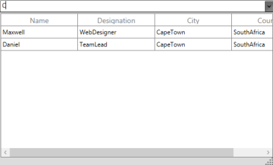

# Filtering

SfMultiColumnDropDownControl allows you to filter the item that is bound to the ItemsSource of the SfMulticolumnDropDown control. When you type on the Editor, it returns the suggestion for typed text based on the DisplayMember. 

* AllowIncrementalFiltering: This Boolean property specifies whether the items should be filtered based on the text in the Editor. 
* AllowCaseSensitiveFiltering: This Boolean property specifies whether the automatic completion of text and filtering are case-sensitive. 

The following code example illustrates how to enable IncrementalFiltering in SfMultiColumnDropDownControl,



<Window.DataContext>

  <local:Viewmodel/>

</Window.DataContext>

<syncfusion:SfMultiColumnDropDownControl x:Name="sfmulticolumn"

                                           AllowIncrementalFiltering="True"

                                           DisplayMember="Name" 

                                           ValueMember="Designation "                                                     

                                           ItemsSource="{Binding GridItemSource}">

<syncfusion:SfMultiColumnDropDownControl.Columns>

<syncfusion:GridTextColumn MappingName="Name" />

<syncfusion:GridTextColumn MappingName="Designation" />

<syncfusion:GridTextColumn MappingName="City" />

<syncfusion:GridTextColumn MappingName="Country" />

</syncfusion:SfMultiColumnDropDownControl.Columns>

</syncfusion:SfMultiColumnDropDownControl>

In above code example Name property is defined as DisplayMember. Therefore, when you start typing on the Editor, it filters the items that are in the Name Colum. The following screenshot displays the output for IncrementalFiltering.

### How To

#### How to Search MultipleColumn in SfMultiColumnDropDownControl?

By default, SfMultiColumnDropDownControl enables you to filter text based on the Display Member. However, you can override the FilterRecord method to search the MultipleColumn in SfMultiColumnDropDownControl. To achieve this, refer to the following code example.



class CustomMultiColumnControl:SfMultiColumnDropDownControl

{

    /// 

    /// Returns true if the item is displayed in the Filtered List, otherwise returns false.

    /// 

    /// <param name="item"></param>

    /// <returns></returns>

    protected override bool FilterRecord(object item)

        {

            var _item = item as Data;

            var textBox = FindDescendant(this, typeof(TextBox)) as TextBox;

            var result = (_item.Name.StartsWith(textBox.Text)) ||

                      (_item.City.StartsWith(textBox.Text));

            return result;

        }    /// 

    /// Gets the Object for the source from the source to the given type.

    /// 

    /// <param name="source"></param>

    /// <param name="typeDescendant"></param>

    /// <returns></returns>

    /// <remarks></remarks>

    public static DependencyObject FindDescendant(Object source, Type typeDescendant)

    {

        var startingFrom = source as DependencyObject;

        if (startingFrom is Popup)

            startingFrom = (startingFrom as Popup).Child;

        DependencyObject visual = null;

        bool result = false;

        int iCount = VisualTreeHelper.GetChildrenCount(startingFrom);

        for (int i = 0; i < iCount; ++i)

        {

            var child = VisualTreeHelper.GetChild(startingFrom, i) as DependencyObject;

            if (typeDescendant == child.GetType())

            {

                visual = child;

                result = true;

            }

            if (!result)

            {

                visual = FindDescendant(child, typeDescendant);

                if (visual != null)

                {

                    break;

                }

            }

            else

            {

                break;

            }

        }

        return visual;

    }

}

Here, Name is defined as DisplayMember. But it also searches the match case from the City__Column and displays the filtered item as illustrated in the following screenshot.

