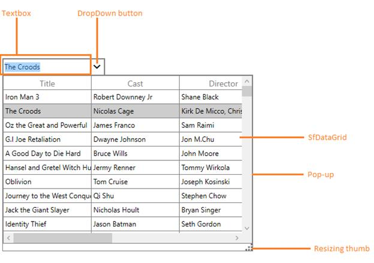
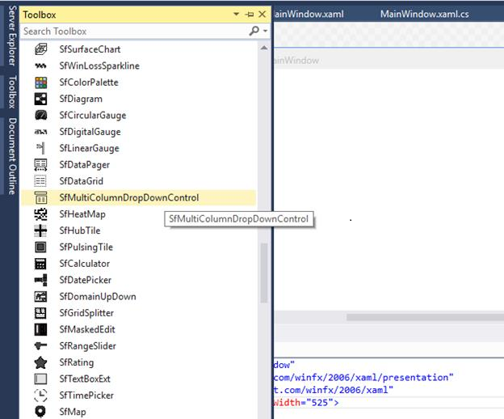
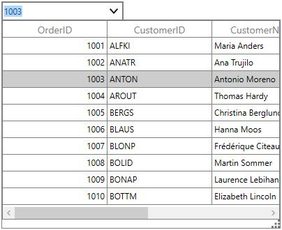

# Getting Started

Here, the assemblies that are required in WPF, to use SfMultiColumnDropDownControl are described.  Deploy the assemblies in your application. 

The following is the list of assemblies.

### List of assemblies

<table>
<tr>
<th>
Demanded Assemblies</th><th>
Description</th></tr>
<tr>
<td>
Syncfusion.Data.WPF</td><td>
Covers basic processing on data like sorting, grouping, and filtering.</td></tr>
<tr>
<td>
Syncfusion.SfGrid.WPF</td><td>
Covers SfMulticolumnDropDownControl and other elements included in. </td></tr>
<tr>
<td>
Syncfudion.Shared.WPF</td><td>
Covers editors like CurrencyTextBox, PercentEdit, DateTimeEdit.</td></tr>
</table>
Adding SfMultiColumnDropDown to an Application

You can either drag the control from Visual Studio or Expression Blend, or add the control to your project by manually creating it. The following code example illustrates how to create the SfMultiColumnDropDown control.



<Window xmlns:syncfusion="http://schemas.syncfusion.com/wpf">

<syncfusion:SfMultiColumnDropDownControl x:Name="sfmulticolumn"/>

</Window>



## Populating With Data

Once you have added the SfMultiColumnDropDownControl to your application, you may have to bind the collection of business objects to the control. The following properties enable binding the SfMultiColumnDropDownControl.

* SfMultiColumnDropDownControl.ItemsSource: Gets or sets the data source (IEnumerable) used to generate the content for the SfDataGrid present inside the DropDownPopup. The data source can be of any type ranging from ObservableCollection<T> to DynamicObjects.
* SfMultiColumnDropDownControl.DisplayMember: Gets or sets the field in the databound source, whose value is displayed in the Editor.
* SfMultiColumnDropDownControl.ValueMember: Gets or sets the field in the databound source that is used to compute the SelectedValue from the SelectedItem.

## Control Structure

The following screenshot illustrates the structure of the SfMultiColumnDropDown control.

Visual Structure of SfMultiColumnDropDownControl

## Create Simple Application with SfMultiColumnDropDownControl

Refer to the following steps to bind the data in SfMultiColumnDropDownControl

1. Create a business object class as Data.

   ~~~csharp

		public class Data:INotifyPropertyChanged

		{

		public string name;

		public string designation;

		public string city;

		public string country;

		public event PropertyChangedEventHandler PropertyChanged;

		public string Name

		{

		get { return name;}

		set {name=value; RaisePropertyChanged("Name");}

		}

		public string Designation

		{

		get { return designation; }

		set { designation = value; RaisePropertyChanged("Designation"); }

		}

		public string City

		{

		get { return city; }

		set { city = value; RaisePropertyChanged("City"); }

		}

		public string Country

		{

		get { return country; }

		set { country = value; RaisePropertyChanged("Country"); }

		}

		protected virtual void RaisePropertyChanged(string propertyName)

		{

		var handler = PropertyChanged;

		if (handler != null)

		handler(this, new PropertyChangedEventArgs(propertyName));

		}

		}

   ~~~

2. Create a new class as ViewModel. This class contains the property EmpDetails that s ItemsSource for SfMultiColumnDropdownControl.

   ~~~csharp

		public class Viewmodel : INotifyPropertyChanged

		{

		public Viewmodel()

		{

		EmpDetails = getData();

		}

		private ObservableCollection<Data> employeeDetails;

		public ObservableCollection<Data> EmpDetails

		{

		get

		{

		return employeeDetails;

		}

		set

		{

		employeeDetails = value;

		RaisePropertyChanged("EmpDetails");

		}

		}

		private ObservableCollection<Data> getData()

		{

		var item = new ObservableCollection<Data>();

		item.Add(new Data() { Name = "Stephen", Designation = "Softwareengineer", City = "Washington", Country = "USA" });

		item.Add(new Data() { Name = "Michael", Designation = "AccountsManager", City = "Parris", Country = "France" });

		item.Add(new Data() { Name = "Mike", Designation = "Senior AccountsManager", City = "Rom", Country = "Italy" });

		item.Add(new Data() { Name = "Maxwell", Designation = "WebDesigner", City = "CapeTown", Country = "SouthAfrica" });

		item.Add(new Data() { Name = "David", Designation = "PhpDeveloper", City = "Parris", Country = "France" });

		item.Add(new Data() { Name = "Hussey", Designation = "Quality Analyst", City = "Parris", Country = "France" });

		item.Add(new Data() { Name = "Daniel", Designation = "TeamLead", City = "CapeTown", Country = "SouthAfrica" });

		item.Add(new Data() { Name = "prabu", Designation = "ProductManager", City = "Chennai", Country = "India" });

		return item;

		}

		}
	
   ~~~	

3. Set the ViewModel instance as DataContext to window. Now you can bind the EmpDetails property in ViewModel as ItemsSource to SfMultiColumnDropdownControl.

   ~~~xaml
   
		<Window.DataContext>

		<local:Viewmodel/>

		</Window.DataContext>

		<syncfusion:SfMultiColumnDropDownControl x:Name="sfmulticolumn"

		ItemsSource="{Binding EmpDetails}"

		DisplayMember="Name"

		ValueMember="Designation" >                                         

   ~~~		
                                           

The following screenshot illustrates the output of the above code.

SfMuticolumnDropDownControl
{:.caption}

### Add SfMultiColumnDropDownControl inside the SfDataGrid

SfDataGrid allows you to add the SfMultiColumnDropDownControl inside it as column. SfDataGrid contains column type as GridMultiColumnDropDownList, it loads the SfMulticolumnDropDownControl inside the SfDataGrid. 

The following code example illustrates how to add SfMultiColumnDropDownControl inside the SfDataGrid.



<Window.DataContext>

<local:Viewmodel/>

</Window.DataContext>

<syncfusion:SfDataGrid Grid.Row="0" AutoGenerateColumns="False" 

ItemsSource="{Binding SFSource }" >

syncfusion:SfDataGrid.Columns>

<syncfusion:GridTextColumn MappingName="Name"/>

<syncfusion:GridTextColumn MappingName="Designation"/>

<syncfusion:GridTextColumn MappingName="City"/>

<syncfusion:GridMultiColumnDropDownList ItemsSource="{Binding EmpDetails}"

DisplayMember="Name"                                                                                                                                                                                                                    

ValueMember="Designation"

MappingName="Name"                  

AutoGenerateColumns="False"

AllowEditing="True">                                                        

<syncfusion:GridMultiColumnDropDownList.Columns >

<syncfusion:Columns>

<syncfusion:GridTextColumn MappingName="Name" />

<syncfusion:GridTextColumn MappingName="Designation" />

<syncfusion:GridTextColumn MappingName="City" />

<syncfusion:GridTextColumn MappingName="Country" />                        

</syncfusion:Columns>

</syncfusion:GridMultiColumnDropDownList.Columns >

</syncfusion:GridMultiColumnDropDownList>

</syncfusion:SfDataGrid.Columns>

</syncfusion:SfDataGrid>



The following screenshot displays the output for MultiColumnControl inside the SfDataGrid.

SfMuticolumnDropDownContorl inside SfDataGrid
{:.caption}

