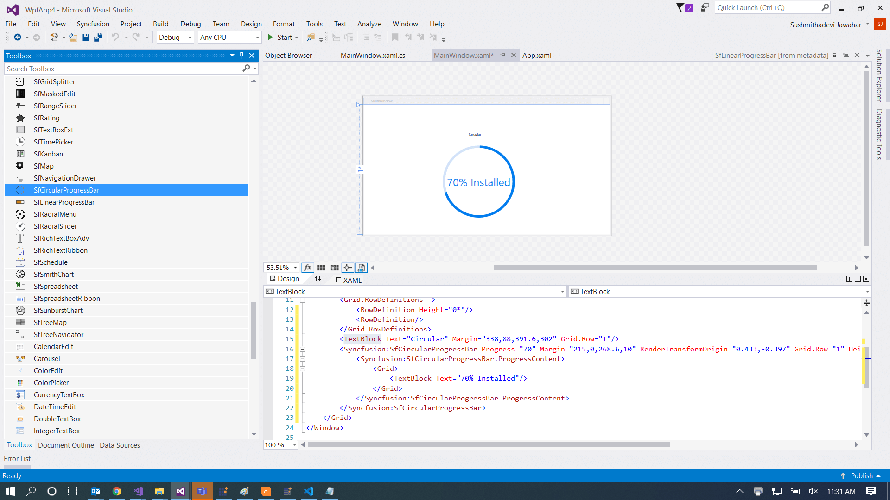

# Getting Started

## Assembly deployment

Refer to the [control dependencies](https://help.syncfusion.com/wpf/control-dependencies#) section to get the list of assemblies or NuGet package that needs to be added as a reference to use the control in any application.

You can find more details about installing the NuGet package in a WPF application in the following link: 

[How to install nuget packages](https://help.syncfusion.com/wpf/nuget-packages)

## Creating a simple application with SfCircularProgressBar

You can create a WPF application with the SfCircularProgressBar control using the following steps:

## Create a project

Create a new WPF project in Visual Studio to display the SfCircularProgressBar with functionalities.

## Add control through designer

The SfCircularProgressBar control can be added to an application by dragging it from the toolbox to a designer view. The following assembly references are added automatically:

* Syncfusion.SfProgressBar.WPF 

## Add control manually in XAML

To add control manually in XAML, follow the given steps:

1.	Add the following required assembly references to the project:
    * Syncfusion.SfProgressBar.WPF     
2.	Import Syncfusion WPF schema **http://schemas.syncfusion.com/wpf** the in XAML page.
3.	Declare the SfCircularProgressBar control in the XAML page.



<Window
        xmlns="http://schemas.microsoft.com/winfx/2006/xaml/presentation"
        xmlns:x="http://schemas.microsoft.com/winfx/2006/xaml"
        xmlns:d="http://schemas.microsoft.com/expression/blend/2008"
        xmlns:mc="http://schemas.openxmlformats.org/markup-compatibility/2006"
        xmlns:local="clr-namespace:WpfApp4"
        xmlns:Syncfusion="http://schemas.syncfusion.com/wpf" x:Class="WpfApp4.MainWindow"
        mc:Ignorable="d"
        Title="MainWindow" Height="450" Width="800">
     <Grid>
        <Grid.RowDefinitions  >
            <RowDefinition Height="67*"/>
            <RowDefinition Height="143*"/>
        </Grid.RowDefinitions><TextBlock Text="Circular"    Margin="344,5.6,384.6,280.8" Grid.Row="1"/>
        <Syncfusion:SfCircularProgressBar Progress="70" Margin="215,5.6,268.6,9.8" RenderTransformOrigin="0.433,-0.397" Grid.Row="1" >
            <Syncfusion:SfCircularProgressBar.ProgressContent>
                <Grid>
                    <TextBlock Text="70% Installed"/>
                </Grid>
            </Syncfusion:SfCircularProgressBar.ProgressContent>
        </Syncfusion:SfCircularProgressBar>
        </Grid>
</Window>



## Add control manually in C#

To add control manually in C#, follow the given steps:

1.	Add the following required assembly references to the project:
   * Syncfusion.SfProgressBar.WPF
2.	Import the SfCircularProgressBar namespace **using Syncfusion.UI.Xaml.ProgressBar;**.
3.	Create an SfCircularProgressBar instance, and add it to the window.



using Syncfusion.UI.Xaml.ProgressBar;
namespace SfProgressBar
{
    /// 

    /// Interaction logic for MainWindow.xaml
    /// 

    public partial class MainWindow : Window
    {                  
        public MainWindow()
        {
            InitializeComponent();          
            SfCircularProgressBar circular = new SfCircularProgressBar();
            circular.Progress = 70;
            circular.ProgressContent = "70 % Installed";
        }      
    }
}

