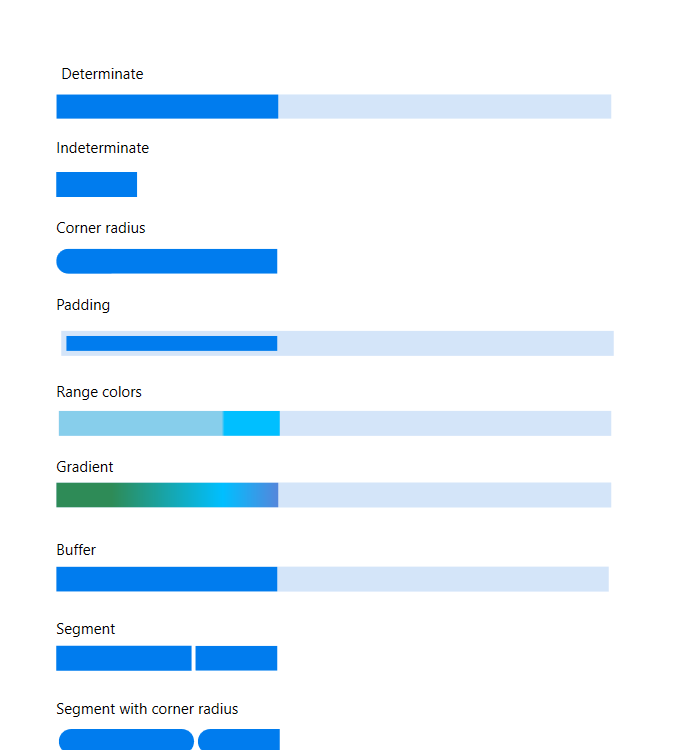

# Overview

The SfLinearProgressBar control for in wpf provides a customizable visual to indicate the progress of a lengthy operation and let users know the remaining time for completion.

SfLinearProgressBar 
{:.caption}

## Key Features

### Determinate and Indeterminate
Determinate shows specific quantity of progress that occurred and indeterminate shows a redundant animations of linear progress.

### Corner radius
It customizes the rounded edges in the linear ProgressBar.

### Padding
Padding generates space around the linear ProgressBar.

### Ranges
Customizes the ranges with different colors in linear progress bar. Specifies the start position and end position to visualize multiple ranges with different colors that are mapped to each range.

### Gradient 
Gradient shows change in intensity of the colors during the linear progress.

### Segments
Segment splits the ProgressBar into multiple segments and indicates the progress.

### Corner radius
It customizes the rounded edges in the linear ProgressBar.

### Segment with corner radius
Segment with corner radius splits the LinearProgressBar into multiple segments with the rounded edges at the corner.

