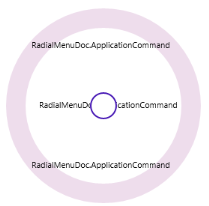
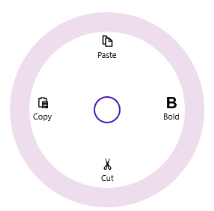
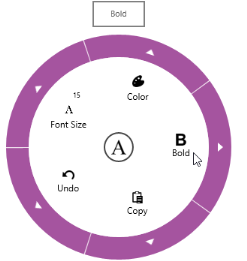

## Concepts 

### Populating Items 

Items Source  

Radial menu items can be populated with the business object collection. Let us create a RadialMenu which will show the list of Application commands.   

The Application command model look likes below.  

[C#]  

  public class ApplicationCommand

    {

        public string Name { get; set; }

        public string ImagePath { get; set; }

        public ICommand Command { get; set; }

    }

Create the Application command collection as follows. 

[C#]

private List<ApplicationCommand> options;

public List<ApplicationCommand> Options

   {

            get { return options; }

            set { options = value; }

   }

Populate the Application command collection as follows. 

[C#]

 Options = new List<ApplicationCommand>(); 

 Options.Add(new ApplicationCommand() { Name="Bold" , ImagePath="bold.png" });    			  Options.Add(new ApplicationCommand() { Name = "Cut" , ImagePath="cut.png"}); 

 Options.Add(new ApplicationCommand() { Name = "Copy" ,ImagePath="copy.png"}); 

 Options.Add(new ApplicationCommand() { Name = "Paste" ,ImagePath="paste.png"});

Bind the Application command collection to the ItemsSource property of the RadialMenu control. 

[XAML]

&lt;navigation:SfRadialMenu IsOpen="True" ItemsSource="{Binding Options}"/&gt;

This will populate the RadialMenu as shown in the image below. 

{  | markdownify }
{:.image }

Display Member Path 

DisplayMemberPath property of the Radial Menu used to define which business model property needs to be displayed inside the header of the Radial Menu items.

[XAML]

<navigation:SfRadialMenu IsOpen="True" ItemsSource="{Binding Options}"

DisplayMemberPath="Name"

                         />

{  | markdownify }
{:.image }

_Displaying member path_

Command Path

CommandPath property of the Radial Menu can be used to bind the command in the business object to the radial menu item when items are populated using data binding. 

[XAML]

<navigation:SfRadialMenu IsOpen="True" DisplayMemberPath="Name" CommandPath="Command"

                                 ItemsSource="{Binding Options}" />

Item Template 

ItemTemplate property of the RadialMenu can be used to customize the header part of the radial menu items.  

[XAML]   

&lt;navigation:SfRadialMenu IsOpen="True" ItemsSource="{Binding Options}"&gt;

            &lt;navigation:SfRadialMenu.ItemTemplate&gt;

                &lt;DataTemplate&gt;

                    &lt;StackPanel &gt;

                        &lt;Image Height="15" Width="15" Source="{Binding ImagePath}"/&gt;

                        &lt;TextBlock Margin="0,5,0,0" Text="{Binding Name}"/&gt;

                    &lt;/StackPanel&gt;

                &lt;/DataTemplate&gt;

            &lt;/navigation:SfRadialMenu.ItemTemplate&gt;

   &lt;/navigation:SfRadialMenu&gt;

{  | markdownify }
{:.image }

### Icon  

The Icon property of the RadialMenu is used to customize the icon displayed in the center of RadialMenu circle.   

[XAML]

&lt;navigation:SfRadialMenu IsOpen="True" &gt;

&lt;navigation:SfRadialMenu.Icon&gt;

                &lt;Grid Background="White"&gt;

                    <Image Source="ms-appx:///Assets/text.png" Width="20"  

 	 	 	                Stretch="Uniform"/>

                &lt;/Grid&gt;

            &lt;/navigation:SfRadialMenu.Icon&gt;

 &lt;/navigation:SfRadialMenu&gt;

{  | markdownify }
{:.image }

### Populating Color Palette

Color Palette can be formed in Radial Menu with the Radial Color Items. 

[XAML]

&lt;navigation:SfRadialMenu IsOpen="True" &gt;

    &lt;navigation:SfRadialMenuItem Header="Font Color"&gt;

       &lt;navigation:SfRadialMenuItem Header="Font"/&gt;

       &lt;navigation:SfRadialColorItem Color="Red"&gt;

           &lt;navigation:SfRadialColorItem Color="DarkRed"/&gt;

           &lt;navigation:SfRadialColorItem Color="IndianRed"/&gt;

           &lt;navigation:SfRadialColorItem Color="OrangeRed"/&gt;

           &lt;navigation:SfRadialColorItem Color="MediumVioletRed"/&gt;

       &lt;/navigation:SfRadialColorItem&gt;

       &lt;navigation:SfRadialColorItem Color="Green"/&gt;

       &lt;navigation:SfRadialColorItem Color="Blue"/&gt;

     &lt;/navigation:SfRadialMenuItem&gt;

&lt;/navigation:SfRadialMenu&gt;

{  | markdownify }
{:.image }

### ToolTip

Tootip support available for the radial menu items. This will show when mouse over the corresponding item. 

ToolTip Placement

Position of the tooltip displayed relative to the Radial Menu can be customized using ToolTipPlacement property. This have the following options.

* None: Tooltip is hidden from the display.
* Left: Tooltip is displayed left of the Radial Menu. 
* Top: Tooltip is displayed on top of the Radial Menu.
* Right: Tooltip is displayed right of the Radial Menu.
* Bottom: Tooltip is displayed at the bottom of the Radial Menu.

[XAML]

&lt;navigation:SfRadialMenuItem  ToolTip="Bold" ToolTipPlacement="Top"  /&gt;

{  | markdownify }
{:.image }

### Layout Types

There are two different layout types available for SfRadialMenu.

* Default
* Custom

 Both the layout types divide the available space equally among all the children in the circular panel.

Default

Number of segments in the panel is determined by children count in the level. Hence segment count in each hierarchical level differs. RadialMenuItem is arranged in the sequential order as added in the RadialMenu.

Custom

Number of segments in the panel is determined by VisibleSegmentsCount property. Hence segment count in all the hierarchical levels are same. RadialMenuItem is arranged in any order based on the SegmentIndex property.

VisibleSegmentsCount

VisibleSegmentsCount property is used to specify the number of segments available in circular panel. When children count is greater than the value given in VisibleSegmentsCount property then overflowing children are not arranged in the panel. When children count is lesser than VisibleSegmentsCount property then remaining segments are left free.

<table>
<tr>
<td>
[XAML]&lt;navigation:SfRadialMenu LayoutType="Custom" VisibleSegmentsCount="7" /&gt;</td></tr>
<tr>
<td>
[C#]SfRadialMenu radialMenu = new SfRadialMenu();radialMenu.LayoutType = LayoutType.Custom; radialMenu.VisibleSeggmentsCount = 7; </td></tr>
</table>
SegmentIndex

SegmentIndex property is used to specify the index of the SfRadialMenuItem in circular panel. Based on the index, the RadialMenuItems are inserted in the segment. When SegmentIndex is not specified for a RadialMenuItem (or) two or more RadialMenuItems having the same SegmentIndex, then the menu item is arranged in the next available free segment. 

<table>
<tr>
<td>
[XAML] &lt;navigation:SfRadialMenu LayoutType="Custom" VisibleSegmentsCount="7" /&gt;   &lt;navigation:SfRadialMenuItem Header="Item  2" SegmentIndex="1" /&gt;   &lt;navigation:SfRadialMenuItem Header="Item 5" SegmentIndex="4" /&gt;   &lt;navigation:SfRadialMenuItem Header="Item 1" SegmentIndex="0" /&gt;   &lt;navigation:SfRadialMenuItem Header="Item 6" SegmentIndex="5" /&gt;   &lt;navigation:SfRadialMenuItem Header="Item 3" SegmentIndex="2" /&gt;&lt;/navigation:SfRadialMenu&gt; </td></tr>
<tr>
<td>
[C#]SfRadialMenu radialMenu = new SfRadialMenu();radialMenu.LayoutType = LayoutType.Custom; radialMenu.VisibleSeggmentsCount = 7; SfRadialMenuItem item2 = new SfRadialMenuItem() { Header = "Item 2", SegmentIndex = 1 };               SfRadialMenuItem item5 = new SfRadialMenuItem() { Header   ="Item 5", SegmentIndex = 4 };SfRadialMenuItem item1 = new SfRadialMenuItem() { Header = "Item 1", SegmentIndex = 0 };SfRadialMenuItem item6 = new SfRadialMenuItem() { Header = "Item 6", SegmentIndex = 5 };SfRadialMenuItem item3 = new SfRadialMenuItem() { Header = "Item 3",SegmentIndex = 2 };radialMenu.Items.Add(item2);radialMenu.Items.Add(item5);radialMenu.Items.Add(item1);radialMenu.Items.Add(item6); radialMenu.Items.Add(item3); </td></tr>
</table>

{  | markdownify }
{:.image }

