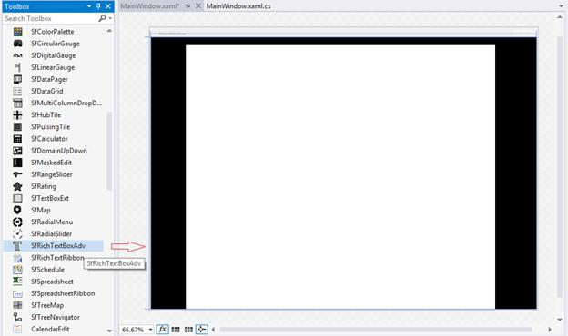
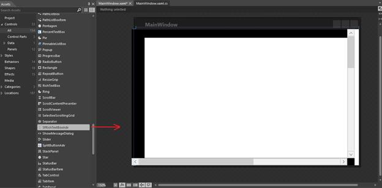

### Add RichTextBoxAdv to an Application 

The following assembly references are required to deploy the **RichTextBoxAdv** control and its namespace:

* Assembly - Syncfusion.SfRichTextBoxAdv.WPF
* Dependent Assemblies - Syncfusion.Compression.Base, Syncfusion.OfficeChart.Base, Syncfusion.Shared.WPF
For 3.5 and 4.0 Frameworks: Syncfusion.DocIO.ClientProfile
For 4.5 and higher Frameworks: Syncfusion.DocIO.Base
* Namespace - Syncfusion.Windows.Controls.RichTextBoxAdv

**Create** **the** **RichTextBoxAdv** **control** **in** **Visual** **Studio**:

1. Create a new Windows Desktop WPF application project.
2. Drag the **SfRichTextBoxAdv** control from the **Toolbox** window to the Design View. An instance of the **RichTextBoxAdv** control is created in the Design view.

**Create** **the** **RichTextBoxAdv** **control** **in** **Blend** **for** **Visual** **Studio**:

1. Create a new Windows Desktop WPF Application project.
2. Drag the **SfRichTextBoxAdv** control from the **Assets** window to the Design View. An instance of the **RichTextBoxAdv** control is created in the Design view.

The following code example demonstrates how to add the **RichTextBoxAdv** control using XAML.


<syncfusion:SfRichTextBoxAdv x:Name="richTextBoxAdv" xmlns:syncfusion="clr-namespace:Syncfusion.Windows.Controls.RichTextBoxAdv;assembly=Syncfusion.SfRichTextBoxAdv.WPF" />



The following code example demonstrates how to load a “.docx” file into the **RichTextBoxAdv** control.


//Loads the file from the specified path in Asynchronous mode.

string filePath = "D:/Sample.docx";

richTextBoxAdv.LoadAsync(filePath);

//Disposes the RichTextBoxAdv instance.

richTextBoxAdv.Dispose();



## 

