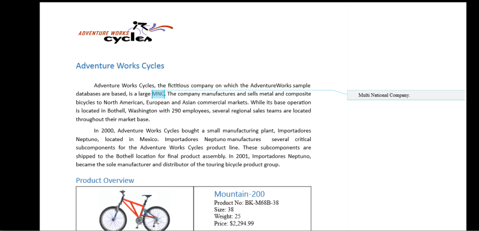

# Comments

A Comment is a note or annotation that an author or reviewer can add to the document. The **RichTextBoxAdv** control supports to view and edit the comment in the Word document. It renders the comments present in the document in the review pane, similar to the Microsoft Word.

_Table_ _15_: _CommentAdv Properties_

<table>
<tr>
<th>
Properties</th><th>
Type</th><th>
Class</th><th>
Description</th></tr>
<tr>
<td>
Author</td><td>
string</td><td>
CommentAdv</td><td>
Gets or sets the author’s name for a comment.</td></tr>
<tr>
<td>
Blocks</td><td>
BlockAdvCollection</td><td>
CommentAdv</td><td>
Gets the block collection for a comment.</td></tr>
<tr>
<td>
Date</td><td>
DateTime</td><td>
CommentAdv</td><td>
Gets the date and time that the comment was entered.</td></tr>
<tr>
<td>
Initial</td><td>
string</td><td>
CommentAdv</td><td>
Gets or sets the initial of the author for a comment.</td></tr>
</table>

## UI Commands for accessing the comment

The following operations can be performed through command binding in the **RichTextBoxAdv** control: 

* Insert a new comment.
* Delete an existing comment.
* Navigate to the next comment.
* Navigate to the previous comment.
* Show/Hide the review pane.

The following code exaample demonstrates how to bind the commands for accessing comment in the **RichTextBoxAdv** document. 



/Binds the button to the ShowCommentsCommand.

<Button Content="Show Comments" Command="{Binding ElementName=richTextBoxAdv, Path=ShowCommentsCommand, Mode=TwoWay}" />

//Binds the button to the NewCommentCommand.

<Button Content="New Comment" Command="{Binding ElementName= richTextBoxAdv, Path=NewCommentCommand, Mode=TwoWay}" />

//Binds the button to the DeleteCommentCommand.

<Button Content="Delete Comment" Command="{Binding ElementName=richTextBoxAdv, Path=DeleteCommentCommand, Mode=TwoWay}"/>

//Binds the button to the PreviousCommentCommand.

<Button Content="Previous Comment" Command="{Binding ElementName=richTextBoxAdv, Path=PreviousCommentCommand, Mode=TwoWay}" />

//Binds the button to the NextCommentCommand.

<Button Content="Next Comment" Command="{Binding ElementName=richTextBoxAdv, Path=NextCommentCommand, Mode=TwoWay}" /> 



## CommentAdding event

The **RichTextBoxAdv** supports customization of the comment properties like Author, Initial, Blocks and its visual style by using the CommentAdding event. This event is triggered when a comment is added to the **RichTextBoxAdv** document.

_Table_ _16_: _CommentAdding event_

<table>
<tr>
<th>
Event</th><th>
Parameters</th><th>
Class</th><th>
Description</th></tr>
<tr>
<td>
CommentAdding</td><td>
CommentAddingEventArgs</td><td>
SfRichTextBoxAdv </td><td>
Occurs when a CommentAdv has been constructed and added to the SfRichTextBoxAdv document.</td></tr>
</table>

The CommentAddingEventArgs class is used to access the comment and its visual style when a comment is added to the **RichTextBoxAdv** document.

_Table_ _17_: _CommentAddingEventArgs Properties_

<table>
<tr>
<th>
Properties</th><th>
Type</th><th>
Class</th><th>
Description</th></tr>
<tr>
<td>
Comment</td><td>
CommentAdv</td><td>
CommentAddingEventArgs</td><td>
Gets the comment added to the document.</td></tr>
<tr>
<td>
VisualStyle</td><td>
CommentVisualStyle</td><td>
CommentAddingEventArgs</td><td>
Gets the comment's visual style for the comment added.</td></tr>
</table>
The CommentVisualStyle class is used to define the visual appearance of a comment in the **RichTextBoxAdv**.

_Table_ _18_: _CommentVisualStyle Properties_

<table>
<tr>
<th>
Properties</th><th>
Type</th><th>
Class</th><th>
Description</th></tr>
<tr>
<td>
BackgroundBrush</td><td>
Brush</td><td>
CommentVisualStyle</td><td>
Gets or sets the background brush of a comment.</td></tr>
<tr>
<td>
BorderBrush</td><td>
Brush</td><td>
CommentVisualStyle</td><td>
Gets or sets the border brush of a comment.</td></tr>
<tr>
<td>
HighlightColor</td><td>
Color</td><td>
CommentVisualStyle</td><td>
Gets or sets the highlight color of a comment.</td></tr>
</table>

The following code example demonstrates how to implement the CommentAdding event handler for the **RichTextBoxAdv**.



//Hooks the event handler for the CommentAdding event.

richTextBoxAdv.CommentAdding += richTextBoxAdv_CommentAdding;

//Unhooks the event handler for the CommentAdding event.

richTextBoxAdv.CommentAdding -= richTextBoxAdv_CommentAdding;

/// 

/// Handles the CommentAdding event of the richTextBoxAdv control.

/// 

/// <param name="obj">The source of the event.</param>

/// <param name="args">The <see cref="CommentAddingEventArgs"/> instance containing the event data.</param>

void richTextBoxAdv_CommentAdding(object obj, CommentAddingEventArgs args)

{

    if (!isFileLoading)

    {

        //Defines the author and initial for the comment.

        args.Comment.Author = "Peter";

        args.Comment.Initial = "Franken";

    }

    //Defines the visual style of the comment in the RichTextBoxAdv.

    args.VisualStyle.BackgroundBrush = new SolidColorBrush(Color.FromArgb(0xff, 0xff, 0x00, 0x00));

    args.VisualStyle.BorderBrush = new SolidColorBrush(Color.FromArgb(0xff, 0x00, 0xff, 0x00));

    args.VisualStyle.HighlightColor = Color.FromArgb(0xff, 0x00, 0x00, 0xff);

}

