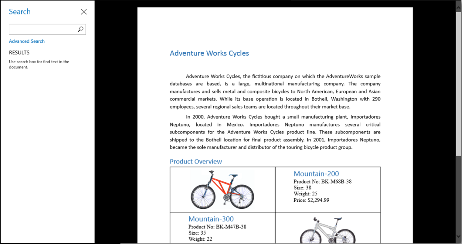
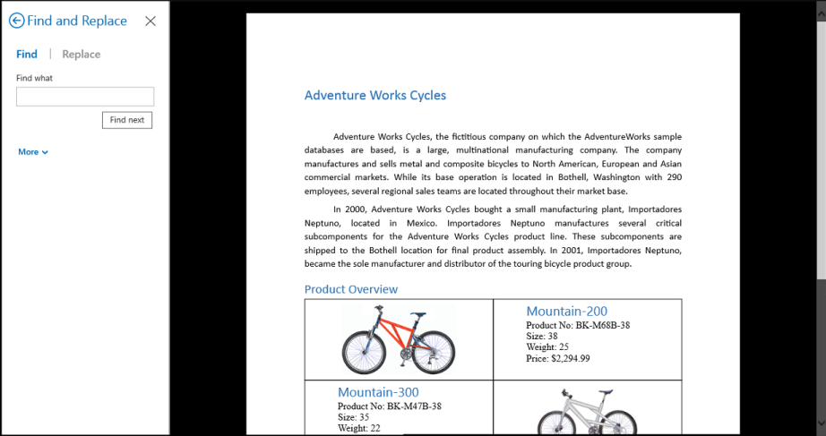
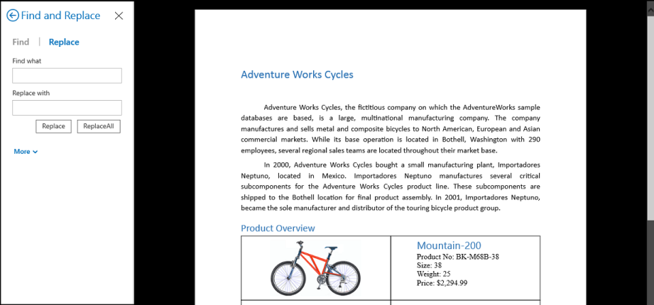

---
layout: post
title: Find-and-Replace-text
description: find and replace text
platform: wpf
control: RichTextBoxAdv
documentation: ug
---

# Find and Replace text

The RichTextBoxAdv control provides support to find and replace text contents in the document. You can find the text in the document and replace a single or all occurrence of the text with another text. You can extend your search by using regular expression to find a particular pattern of text in the document. This helps you to modify the contents easily.

The following table describes the methods of RichTextBoxAdv to find the occurrence of text.

_Table_ _19_: _SfRichTextBoxAdv find methods_

<table>
<tr>
<th>
Method Name</th><th>
Return Type</th><th>
Class</th><th>
Parameters</th><th>
Description</th></tr>
<tr>
<td>
Find</td><td>
TextSearchResultReturns the text search result, if any text matched. Otherwise returns null.</td><td>
SfRichTextBoxAdv</td><td>
1. string textToFind, 2. FindOptions option</td><td>
Finds the first occurrence of specified text in the document from current selection.</td></tr>
<tr>
<td>
Find</td><td>
TextSearchResultReturns the text search result, if any text matched. Otherwise returns null.</td><td>
SfRichTextBoxAdv</td><td>
1. Regex pattern, 2. FindOptions option</td><td>
Finds the first occurrence of specified regular expression in the document from current selection.</td></tr>
<tr>
<td>
FindAll</td><td>
TextSearchResultsReturns the text search results, if any text matched. Otherwise returns null.</td><td>
SfRichTextBoxAdv</td><td>
1. string textToFind, 2. FindOptions option</td><td>
Finds all the occurrence of specified text in the entire document.</td></tr>
<tr>
<td>
FindAll</td><td>
TextSearchResultsReturns the text search results, if any text matched. Otherwise returns null.</td><td>
SfRichTextBoxAdv</td><td>
1. Regex pattern, 2. FindOptions option</td><td>
Finds all the occurrence of specified regular expression in the entire document.</td></tr>
</table>

The following table describes the find option enumeration.

_Table_ _20_: _SfRichTextBoxAdv find option enumeration._

<table>
<tr>
<th>
FindOptions</th><th>
Value</th><th>
Description</th></tr>
<tr>
<td>
None</td><td>
0</td><td>
Specifies the default find option; Uses case-independent, arbitrary character boundaries.</td></tr>
<tr>
<td>
WholeWord</td><td>
1</td><td>
Specifies the find option to match whole words only.</td></tr>
<tr>
<td>
CaseSensitive</td><td>
2</td><td>
Specifies the find option to match case sensitive.</td></tr>
<tr>
<td>
CaseSensitiveWholeWord</td><td>
3</td><td>
Specifies the find option to match case sensitive and whole words.</td></tr>
</table>

The following code example explains how to find and replace contents in RichTextBoxAdv document.



FindOptions option = FindOptions.CaseSensitive;

// Finds the occurrence of specified text that matches case in RichTextBoxAdv document from current selection.

TextSearchResult textSearchResult = richTextBoxAdv.Find("the", option);

// Finds the occurrence of specified pattern (text starts with ‘S’) that matches case in RichTextBoxAdv document from current selection.

TextSearchResult textSearchResult = richTextBoxAdv.Find(new Regex(@"\bS\S*"), option);

// Replaces the search result text with the specified text

textSearchResult.Replace("an");

// Finds all the occurrence of specified text that matches case in RichTextBoxAdv document.

TextSearchResults textSearchResults = richTextBoxAdv.FindAll("the", option);

// Finds all the occurrence of specified pattern (text starts with ‘S’) that matches case in RichTextBoxAdv document.

TextSearchResults textSearchResults = richTextBoxAdv.FindAll(new Regex(@"\bS\S*"), option);

// Replaces all the search result text with the specified text

textSearchResults.ReplaceAll("an");



## Built-in Options Pane

The RichTextBoxAdv provides the built-in options paneto find the text and navigate to text results similar to Microsoft Word application. It also provides separate pane for advanced find and replace options. You can enable the options pane to view by keyboard shortcut CTRL + F key or binding ShowOptionsPaneCommand.

You can optionally specify the pane type to be shown in the RichTextBoxAdvOptionsPane. The following table describes all the pane types.

_Table_ _21_: _SfRichTextBoxAdv pane type enumeration_

<table>
<tr>
<th>
PaneType</th><th>
Value</th><th>
Description</th></tr>
<tr>
<td>
Find</td><td>
0</td><td>
Specifies the options pane with simple text find and result navigation.</td></tr>
<tr>
<td>
AdvancedFind</td><td>
1</td><td>
Specifies the options pane with advanced find options.</td></tr>
<tr>
<td>
Replace</td><td>
2</td><td>
Specifies the options pane with advanced replace options.</td></tr>
</table>

The following code example explains how to show the OptionsPane of RichTextBoxAdv using command binding.



<!-- Binding Button to ShowOptionsPaneCommand that shows the default option pane  -->

<Button Content="Show Options Pane" Command="{Binding ElementName=richTextBoxAdv, Path=ShowOptionsPaneCommand}" />

<!-- Binding Button to ShowOptionsPaneCommand that shows the option pane with advanced replace options -->

<Button Content="Show Options Pane" Command="{Binding ElementName=richTextBoxAdv, Path=ShowOptionsPaneCommand}" CommandParameter="Replace" />



N>  Currently, the RichTextBoxAdv does not support options pane in Windows Phone platform.

## Text Search Result

### TextSearchResult

The TextSearchResult class represents the text search result in the RichTextBoxAdv document. You can replace the text search result with required text using Replace method of this instance.

_Table_ _22_: _TextSearchResult properties_

<table>
<tr>
<th>
Property</th><th>
Type</th><th>
Class</th><th>
Description</th></tr>
<tr>
<td>
Start</td><td>
TextPosition</td><td>
TextSearchResult</td><td>
Gets the start text position of the result.</td></tr>
<tr>
<td>
End</td><td>
TextPosition</td><td>
TextSearchResult</td><td>
Gets the end text position of the result.</td></tr>
<tr>
<td>
Text</td><td>
string</td><td>
TextSearchResult</td><td>
Gets the text result.</td></tr>
</table>

_Table_ _23_: _TextSearchResult methods_

<table>
<tr>
<th>
Method</th><th>
Return Type</th><th>
Parameters</th><th>
Description</th></tr>
<tr>
<td>
Replace</td><td>
void</td><td>
string replaceText</td><td>
Replaces the text result with the specified text.</td></tr>
<tr>
<td>
Dispose</td><td>
void</td><td>
</td><td>
Releases all the resources used by this TextSearchResult instance.</td></tr>
</table>

The TextSearchResults class represents the collection of text search result in the RichTextBoxAdv document. You can replace all the text search results one by one with the required text using Replace method of this instance. You can also replace all the text search results directly with same text using ReplaceAll method of this instance

_Table_ _24_: _TextSearchResults properties._

<table>
<tr>
<th>
Property</th><th>
Type</th><th>
Class</th><th>
Description</th></tr>
<tr>
<td>
Indexer</td><td>
TextSearchResult</td><td>
TextSearchResults</td><td>
Gets the TextSearchResult instance at the specified index.</td></tr>
<tr>
<td>
Count</td><td>
int</td><td>
TextSearchResults</td><td>
Gets the searched text results count.</td></tr>
</table>

_Table_ _25_: _TextSearchResults methods._

<table>
<tr>
<th>
Method</th><th>
Return Type</th><th>
Parameters</th><th>
Description</th></tr>
<tr>
<td>
Replace</td><td>
void</td><td>
string replaceText</td><td>
Replaces the current text search result.</td></tr>
<tr>
<td>
ReplaceAll</td><td>
void</td><td>
string replaceText</td><td>
Replaces all the text search results.</td></tr>
<tr>
<td>
Dispose</td><td>
void</td><td>
</td><td>
Releases all the resources used by current list.</td></tr>
</table>

