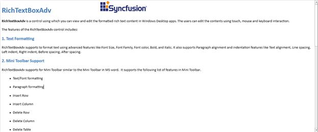
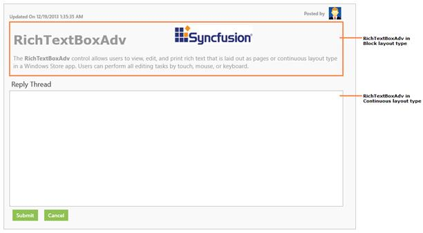

### Layout types

1. Pages - In the **Pages** **Layout** type, the rich-text content is rendered sequentially in several pages similar to the Print Layout view of the Microsoft Word.


<syncfusion:SfRichTextBoxAdv x:Name="richTextBoxAdv" LayoutType="Pages" xmlns:syncfusion="clr-namespace:Syncfusion.Windows.Controls.RichTextBoxAdv;assembly=Syncfusion.SfRichTextBoxAdv.WPF" />




//Sets the layout type as pages.

richTextBoxAdv.LayoutType = LayoutType.Pages;



2. Continuous - In the **Continuous** **Layout** type, the entire rich-text content is rendered continuously in a single page similar to the Web Layout view of the Microsoft Word. This layout looks like a simple textbox with rich-text content and can be used for applications such as forums and blogs.


<syncfusion:SfRichTextBoxAdv x:Name="richTextBoxAdv" LayoutType="Continuous" xmlns:syncfusion="clr-namespace:Syncfusion.Windows.Controls.RichTextBoxAdv;assembly=Syncfusion.SfRichTextBoxAdv.WPF" />




//Sets the layout type as continuous.

richTextBoxAdv.LayoutType = LayoutType.Continuous;



3. Block - In the **Block** **Layout** type, the rich-text content is rendered as read only in a single page. This layout looks like a simple text block with rich-text content such as texts, images, and tables. **Block** **Layout** also supports copying contents to the clipboard. This can be used for applications such as forums and blogs in order to display the rich-text contents with same look and feel as in the continuous layout type.


<syncfusion:SfRichTextBoxAdv x:Name="richTextBoxAdv" LayoutType="Block" xmlns:syncfusion="clr-namespace:Syncfusion.Windows.Controls.RichTextBoxAdv;assembly=Syncfusion.SfRichTextBoxAdv.WPF" />




//Sets the layout type as block.

richTextBoxAdv.LayoutType = LayoutType.Block;



