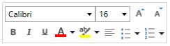

### Mini Toolbar support 

The **RichTextBoxAdv** provides support for built-in **Mini** **Toolbar** that is enabled by default. You can enable/disable the built-in Mini Toolbar by using the **EnableMiniToolBar** property of the **RichTextBoxAdv**. 

The following code example demonstrates how to disable the built-in mini toolbar in the **RichTextBoxAdv**. 


<syncfusion:SfRichTextBoxAdv x:Name="richTextBoxAdv" EnableMiniToolBar="False" xmlns:Syncfusion="clr-namespace:Syncfusion.Windows.Controls.RichTextBoxAdv;assembly=Syncfusion.SfRichTextBoxAdv.WPF" />




//Disables the built-in mini toolbar in the RichTextBoxAdv.

richTextBoxAdv.EnableMiniToolBar = false;



__**Note**____**:**__ __**The**__ __**mini**__ __**tool**__ __**bar**__ __**is**__ __**automatically**__ __**disabled**__ __**when**__ __**IsReadOnly**__ __**property**__ __**is**__ __**set**__ __**to**__ __**True**__ __**and**__ __**also**__ __**in**__ __**Block**__ __**layout**____**.**____****__

