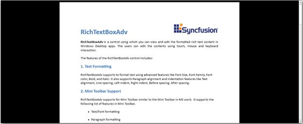

## Overview

The **RichTextBoxAdv** control allows you to view, edit and print rich-text that renders as pages or as continuous layout in a Windows Store application. You can perform all editing tasks by using touch, mouse, or keyboard.

The following image displays the **RichTextBoxAdv** Control.

**Features** **of** **the** **RichTextBoxAdv** **control**:

* View and edit rich-text, images and tables.
* Import or export rich-text format (.rtf) files, Word documents (.doc, .docx), Html (.html), Xaml (.xaml) and text files (.txt).
* Print rendered content.
* Supports all image types except for metafile images.
* Supports undo and redo operations such as editing text, table, rows, cells and formatting.
* Supports first-page headers and footers as well as odd and even page headers and footers. 
* The ability to cut, copy, and paste the rich-text content to and from the **RichTextBoxAdv**.
* Supports find and replace text in a document.
* Add notes to the document by using the Word-like comment support.
* Supports opening encrypted Word documents with valid password and encrypting the word document.

This control allows you to view, edit and print content formatted as rich-text, including bold or italicized fonts and paragraphs with proper alignment and indentation. It can also be used to view Word documents in rich-text content applications such as forums and blogs.

__**Note**____**:**__ __**Currently**____**,**__ __**the**__ __**RichTextBoxAdv**__ __**control**__ __**cannot**__ __**edit**__ __**rich**____**-**____**text**__ __**in**__ __**headers**__ __**and**__ __**footers**____**.**____****__

The following formatting operations are supported by the **RichTextBoxAdv** control:

* **Rich****-****text** **formatting**: Bold, italics, font size, font family, font color, highlight color, underline, strikethrough, subscript, superscript, before and after spacing, first line, left and right indenting, text justification, line spacing, and multilevel lists.
* **Table** **formatting**: Background color, cell spanning, cell margin.
* **Section** **formatting**: Page size, page margin.

__**Note**____**:**__ __**When**__ __**the**__ __**RichTextBoxAdv**__ __**control**__ __**encounters**__ __**an**__ __**unsupported**__ __**element**____**,**__ __**it**__ __**does**__ __**not**__ __**render**__ __**the**__ __**element**____**,**__ __**instead**____**,**__ __**it**__ __**continues**__ __**to**__ __**the**__ __**next**__ __**supported**__ __**element**__ __**and**__ __**render**__ __**it**____**.**__ __**Examples**__ __**of**__ __**unsupported**__ __**elements**__ __**are**__ __**AutoShapes**____**,**__ __**watermarks**____**,**__ __**charts**____**,**__ __**SmartArt**____**,**__ __**WordArt**____**,**__ __**equations**____**,**__ __**document**__ __**structure**__ __**tags**____**,**__ __**styles**____**,**__ __**wrapping**__ __**styles**____**,**__ __**fields**__ __**other**__ __**than**__ __**hyperlinks**____**,**__ __**absolutely**__ __**positioned**__ __**tables**____**,**__ __**and**__ __**absolutely**__ __**positioned**__ __**images**____**.**____****__

