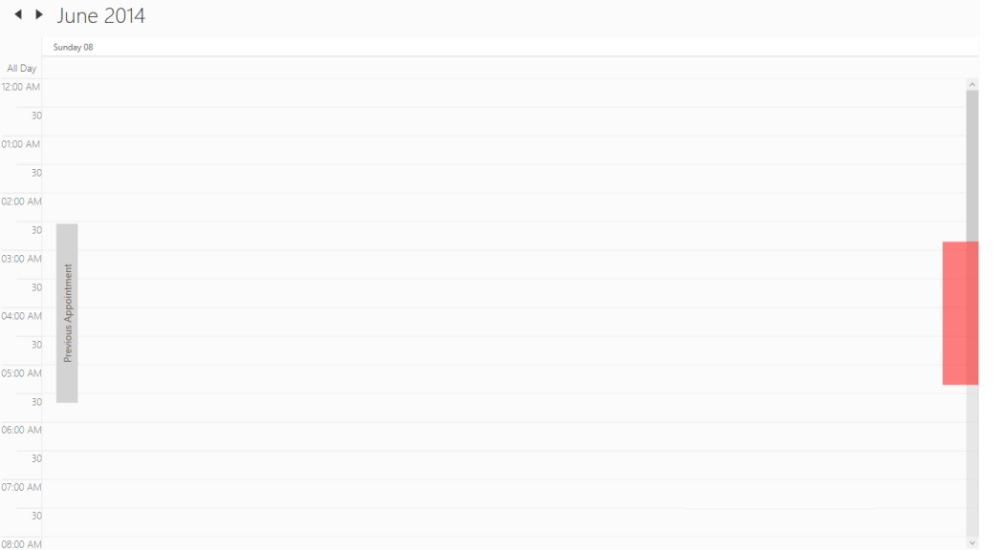

# Appointment Navigation

When there is no appointment in the current view, we can navigate to view the previous appointment or next appointment from the current view. This can be enabled or disabled using the property ShowNavigationTap. The default value of ShowNavigationTap property is False.  

[XAML]

     <Schedule:SfSchedule x:Name="schedule" ScheduleType="Week"

                          ShowAppointmentNavigationButtons ="True"  /> 

[C#]

            SfSchedule schedule = new SfSchedule();

            schedule.ScheduleType = ScheduleType.Week;

            schedule.ShowAppointmentNavigationButtons = true;

            this.grid.Children.Add(schedule);

{  | markdownify }
{:.image }

PreviousNavigationButtonTemplate 

Previous appointment navigation button can be customized by PreviousNavigationButtonTemplate property.

[XAML]

            &lt;Schedule:SfSchedule x:Name="schedule" ScheduleType="Day" ShowAppointmentNavigationButtons="True"&gt;

            &lt;Schedule:SfSchedule.PreviousNavigationButtonTemplate&gt;

                &lt;DataTemplate&gt;

&lt;Border Height="200" Width="50" Background="Red"/&gt;                &lt;/DataTemplate&gt;

            &lt;/Schedule:SfSchedule.PreviousNavigationButtonTemplate&gt;

        &lt;/Schedule:SfSchedule&gt;

{  | markdownify }
{:.image }

NextNavigationButtonTemplate

By using the NextNavigationButtonTemplate property the next appointment navigation button can be customized to view the next appointment.

[XAML]

            &lt;Schedule:SfSchedule x:Name="schedule" ScheduleType="Day" ShowAppointmentNavigationButtons="True"&gt;

             &lt;Schedule:SfSchedule.NextNavigationButtonTemplate&gt;                &lt;DataTemplate&gt;

&lt;Border Height="200" Width="50" Background="Red"/&gt;                                &lt;/DataTemplate&gt;

            &lt;/Schedule:SfSchedule.NextNavigationButtonTemplate&gt;

        &lt;/Schedule:SfSchedule&gt;

{  | markdownify }
{:.image }

