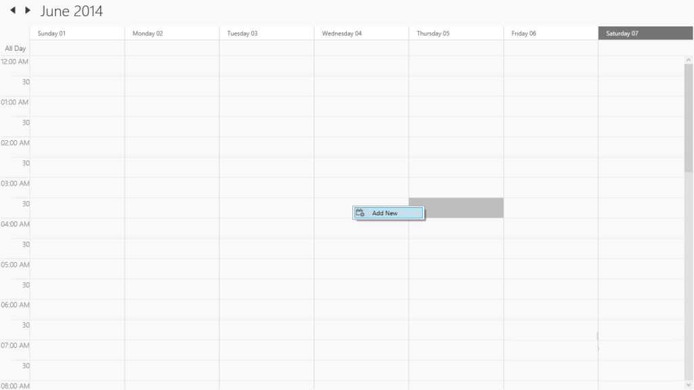

# ContextMenuType 

The collection of MenuItem elements can be organized by ContextMenuType property.


        <Schedule:SfSchedule x:Name="schedule"   ScheduleType="Week" ContextMenuType="RadialMenu">

        </Schedule:SfSchedule>





            SfSchedule schedule = new SfSchedule();

            schedule.ScheduleType = ScheduleType.Week;

           schedule.EnableTouch = true;  

            this.grid.Children.Add(schedule);



