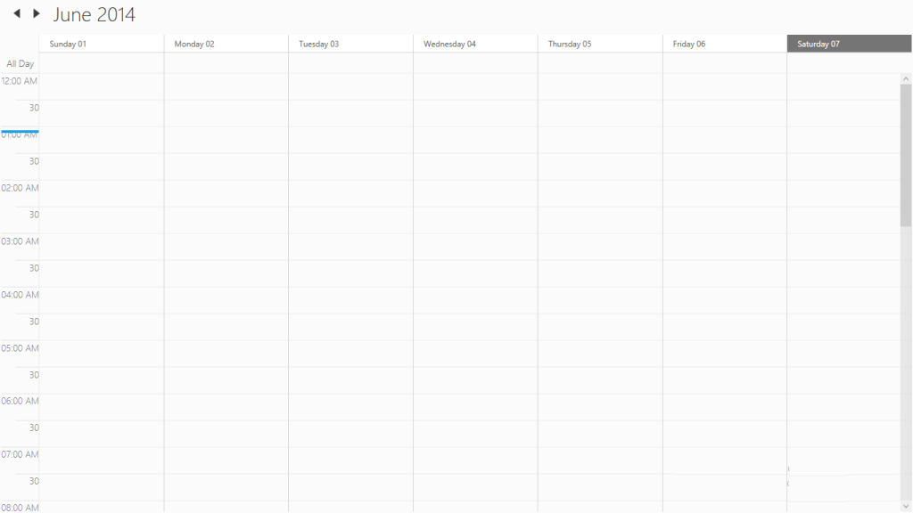

# CurrentTimeIndicator Template Customization

## CurrentTimeIndicatorVisibility 

The visibility of current time indicator enabled by using the CurrentTimeIndicatorVisibility property of SfSchedule Control.



  <Grid Background="White" Name="grid">

     <Schedule:SfSchedule ScheduleType="Week"   CurrentTimeIndicatorVisibility="Visible">     

        </Schedule:SfSchedule>

    </Grid>





            SfSchedule schedule = new SfSchedule();

            schedule.ScheduleType = ScheduleType.Week;

            schedule.CurrentTimeIndicatorVisibility = Visibility.Visible;

            this.grid.Children.Add(schedule);




## CurrentTimeIndicatorTemplate

The CurrentTimeIndicator can be customized by using the__CurrentTimeIndicatorTemplate of SfScheduleControl.



<Grid Background="White" Name="grid">

<Schedule:SfSchedule x:Name="schedule" ScheduleType="Week" CurrentTimeIndicatorVisibility="Visible">

<Schedule:SfSchedule.CurrentTimeIndicatorTemplate>

<DataTemplate>

<Border Background="DarkGreen" Height="10" Width="100"></Border>

</DataTemplate>

</Schedule:SfSchedule.CurrentTimeIndicatorTemplate>

</Schedule:SfSchedule>        

</Grid>





SfSchedule schedule = new SfSchedule();

schedule.ScheduleType = ScheduleType.Week;

schedule.CurrentTimeIndicatorVisibility = Visibility.Visible;

schedule.CurrentTimeIndicatorTemplate = (DataTemplate)this.Resources["CurrentTimeIndicatorTemplate"];

this.grid.Children.Add(schedule);




