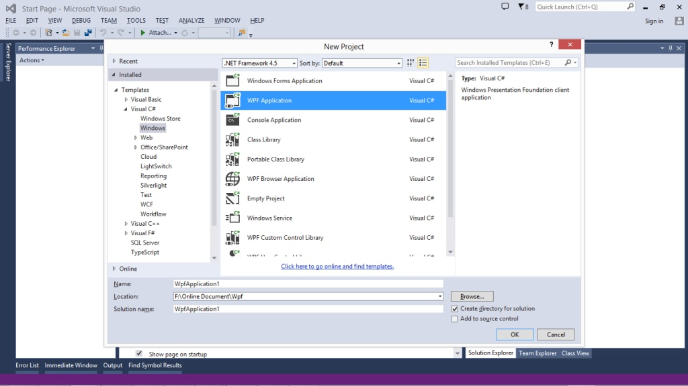
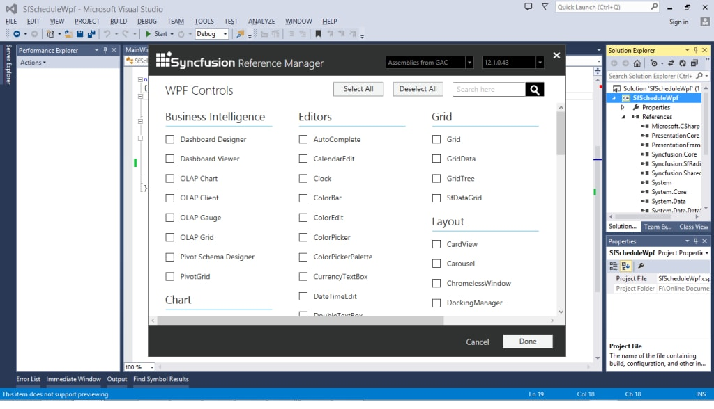
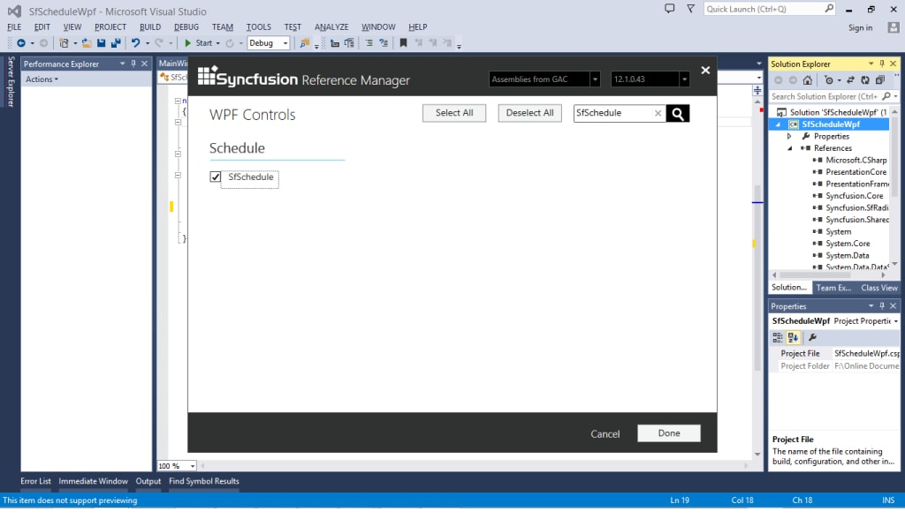
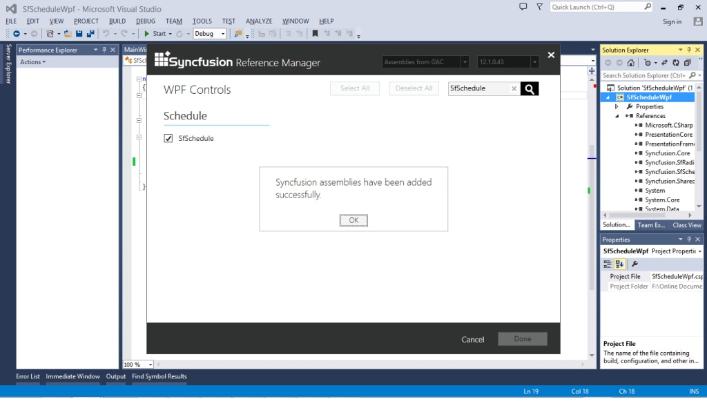
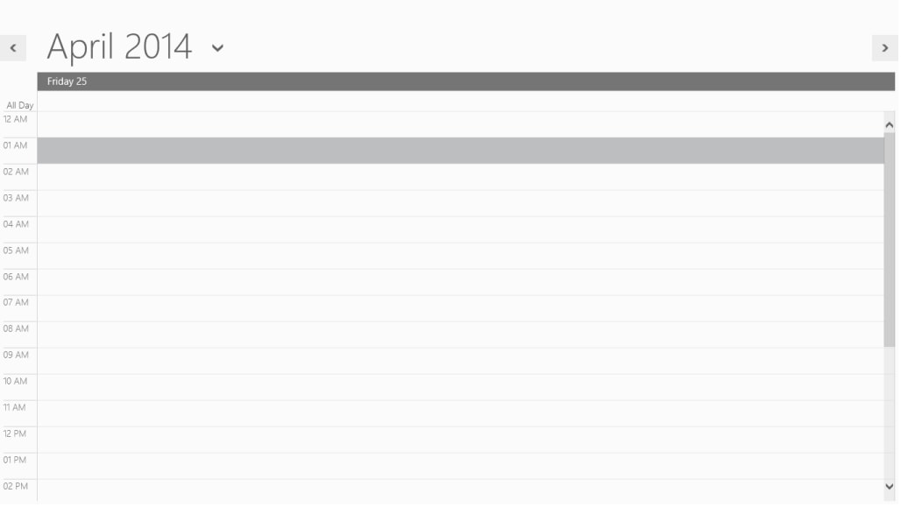

# Getting Started
This section gives you an overview of how to work with SfSchedule and also includes a walk-through to configure real-time SfSchedule command.

## Assembly deployment
Refer to the section on [control dependencies](https://help.syncfusion.com/wpf/control-dependencies#sfschedule) for a list of assemblies or NuGet Packages to be used as a guide for using control in any application.

Further information on installing the NuGet package can be found in the following link in a WPF application: [How to install nuget packages](https://help.syncfusion.com/wpf/nuget-packages).

The following steps can be used to construct a WPF application with SfSchedule control:

## Create a project
In Visual Studio, create a new WPF project to show the features of the `SfSchedule` control and add the following namespace to the added assemblies.

Assembly: Syncfusion.SfSchedule.WPF

Namespace: Syncfusion.UI.Xaml.Schedule

## Add control manually in XAML

To add the control manually in XAML page, follow the given steps:

1. Add the `Syncfusion.SfSchedule.WPF` assembly reference to the project.
2. Import WPF schema http://schemas.syncfusion.com/wpf in the XAML page.
3. Declare the SfSchedule control in XAML page.


<Window x:Class="SfScheduleSample.MainWindow"   
	        
		xmlns="http://schemas.microsoft.com/winfx/2006/xaml/presentation"
			
        xmlns:x="http://schemas.microsoft.com/winfx/2006/xaml"

        xmlns:schedule="http://schemas.syncfusion.com/wpf"

        WindowStartupLocation="CenterScreen" WindowStyle="None"

        Width="950" Height="600">

        <Grid x:Name="LayoutRoot">

          <schedule:SfSchedule/>

        </Grid>

</Window>


## Add control manually in C#
To manually attach control to C #, follow the following steps:

1. Add the `Syncfusion.SfSchedule.WPF` assembly reference to the project.
2. Import the `SfSchedule` namespace using Syncfusion.UI.Xaml.Schedule.
3. Create an `SfSchedule` instance, and add it to the window.


using Syncfusion.UI.Xaml.Schedule;
namespace GettingStarted
{
    public partial class MainWindow : Window
    {
       SfSchedule schedule = new SfSchedule();
       this.Content = schedule;
	}
}


Run the code above and now you can see the empty scheduler as follows, but without appointments. To view the scheduler appointments, whether local or remote information must be passed on to the scheduler.

## Creating the SfSchedule Control with the Syncfusion Reference Manager

Throughout Visual Studio, the **Syncfusion Reference Manager** is used to add tools to Syncfusion.

Follow the steps below to add `SfSchedule` control:

1.Create a simple WPF application using Visual Studio.

   

2.Right click on the Project and pick Syncfusion Reference Manager.

   

3.As shown in the figure below, the **Syncfusion Reference Manager Wizard** will be opened

   

4.Using SearchBox to search for "SfSchedule" and pick Control `SfSchedule`.

   
 

5.The SfSchedule assemblies will be automatically added to the Project after Clicking OK.

   

   

6.Create a namespace reference to the SfSchedule control using Syncfusion’s global namespace reference `schemas.syncfusion.com` or the `SfSchedule` control’s namespace reference `Syncfusion.UI.Xaml.Schedule` available in the `Syncfusion.SfSchedule.WPF` assembly.


   
    xmlns:schedule="http://schemas.syncfusion.com/wpf"

         (or)

   xmlns:schedule="clr-namespace:Syncfusion.UI.Xaml.Schedule;assembly=Syncfusion.SfSchedule.WPF"



7.To create a simple `SfSchedule` control, add the following code.




<Window x:Class="SfScheduleSample.MainWindow"       
   
    xmlns="http://schemas.microsoft.com/winfx/2006/xaml/presentation"

    xmlns:x="http://schemas.microsoft.com/winfx/2006/xaml"

    xmlns:schedule="http://schemas.syncfusion.com/wpf"

    WindowStartupLocation="CenterScreen" WindowStyle="None"

    Width="950" Height="600">

    <Grid x:Name="LayoutRoot">

        <schedule:SfSchedule/>
	
    </Grid>

</Window>




using Syncfusion.UI.Xaml.Schedule;

using System.Windows;

namespace SfScheduleSample
{

    public partial class MainWindow : Window

    {

        public MainWindow()

        {

           InitializeComponent();

           SfSchedule sfSchedule = new SfSchedule();

           this.LayoutRoot.Children.Add(sfSchedule);

        }

    }

}


8.As shown in the figure below, the simple `SfSchedule` control will be established.

   

N> 1. The Syncfusion Reference Manager is available in versions 11.3.0.30 and later. It supports referencing assemblies from version 10.4.0.71 version to the current version. 
N> 2. The Syncfusion Reference Manager can be used only in Visual Studio 2010, 2012 and 2013.

