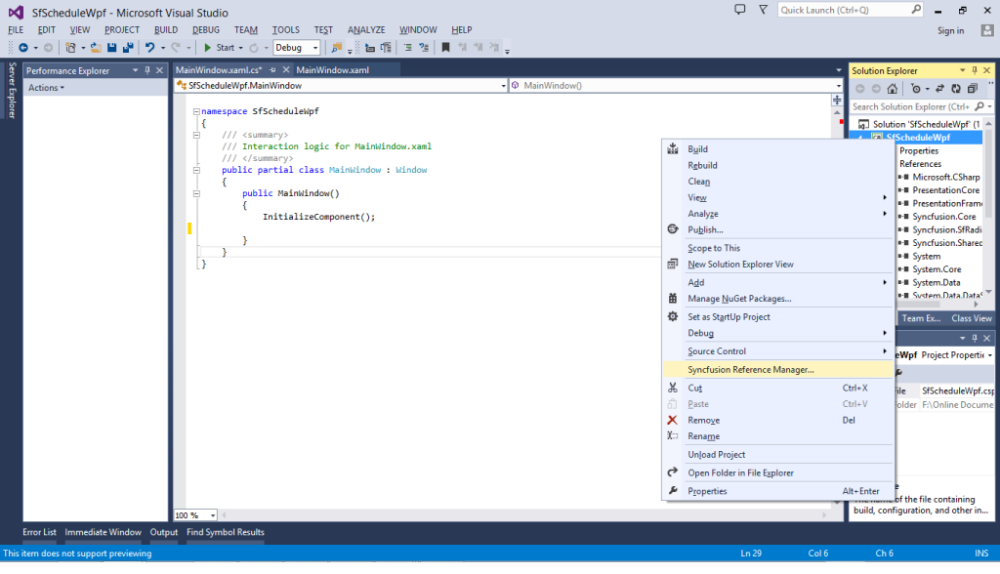
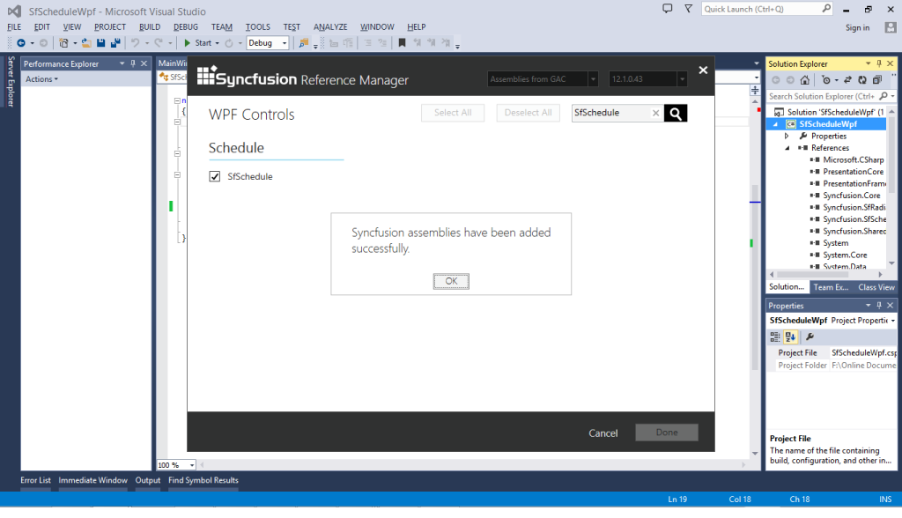

# Getting Started
This section provides you an overview for working with SfSchedule and also provides a walk through to configure SfSchedule control in real time scenario.

## Assembly deployment
Refer to the [control dependencies](https://help.syncfusion.com/wpf/control-dependencies#sfschedule) section to get the list of assemblies or NuGet Packages that needs to be added as a reference to use the control in any application.

You can find more details about installing the NuGet package in a WPF application in the following link: [How to install nuget packages](https://help.syncfusion.com/wpf/nuget-packages).

You can create a WPF application with SfSchedule control using the following steps:

## Create a project
Create a new WPF project in Visual Studio to display the SfSchedule control with its functionalities, and add the following namespace to the added assemblies.

Assembly: Syncfusion.SfSchedule.WPF

Namespace: Syncfusion.UI.Xaml.Schedule

## Add control manually in XAML

To add the control manually in XAML page, follow the given steps:

1. Add the Syncfusion.SfSchedule.WPF assembly reference to the project.
2. Import WPF schema http://schemas.syncfusion.com/wpf in the XAML page.
3. Declare the SfSchedule control in XAML page.


<Window x:Class="SfScheduleSample.MainWindow"   
	        
		xmlns="http://schemas.microsoft.com/winfx/2006/xaml/presentation"
			
        xmlns:x="http://schemas.microsoft.com/winfx/2006/xaml"

        xmlns:schedule="http://schemas.syncfusion.com/wpf"

        WindowStartupLocation="CenterScreen" WindowStyle="None"

        Width="950" Height="600">

        <Grid x:Name="LayoutRoot">

          <schedule:SfSchedule/>

        </Grid>

</Window>


## Add control manually in C#
To add control manually in C#, follow the given steps:

1. Add the Syncfusion.SfShared.WPF assembly reference to the project.
2. Import the SfRating namespace using Syncfusion.Windows.Controls.Input;.
3. Create an SfRating instance, and add it to the window.


using Syncfusion.UI.Xaml.Schedule;
namespace GettingStarted
{
    public partial class MainWindow : Window
    {
       SfSchedule schedule = new SfSchedule();
       this.Content = schedule;
	}
}


Run the above code and now the empty Scheduler can be seen as follows but with no appointments. In order to display the appointments on the scheduler, either the local or remote data needs to be passed to it.

## Creating the SfSchedule Control with the Syncfusion Reference Manager

Syncfusion Reference Manager is used to add   Syncfusion Tools in Visual Studio.

To Add SfSchedule Control, follow the steps below:

1.Create a simple WPF application using Visual Studio.

   

2.Right Click on the Project and select Syncfusion Reference Manager.

   

3.The Syncfusion Reference Manager Wizard will be opened as shown in the figure below.

   

4.Search for “SfSchedule” using SearchBox and select SfSchedule Control.  Click on done to add selected SfSchedule Control.

   
 

5.The SfSchedule assemblies will be automatically added to the Project after Clicking OK

   

   

6.Create a namespace reference to the SfSchedule control using Syncfusion’s global namespace reference schemas.syncfusion.com or the SfSchedule control’s namespace reference Syncfusion.UI.Xaml.Schedule available in the Syncfusion.SfSchedule.WPF assembly.


   
    xmlns:schedule="http://schemas.syncfusion.com/wpf"

         (or)

   xmlns:schedule="clr-namespace:Syncfusion.UI.Xaml.Schedule;assembly=Syncfusion.SfSchedule.WPF"



7.Add the following code to create a simple SfSchedule control.




<Window x:Class="SfScheduleSample.MainWindow"       
   
    xmlns="http://schemas.microsoft.com/winfx/2006/xaml/presentation"

    xmlns:x="http://schemas.microsoft.com/winfx/2006/xaml"

    xmlns:schedule="http://schemas.syncfusion.com/wpf"

    WindowStartupLocation="CenterScreen" WindowStyle="None"

    Width="950" Height="600">

    <Grid x:Name="LayoutRoot">

        <schedule:SfSchedule/>
	
    </Grid>

</Window>




using Syncfusion.UI.Xaml.Schedule;

using System.Windows;

namespace SfScheduleSample
{

    public partial class MainWindow : Window

    {

        public MainWindow()

        {

           InitializeComponent();

           SfSchedule sfSchedule = new SfSchedule();

           this.LayoutRoot.Children.Add(sfSchedule);

        }

    }

}


8. The simple SfSchedule control will be created as shown in the figure below.

   

N> 1. The Syncfusion Reference Manager is available in versions 11.3.0.30 and later. It supports referencing assemblies from version 10.4.0.71 version to the current version. 
N> 2. The Syncfusion Reference Manager can be used only in Visual Studio 2010, 2012 and 2013.

