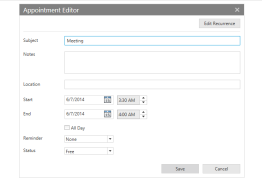

#### Edit/Deleting Appointments

The user can also edit or delete the appointments within the schedule control by clicking the Edit/Delete option available in Context Menu.

{{ '' | markdownify }}

