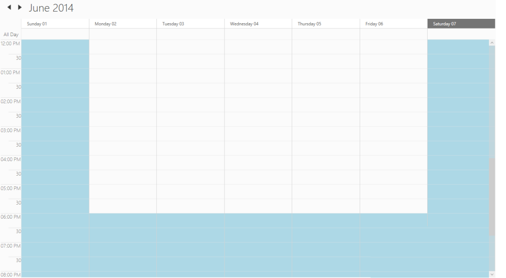

# Non-Working Hours

## Enabling Non-Working Hours

The Non-Working hours can be enabled or disabled by using IsHighLightWorkingHours property. The default value of IsHighLightWorkingHours property is false.

## Non-Working Days of Week

The Non-Working Days of the Week can be set using the property NonWorkingDays. The NonWorkingDays is string type, the default value of this property is “Sunday,Saturday”

## NonWorkingDateCollection:

NonWorkingDateCollection property allows you to add the Non-Working Days of the week.

## Starting Work Hour and Ending Work Hour

The starting and ending work hour of a day is set using the WorkStartHour and WorkEndHour properties respectively.

## Non-Working Hour Brush

The Non-Working hour’s background brush can be customized using the NonWorkingHourBrush property. 



<Grid Background="White">

<Schedule:SfSchedule IsHighLightWorkingHours="True" 

NonWorkingDays="Sunday,Saturday" 

WorkStartHour="9" 

WorkEndHour="18" 

ScheduleType="Week"  NonWorkingHourBrush="LightBlue"/>

</Grid>




SfSchedule schedule = new SfSchedule();

schedule.IsHighLightWorkingHours = true;

schedule.ScheduleType = ScheduleType.Week;

schedule.WorkStartHour = 9;

schedule.WorkEndHour = 18;

schedule.NonWorkingDays = "Sunday,Saturday";

schedule.NonWorkingHourBrush = new SolidColorBrush(Colors.LightBlue);

this.grid.Children.Add(schedule);




