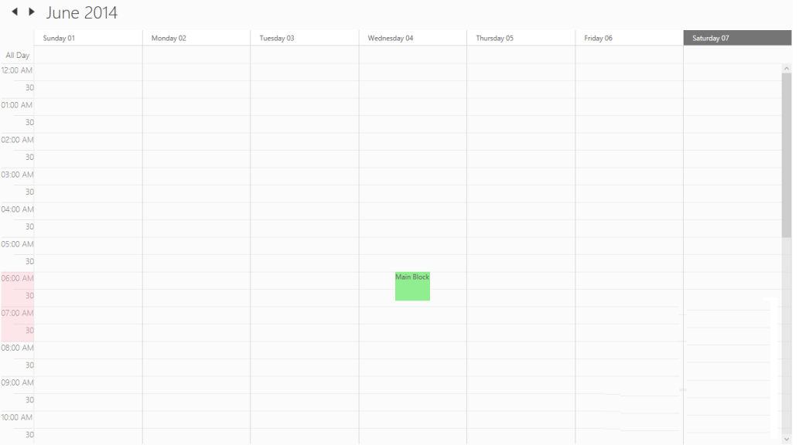

# NonAccessibleBlocks 

 For a particular Starting and Ending time the block could not be accessed by setting the NonAccessibleBlocks property.

[XAML]

              &lt;Schedule:SfSchedule ScheduleType="Week"  IntervalHeight="30"&gt;

            &lt;Schedule:SfSchedule.NonAccessibleBlocks&gt;

                &lt;Schedule:NonAccessibleBlock Background="LightPink" StartHour="6.00" EndHour="8.00" Label="Non Accessible Block"&gt;

                &lt;/Schedule:NonAccessibleBlock&gt; 

            &lt;/Schedule:SfSchedule.NonAccessibleBlocks&gt;

        &lt;/Schedule:SfSchedule&gt;

[C#]

            SfSchedule schedule = new SfSchedule();

            schedule.ScheduleType = ScheduleType.Week;

            schedule.NonAccessibleBlocks.Add(new NonAccessibleBlock() { Background = new SolidColorBrush(Colors.LightPink), StartHour = 6.00, EndHour = 8.00, Label = "Non Accessible Block" });

            this.grid.Children.Add(schedule);  

{  | markdownify }
{:.image }

NonAccessibleBlockTemplate :

The  NonAccessibleBlockTemplate can be customized by NonAccessibleBlockTemplate property.

[XAML]

    &lt;Grid Background="White" Name="grid"&gt;

        &lt;Schedule:SfSchedule  Name="schedule" ScheduleType="Week"  IntervalHeight="30"&gt;

            &lt;Schedule:SfSchedule.NonAccessibleBlockTemplate&gt;

                &lt;DataTemplate&gt;

                    &lt;Border Height="50" Width="60" Background="LightGreen"&gt;

                        &lt;TextBlock Text="Main Block"&gt;&lt;/TextBlock&gt;

                            &lt;/Border&gt;

                &lt;/DataTemplate&gt;

            &lt;/Schedule:SfSchedule.NonAccessibleBlockTemplate&gt;

        &lt;/Schedule:SfSchedule&gt;

    &lt;/Grid&gt;

[C#]

            SfSchedule schedule = new SfSchedule();

            schedule.NonAccessibleBlocks.Add(new NonAccessibleBlock() { StartHour = 2,EndHour = 4, Label = "Main Block" });

            schedule.NonAccessibleBlockTemplate = (DataTemplate)this.Resources["NonAccessibleBlockTemplate"];

            this.grid.Children.Add(schedule);

{  | markdownify }
{:.image }

