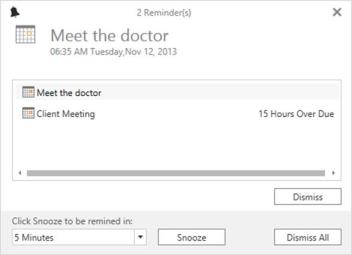

# Reminder

Schedule supports to remind you the particular appointment in the specified time with reminder window which does have the support to Dismiss or set the SnoozeTime for that reminder appointments.

## Setting reminder for an Appointment
Reminder can be set by setting the [EnableReminderTimer](https://help.syncfusion.com/cr/wpf/Syncfusion.SfSchedule.WPF~Syncfusion.UI.Xaml.Schedule.SfSchedule~EnableReminderTimer.html) property is true.The remainder time can be set using the [ReminderTime](https://help.syncfusion.com/cr/cref_files/wpf/Syncfusion.SfSchedule.WPF~Syncfusion.UI.Xaml.Schedule.ScheduleAppointment~ReminderTime.html) property of ScheduleAppointment.



	SfSchedule schedule = new SfSchedule();

	schedule.EnableReminderTimer = true;

	schedule.Appointments.Add(new ScheduleAppointment

	{

	StartTime = DateTime.Now.Date.AddHours(9),

	EndTime   = DateTime.Now.Date.AddHours(12),

	AppointmentBackground = new SolidColorBrush(Color.FromArgb(0xFf, 0xA2, 0xC1, 0x39)),

	Subject = "Business Meeting",

	ReminderTime = ReminderTimeType.TenHours

	});

	schedule.Appointments.Add(new ScheduleAppointment

	{

	StartTime = currentDate.Date.AddDays(1).AddHours(10),

	EndTime = currentDate.Date.AddDays(1).AddHours(16),

	AppointmentBackground = new SolidColorBrush(Color.FromArgb(0xFf, 0xD8, 0x00, 0x73)),

	Subject = "Auditing",

	ReminderTime = ReminderTimeType.TwoDays

	});

	schedule.Appointments.Add(new ScheduleAppointment

	{

	StartTime = DateTime.Now.Date.AddDays(7).AddHours(10),

	EndTime = DateTime.Now.Date.AddDays(7).AddHours(13),

	AppointmentBackground = new SolidColorBrush(Color.FromArgb(0xFf, 0xF0, 0x96, 0x09)),

	Subject = "Conference",

	ReminderTime = ReminderTimeType.TwoWeeks

	});

	this.grid.Children.Add(schedule);



## Configuration Reminder Duration
Reminder does have the support to set the reminder duration time to remind the appointments by using the [ReminderTime](https://help.syncfusion.com/cr/cref_files/wpf/Syncfusion.SfSchedule.WPF~Syncfusion.UI.Xaml.Schedule.ScheduleAppointment~ReminderTime.html) property of ScheduleAppointment.

**Type of reminder duration**

* None
* ZeroMin
* FiveMin
* TenMin
* FifteenMin
* ThirtyMin
* OneHour
* TwoHours
* ThreeHours
* FourHours
* FiveHours
* SixHours
* SevenHours
* EightHours
* NineHours
* TenHours
* ElevenHours
* EighteenHours
* HalfDay
* OneDay
* TwoDays
* ThreeDays
* FourDays
* OneWeek
* TwoWeeks


schedule.Appointments[0].ReminderTime = ReminderTimeType.FifteenMin;


## Custom ReminderTime mapping for ScheduleAppointment
ReminderTime supports to bind with your custom biniding object.


/// 

/// Represents custom data properties.
/// 

public class Meeting
{
    public String Subject { get; set; }
	public DateTime StartTime { get; set; }
	public DateTime EndTime { get; set; }
	public Brush AppointmentColor { get; set; }
	public ReminderTimeType ReminderTime { get; set; }
}


N>You can inherit this class from INotifyPropertyChanged for dynamic changes in custom data.

You can map those properties of Meeting class with our SfSchedule control by using ScheduleAppointmentMapping.



<syncfusion:SfSchedule x:Name="schedule" ScheduleType="Month" DataSource="{Binding Meetings}">
	<syncfusion:SfSchedule.AppointmentMapping>
		<syncfusion:ScheduleAppointmentMapping
			SubjectMapping="Subject"
			AppointmentBackgroundMapping="AppointmentColor"
			StartTimeMapping="StartTime"
			EndTimeMapping="EndTime"
			ReminderTimeMapping="ReminderTime">
		</syncfusion:ScheduleAppointmentMapping>
	</syncfusion:SfSchedule.AppointmentMapping>
</syncfusion:SfSchedule>


// Schedule data mapping for custom appointments
ScheduleAppointmentMapping dataMapping = new ScheduleAppointmentMapping();
dataMapping.SubjectMapping = "Subject";
dataMapping.StartTimeMapping = "StartTime";
dataMapping.EndTimeMapping = "EndTime";
dataMapping.ColorMapping = "AppointmentColor";
dataMapping.ReminderMapping = ReminderTimeType.TenMin;
schedule.AppointmentMapping = dataMapping;



## Handling Reminder events

### ReminderOpening event

**ReminderOpening** – event occurs when appear that reminder form.
ReminderControlOpeningEventArgs has following members which provides the information for ReminderOpening event.

RemindAppCollection – Gets list of reminder appointments.

You can prevent the reminder form opening through ReminderControlOpeningEventArgs.Cancel property of ReminderOpening event.


this.Schedule.ReminderOpening += Schedule_ReminderOpening;
private void Schedule_ReminderOpening(object sender, ReminderControlOpeningEventArgs e)
{
    e.Cancel = true;
}



### ReminderClosed event

**ReminderClosed** – event occurs when closing the reminder form.
`ReminderControlClosedEventArgs` provides information for ReminderClosed event

### ReminderFormActionChanged event

**ReminderFormActionChanged** – event occurs when the reminder form action changed for the appointment
**ReminderFormActionChangedEventArgs** has following members which provides information for ReminderFormActionChanged event.

**Action** - Gets the action triggered this event.
**Appointments** – Gets list of appointments that are changed 
**SnoozeTime** – Gets the snooze time of action changed appointments.
