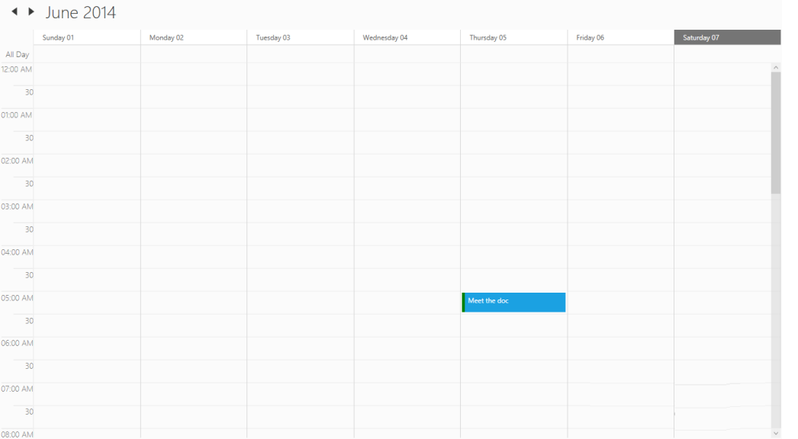

# Schedule Appointment Status

Schedule Appointment status can be set by using the Status Property of the ScheduleAppointment.

[C#]

SfSchedule schedule = new SfSchedule();

schedule.ScheduleType = ScheduleType.Week;

schedule.Appointments.Add(new ScheduleAppointment() { Status= new ScheduleAppointmentStatus(){ Brush= new SolidColorBrush(Colors.Green), Status="Free"}, StartTime= new DateTime(2013,6,5,5,0,0), EndTime= new DateTime(2013,6,5,5,30,0), Subject="Meet the doc", Location="Hutchison road", AllDay=false });

{  | markdownify }
{:.image }

AppointmentStatusCollection:

The AppointmentStatusCollection property used to set the status to collection of appointments.

[C#]

            SfSchedule schedule = new SfSchedule();

            schedule.ScheduleType = ScheduleType.Week;

  schedule.AppointmentStatusCollection.Add(new ScheduleAppointmentStatus() {Status="idle",Brush=new SolidColorBrush(Colors.Pink)});

            schedule.AppointmentStatusCollection.Add(new ScheduleAppointmentStatus() { Status = "busy",Brush=new SolidColorBrush(Colors.Yellow)});

            schedule.AppointmentStatusCollection.Add(new ScheduleAppointmentStatus() { Status="Busy",Brush=new SolidColorBrush(Colors.Red)});

           this.grid.Children.Add(schedule);

{  | markdownify }
{:.image }

AppointmentSelectionBrush

The selected appointment can be marked by AppointmentSelectionBrush property.

[C#]

            SfSchedule schedule = new SfSchedule();

            schedule.EnableTouch = true;

            schedule.ScheduleType = ScheduleType.Week;

            schedule.AppointmentStatusCollection.Add(new ScheduleAppointmentStatus() { Status = "idle", Brush = new SolidColorBrush(Colors.Pink) });

            schedule.AppointmentStatusCollection.Add(new ScheduleAppointmentStatus() { Status = "busy", Brush = new SolidColorBrush(Colors.Yellow) });

            schedule.AppointmentStatusCollection.Add(new ScheduleAppointmentStatus() { Status = "Busy", Brush = new SolidColorBrush(Colors.Red) });

            schedule.AppointmentSelectionBrush = new SolidColorBrush(Colors.Yellow);

            this.grid.Children.Add(schedule);

{  | markdownify }
{:.image }

