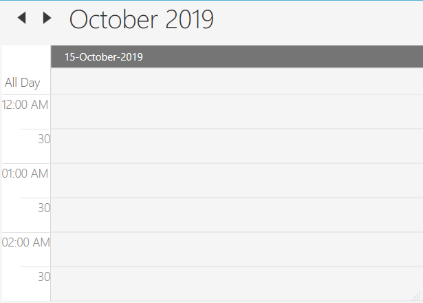
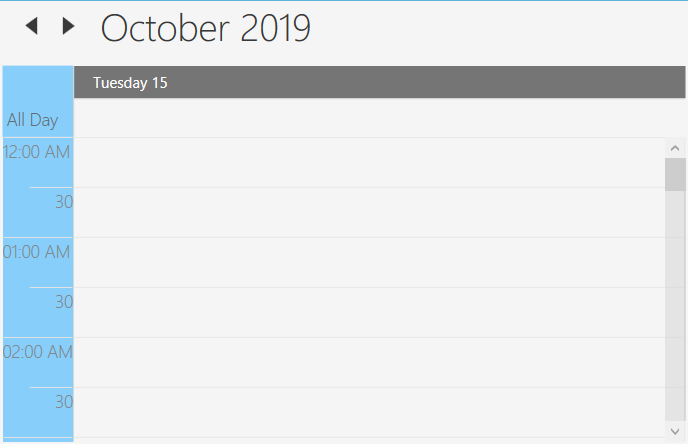
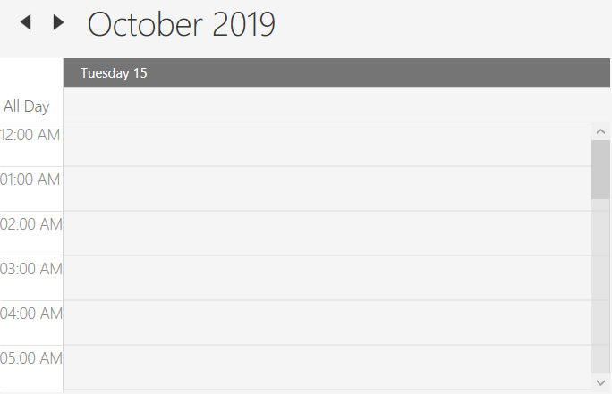
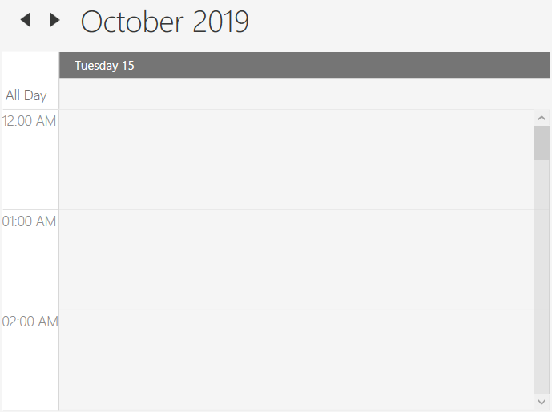
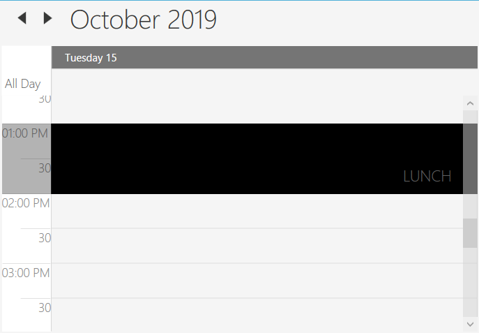
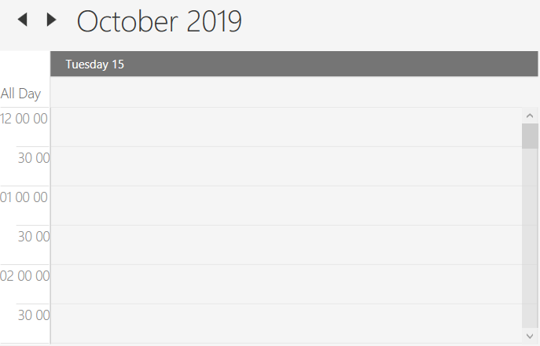
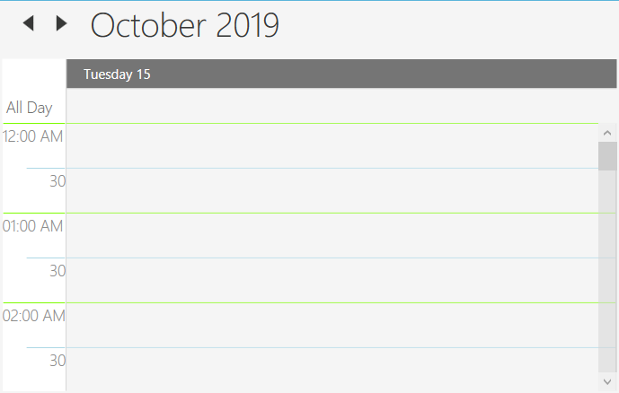

## DayView
DayView is used to view a single day. By default, the current day will bevisible. Appointments on a specific day will be scheduled on the basis of their duration in the respective time slots.

## Day Header Date Format
The default Header date format of the Day view can be customized by using the [HeaderDateFormat](https://help.syncfusion.com/cr/wpf/Syncfusion.SfSchedule.WPF~Syncfusion.UI.Xaml.Schedule.SfSchedule~HeaderDateFormat.html) property.



<Schedule:SfSchedule  ScheduleType="Day"
HeaderDateFormat="dd-MMMM-yyyy">
</Schedule:SfSchedule>


SfSchedule schedule = new SfSchedule();

schedule.ScheduleType = ScheduleType.Day;

schedule.HeaderDateFormat = "dd-MMMM-yyyy";




## Day Header Background

The Header background can be changed by [HeaderBackground](https://help.syncfusion.com/cr/wpf/Syncfusion.SfSchedule.WPF~Syncfusion.UI.Xaml.Schedule.SfSchedule~HeaderBackground.html) property.



<Schedule:SfSchedule  ScheduleType="Day" HeaderBackground="LightSkyBlue" />


schedule.ScheduleType = ScheduleType.Day;

schedule.HeaderBackground = Brushes.LightSkyBlue;



## Change Time Interval
By setting schedulars's [TimeInterval](https://help.syncfusion.com/cr/wpf/Syncfusion.SfSchedule.WPF~Syncfusion.UI.Xaml.Schedule.SfSchedule~TimeInterval.html) property, you can configure the timeslots interval for day view.



<Schedule:SfSchedule  ScheduleType="Day" TimeInterval = "OneHour" />


schedule.ScheduleType = ScheduleType.Day;
schedule.TimeInterval = TimeInterval.OneHour;



## Change Time Interval Height
By setting schedulars's [IntervalHeight](https://help.syncfusion.com/cr/wpf/Syncfusion.SfSchedule.WPF~Syncfusion.UI.Xaml.Schedule.SfSchedule~IntervalHeight.html) property, you can configure the timeslots interval for day view.



<Schedule:SfSchedule  ScheduleType="Day" IntervalHeight = 100 />


schedule.ScheduleType = ScheduleType.Day;
schedule.IntervalHeight = 100;



## Full screen scheduler
Schedule time interval height can be adjusted based on screen height by changing the value of `IntervalHeight` property to -1. It will auto-fit to the screen height and width.



<Schedule:SfSchedule  ScheduleType="Day" IntervalHeight = -1 />


schedule.ScheduleType = ScheduleType.Day;
schedule.IntervalHeight = -1;



## Non-Accessible timeslots
By using [NonAccessibleBlocks](https://help.syncfusion.com/cr/wpf/Syncfusion.SfSchedule.WPF~Syncfusion.UI.Xaml.Schedule.SfSchedule~NonAccessibleBlocks.html), you could limit or assign those time slots as non-accessible blocks, so you can allocate certain time slots to pre-defined events / activities such as lunch hour using `NonAccessibleBlocks` [StartHour](https://help.syncfusion.com/cr/wpf/Syncfusion.SfSchedule.WPF~Syncfusion.UI.Xaml.Schedule.NonAccessibleBlock~StartHour.html), [EndHour](https://help.syncfusion.com/cr/wpf/Syncfusion.SfSchedule.WPF~Syncfusion.UI.Xaml.Schedule.NonAccessibleBlock~EndHour.html), [Label](https://help.syncfusion.com/cr/wpf/Syncfusion.SfSchedule.WPF~Syncfusion.UI.Xaml.Schedule.NonAccessibleBlock~Label.html) and [Background](https://help.syncfusion.com/cr/wpf/Syncfusion.SfSchedule.WPF~Syncfusion.UI.Xaml.Schedule.NonAccessibleBlock~Background.html) properties.



<Schedule:SfSchedule ScheduleType="Day">
    <Schedule:SfSchedule.NonAccessibleBlocks>
        <Schedule:NonAccessibleBlock Background="LightPink" StartHour="13" EndHour="14" Label="Non Accessible Block">
        </Schedule:NonAccessibleBlock> 
    </Schedule:SfSchedule.NonAccessibleBlocks>
</Schedule:SfSchedule>


SfSchedule schedule = new SfSchedule();
schedule.ScheduleType = ScheduleType.Day;
schedule.NonAccessibleBlocks.Add(new NonAccessibleBlock() { Background = new SolidColorBrush(Colors.LightPink), StartHour = 13, EndHour = 14, Label = "Non Accessible Block" });
this.grid.Children.Add(schedule);



### Customize Non-Accessible timeslots using template
The NonAccessible timeslots can be customized by [NonAccessibleBlockTemplate](https://help.syncfusion.com/cr/wpf/Syncfusion.SfSchedule.WPF~Syncfusion.UI.Xaml.Schedule.SfSchedule~NonAccessibleBlockTemplate.html) property.



<syncfusion:SfSchedule.NonAccessibleBlockTemplate>
    <DataTemplate>
        <Border Background="LightGreen">
            <TextBlock Text="Meeting" Foreground="White" HorizontalAlignment="Center" VerticalAlignment="Center"/>
        </Border>
    </DataTemplate>
</syncfusion:SfSchedule.NonAccessibleBlockTemplate>


SfSchedule schedule = new SfSchedule();
schedule.ScheduleType = ScheduleType.Day;
schedule.NonAccessibleBlocks.Add(new NonAccessibleBlock() { Background = new SolidColorBrush(Colors.LightPink), StartHour = 13, EndHour = 14, Label = "Non Accessible Block" });
this.grid.Children.Add(schedule);



## Time formatting
You can customize the format for the time in day view by setting [MajorTickTimeFormat](https://help.syncfusion.com/cr/wpf/Syncfusion.SfSchedule.WPF~Syncfusion.UI.Xaml.Schedule.SfSchedule~MajorTickTimeFormat.html) and [MinorTickTimeFormat](https://help.syncfusion.com/cr/wpf/Syncfusion.SfSchedule.WPF~Syncfusion.UI.Xaml.Schedule.SfSchedule~MinorTickTimeFormat.html) property.



<syncfusion:SfSchedule ScheduleType="Day" MajorTickTimeFormat="hh mm ss" MinorTickTimeFormat="mm ss"/>


SfSchedule schedule = new SfSchedule();
schedule.ScheduleType = ScheduleType.Day;
schedule.MajorTickTimeFormat = "hh mm ss";
schedule.MinorTickTimeFormat = "hh mm ss";



## Time Label Appearance
### Changing Time Label Foreground
By setting schedular's [MinorTickLabelStroke](https://help.syncfusion.com/cr/wpf/Syncfusion.SfSchedule.WPF~Syncfusion.UI.Xaml.Schedule.SfSchedule~MinorTickLabelStroke.html) and [MajorTickLabelStroke](https://help.syncfusion.com/cr/wpf/Syncfusion.SfSchedule.WPF~Syncfusion.UI.Xaml.Schedule.SfSchedule~MajorTickLabelStroke.html). you can customize the color for the labels that mention the time.



<syncfusion:SfSchedule ScheduleType="Day" MajorTickLabelStroke="DarkRed" MinorTickLabelStroke="Red"/>


SfSchedule schedule = new SfSchedule();
schedule.ScheduleType = ScheduleType.Day;
schedule.MajorTickLabelStroke = Brushes.DarkRed;
schedule.MinorTickLabelStroke = Brushes.Red;

{% endtabs %

### Changing Time Label Strokes
By setting Scheduler's [MajorTickStroke](https://help.syncfusion.com/cr/wpf/Syncfusion.SfSchedule.WPF~Syncfusion.UI.Xaml.Schedule.SfSchedule~MajorTickStroke.html) and [MinorTickStroke](https://help.syncfusion.com/cr/wpf/Syncfusion.SfSchedule.WPF~Syncfusion.UI.Xaml.Schedule.SfSchedule~MinorTickStroke.html) property, you can customize the border color of the labels that mention the time. 



<syncfusion:SfSchedule ScheduleType="Day" MajorTickStroke="LawnGreen" MinorTickStroke="LightBlue"/>


SfSchedule schedule = new SfSchedule();
schedule.ScheduleType = ScheduleType.Day;
schedule.MajorTickStroke = Brushes.LawnGreen;
schedule.MinorTickStroke = Brushes.LightBlue;

{% endtabs %

