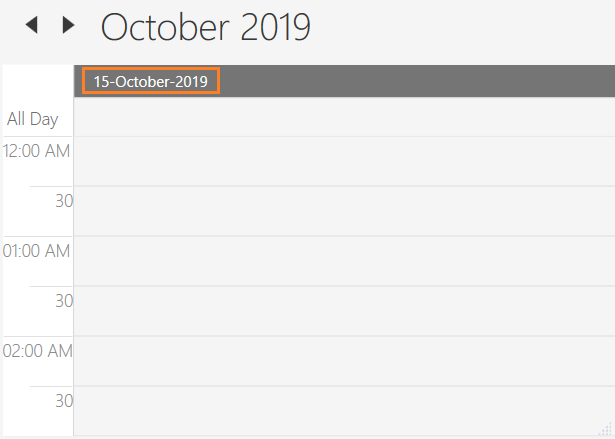
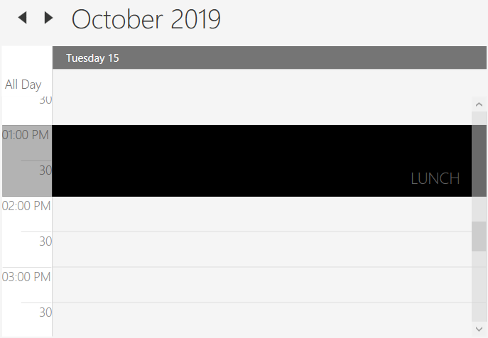
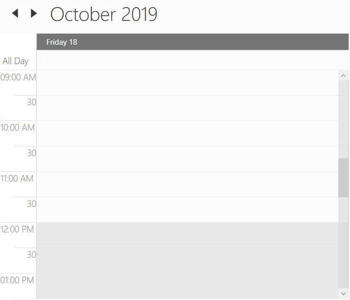
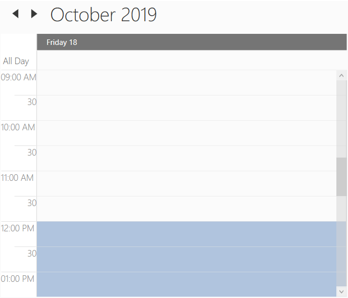
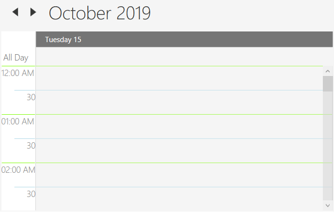

## Views (DayView, WeekView and WorkWeekView)
Scheduler provides the following different types of views.

* Day view
* Week view
* WorkWeek view
* Timeline View - Refer [scheduler timeline view](https://help.syncfusion.com/wpf/sfschedule/getting-started#timeline-view) documentation for more customization details.
* Month View - Refer [scheduler month view](https://help.syncfusion.com/wpf/sfschedule/getting-started#month-view) documentation for more customization details.

This topic covers customization of day, week and workweek views of the scheduler which shares common properties.

N> This topic explains all customization using day view. But the same applies for week and workweek views also. if you want to make customization specific to views, then please refer [link](#change-the-settings-based-on-the-views-at-run-time)

## Header Date Format
Scheduler supports to customize the default header date format of the day, week, workweek and timeline view by using the [HeaderDateFormat](https://help.syncfusion.com/cr/wpf/Syncfusion.SfSchedule.WPF~Syncfusion.UI.Xaml.Schedule.SfSchedule~HeaderDateFormat.html) property.



<Schedule:SfSchedule
HeaderDateFormat="dd-MMMM-yyyy">
</Schedule:SfSchedule>


SfSchedule schedule = new SfSchedule();

schedule.HeaderDateFormat = "dd-MMMM-yyyy";




## Time Formatting
Scheduler supports to customize time format for day, week, workweek and timeline views by using [MajorTickTimeFormat](https://help.syncfusion.com/cr/wpf/Syncfusion.SfSchedule.WPF~Syncfusion.UI.Xaml.Schedule.SfSchedule~MajorTickTimeFormat.html) and [MinorTickTimeFormat](https://help.syncfusion.com/cr/wpf/Syncfusion.SfSchedule.WPF~Syncfusion.UI.Xaml.Schedule.SfSchedule~MinorTickTimeFormat.html) property.



<syncfusion:SfSchedule MajorTickTimeFormat="hh mm ss" MinorTickTimeFormat="mm ss"/>


SfSchedule schedule = new SfSchedule();
schedule.MajorTickTimeFormat = "hh mm ss";
schedule.MinorTickTimeFormat = "hh mm ss";



## Change Time Interval
Scheduler supports to change the time interval by using [TimeInterval](https://help.syncfusion.com/cr/wpf/Syncfusion.SfSchedule.WPF~Syncfusion.UI.Xaml.Schedule.SfSchedule~TimeInterval.html) property.



<Schedule:SfSchedule TimeInterval = "OneHour" />


schedule.TimeInterval = TimeInterval.OneHour;



## Change Time Interval Height
Scheduler supports to change the time interval height by using [IntervalHeight](https://help.syncfusion.com/cr/wpf/Syncfusion.SfSchedule.WPF~Syncfusion.UI.Xaml.Schedule.SfSchedule~IntervalHeight.html) property.



<Schedule:SfSchedule IntervalHeight = 100 />


schedule.IntervalHeight = 100;



### Full screen scheduler
Scheduler time interval height can be adjusted based on screen height by changing the value of `IntervalHeight` property to -1. It will auto-fit to the screen height and width.



<Schedule:SfSchedule IntervalHeight = -1 />


schedule.IntervalHeight = -1;



## Non-accessible Timeslots
Scheduler supports to limit or assign those time slots as non-accessible timeslots by using [NonAccessibleBlocks](https://help.syncfusion.com/cr/wpf/Syncfusion.SfSchedule.WPF~Syncfusion.UI.Xaml.Schedule.SfSchedule~NonAccessibleBlocks.html) property. So, you can allocate certain time slots to pre-defined events / activities such as lunch hour using `NonAccessibleBlocks` [StartHour](https://help.syncfusion.com/cr/wpf/Syncfusion.SfSchedule.WPF~Syncfusion.UI.Xaml.Schedule.NonAccessibleBlock~StartHour.html), [EndHour](https://help.syncfusion.com/cr/wpf/Syncfusion.SfSchedule.WPF~Syncfusion.UI.Xaml.Schedule.NonAccessibleBlock~EndHour.html), [Label](https://help.syncfusion.com/cr/wpf/Syncfusion.SfSchedule.WPF~Syncfusion.UI.Xaml.Schedule.NonAccessibleBlock~Label.html) and [Background](https://help.syncfusion.com/cr/wpf/Syncfusion.SfSchedule.WPF~Syncfusion.UI.Xaml.Schedule.NonAccessibleBlock~Background.html) properties.



<Schedule:SfSchedule>
    <Schedule:SfSchedule.NonAccessibleBlocks>
        <Schedule:NonAccessibleBlock Background="Black" StartHour="13" EndHour="14" Label="Lunch">
        </Schedule:NonAccessibleBlock> 
    </Schedule:SfSchedule.NonAccessibleBlocks>
</Schedule:SfSchedule>


SfSchedule schedule = new SfSchedule();
schedule.NonAccessibleBlocks.Add(new NonAccessibleBlock() { Background = new SolidColorBrush(Colors.Black), StartHour = 13, EndHour = 14, Label = "Lunch" });
this.grid.Children.Add(schedule);



### Customize Non-accessible Timeslots using Template
Scheduler supports to customize the non-accessible timeslots by using [NonAccessibleBlockTemplate](https://help.syncfusion.com/cr/wpf/Syncfusion.SfSchedule.WPF~Syncfusion.UI.Xaml.Schedule.SfSchedule~NonAccessibleBlockTemplate.html) property.



<syncfusion:SfSchedule.NonAccessibleBlockTemplate>
    <DataTemplate>
        <Border Background="LightGreen">
            <TextBlock Text="Meeting" Foreground="White" HorizontalAlignment="Center" VerticalAlignment="Center"/>
        </Border>
    </DataTemplate>
</syncfusion:SfSchedule.NonAccessibleBlockTemplate>



## Change first day of week
Scheduler supports to switch the first week with any day by using [FirstDayOfWeek](https://help.syncfusion.com/cr/wpf/Syncfusion.SfSchedule.WPF~Syncfusion.UI.Xaml.Schedule.SfSchedule~FirstDayOfWeek.html) property.

`Day` - `FirstDayOfWeek` of Scheduler is not applicable for day view as it displays only one day.
`Week` - By default, scheduler control will be rendered with `Sunday` as the first day of the week.
`WorkWeek` - By default, scheduler control will be rendered with `Monday` as the first day. `Saturday` and `Sunday` has considered as a non working days. You can customize that using [NonWorkingDays](https://help.syncfusion.com/cr/wpf/Syncfusion.SfSchedule.WPF~Syncfusion.UI.Xaml.Schedule.SfSchedule~NonWorkingDays.html) property.



this.schedule.NonWorkingDays = DayOfWeek.Monday.ToString() + "," + DayOfWeek.Tuesday.ToString();



## Change Working hours
Working hours of Scheduler will be differentiated with non-working hours by separate color using [IsHighLightWorkingHours](https://help.syncfusion.com/cr/wpf/Syncfusion.SfSchedule.WPF~Syncfusion.UI.Xaml.Schedule.SfSchedule~IsHighLightWorkingHours.html) property for day, week, workweek and timeline views. By default, working hours will be between 09 to 18. You can customize the working hours by setting [WorkStartHour](https://help.syncfusion.com/cr/wpf/Syncfusion.SfSchedule.WPF~Syncfusion.UI.Xaml.Schedule.SfSchedule~WorkStartHour.html) and [WorkEndHour](https://help.syncfusion.com/cr/wpf/Syncfusion.SfSchedule.WPF~Syncfusion.UI.Xaml.Schedule.SfSchedule~WorkEndHour.html) properties.



<schedule:SfSchedule x:Name="schedule" 
                     WorkStartHour="9"
                     WorkEndHour="12"
                     IsHighLightWorkingHours="True"/>


this.schedule.WorkStartHour = 9;
this.schedule.WorkEndHour = 12;
this.schedule.IsHighLightWorkingHours = true;



###  Display Working hours only
Scheduler supports to display the working hours only by disabling the [ShowNonWorkingHours](https://help.syncfusion.com/cr/wpf/Syncfusion.SfSchedule.WPF~Syncfusion.UI.Xaml.Schedule.SfSchedule~ShowNonWorkingHours.html) property.



<schedule:SfSchedule x:Name="schedule" 
                     WorkStartHour="9"
                     WorkEndHour="12"
                     ShowNonWorkingHours="False"/>


this.schedule.WorkStartHour = 9;
this.schedule.WorkEndHour = 12;
this.schedule.ShowNonWorkingHours = false;



### Change Non-working hours Background
Scheduler supports to change the background color for non-working hours by using [NonWorkingHourBrush](https://help.syncfusion.com/cr/wpf/Syncfusion.SfSchedule.WPF~Syncfusion.UI.Xaml.Schedule.SfSchedule~NonWorkingHourBrush.html) property.



<schedule:SfSchedule x:Name="schedule" 
                     WorkStartHour="9"
                     WorkEndHour="12"
                     NonWorkingHourBrush="LightSteelBlue"
                     IsHighLightWorkingHours="True"/>


this.schedule.WorkStartHour = 9;
this.schedule.WorkEndHour = 12;
this.schedule.NonWorkingHourBrush = Brushes.LightSteelBlue;
this.schedule.IsHighLightWorkingHours = true;



## Header Background

Scheduler supports to change the header background by using [HeaderBackground](https://help.syncfusion.com/cr/wpf/Syncfusion.SfSchedule.WPF~Syncfusion.UI.Xaml.Schedule.SfSchedule~HeaderBackground.html) property.



<Schedule:SfSchedule HeaderBackground="LightSkyBlue" />


schedule.HeaderBackground = Brushes.LightSkyBlue;



## Time Label Appearance
### Changing Time Label Foreground
Scheduler supports to change the time label foreground by using [MinorTickLabelStroke](https://help.syncfusion.com/cr/wpf/Syncfusion.SfSchedule.WPF~Syncfusion.UI.Xaml.Schedule.SfSchedule~MinorTickLabelStroke.html) and [MajorTickLabelStroke](https://help.syncfusion.com/cr/wpf/Syncfusion.SfSchedule.WPF~Syncfusion.UI.Xaml.Schedule.SfSchedule~MajorTickLabelStroke.html) property.



<syncfusion:SfSchedule MajorTickLabelStroke="DarkRed" MinorTickLabelStroke="Red"/>


SfSchedule schedule = new SfSchedule();
schedule.MajorTickLabelStroke = Brushes.DarkRed;
schedule.MinorTickLabelStroke = Brushes.Red;



### Changing Timeslots Line Color
Scheduler supports to change the time slots line color by using [MajorTickStroke](https://help.syncfusion.com/cr/wpf/Syncfusion.SfSchedule.WPF~Syncfusion.UI.Xaml.Schedule.SfSchedule~MajorTickStroke.html) and [MinorTickStroke](https://help.syncfusion.com/cr/wpf/Syncfusion.SfSchedule.WPF~Syncfusion.UI.Xaml.Schedule.SfSchedule~MinorTickStroke.html) property. 



<syncfusion:SfSchedule MajorTickStroke="LawnGreen" MinorTickStroke="LightBlue"/>


SfSchedule schedule = new SfSchedule();
schedule.MajorTickStroke = Brushes.LawnGreen;
schedule.MinorTickStroke = Brushes.LightBlue;



## Change Schedule View settings based on the views at run time
Scheduler supports to notify before that changing the schedule view by using [ScheduleTypeChanging](https://help.syncfusion.com/cr/wpf/Syncfusion.SfSchedule.WPF~Syncfusion.UI.Xaml.Schedule.SfSchedule~ScheduleTypeChanging_EV.html) event. By this event, the appearance can be adjusted depending on the view.

For example, if you want to change the header date format based on the schedule view, you can use this event. Please refer the following code example,



this.schedule.ScheduleTypeChanging += Schedule_ScheduleTypeChanging;
private void Schedule_ScheduleTypeChanging(object sender, ScheduleTypeChangingEventArgs e)
{      
    switch (e.NewValue)
    {
        case ScheduleType.Day:
            this.schedule.HeaderDateFormat = "dd-MMM-yyyy";
            break;
        case ScheduleType.Week:
            this.schedule.HeaderDateFormat = "dd-MMM";
            break;
        case ScheduleType.WorkWeek:
            this.schedule.HeaderDateFormat = "dd MMM";
            break;
    }
}



!{WPF Scheduler appearance customization based on ScheduleType at run time](views_images/dayview-runtime-changes.png)
