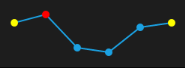

# Marker Customization

We can customizing the markers by initialize the marker template selector class, and we can differentiate the first, last, high, low, negative points.



<Syncfusion:SfLineSparkline 

		    ItemsSource="{Binding UsersList}" 

			MarkerVisibility="Visible" Padding="20"

		    YBindingPath="NoOfUsers">

<Syncfusion:SfLineSparkline.MarkerTemplateSelector>

	<Syncfusion:MarkerTemplateSelector FirstPointBrush="Yellow" LastPointBrush="Yellow" HighPointBrush="Red" MarkerHeight="15" MarkerWidth="15"/>

	</Syncfusion:SfLineSparkline.MarkerTemplateSelector>

</Syncfusion:SfLineSparkline >
  


Following is the snapshot above code,

