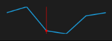

# Track ball

This is used to indicate the value point on mouse move and this feature is applicable for line and area sparkline.



<Syncfusion:SfLineSparkline 

                ItemsSource="{Binding UsersList}" 

                ShowTrackBall="True”

                YBindingPath="NoOfUsers">

  </Syncfusion:SfLineSparkline >
  


Following is the snapshot for track ball,

