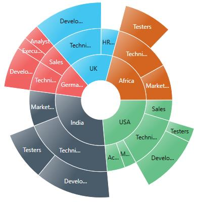
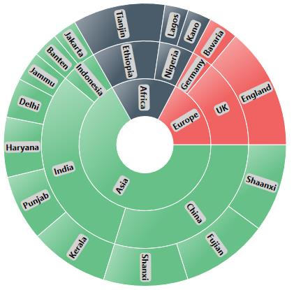

---

layout: post
title: DataLabels of Sunburst.
description: It is used to display the data releated to the chart segment. 
platform: wpf 
control: SfSunburstChart 
documentation: ug

---

# Data Labels

Sunburst data labels are used to display the data related to the segment. It helps to provide the information about the data points to the users. 

You can enable or disable the data labels by using [`ShowLabel`](https://help.syncfusion.com/cr/cref_files/wpf/Syncfusion.SfSunburstChart.WPF~Syncfusion.UI.Xaml.SunburstChart.SunburstDataLabelInfo~ShowLabel.html) property as shown in the below code 





 <sunburst:SfSunburstChart.DataLabelInfo>
                
         <sunburst:SunburstDataLabelInfo ShowLabel="True" />
                
 </sunburst:SfSunburstChart.DataLabelInfo>





SunburstDataLabelInfo dataLabelInfo = new SunburstDataLabelInfo()
{
          ShowLabel = true
};
chart.DataLabelInfo = dataLabelInfo;





N> By default, the ShowLabel property value is True.

## LabelOverflowMode

When you represent huge data with data labels, they may intersect each other. You can avoid this using the [`LabelOverflowMode`](https://help.syncfusion.com/cr/cref_files/wpf/Syncfusion.SfSunburstChart.WPF~Syncfusion.UI.Xaml.SunburstChart.SunburstDataLabelInfo~LabelOverflowMode.html) property.

The following properties are used to avoid the overlapping.

* Trim – To trim the large data labels.
* Hide – To hide the overlapped data labels.

The following code shows how to set Hide and Trim mode.

### Hide





<sunburst:SfSunburstChart.DataLabelInfo>
                
           <sunburst:SunburstDataLabelInfo ShowLabel="True"
                                           LabelOverflowMode="Hide"/>
                
</sunburst:SfSunburstChart.DataLabelInfo>





SunburstDataLabelInfo dataLabelInfo = new SunburstDataLabelInfo()
{
         ShowLabel = true,
         LabelOverflowMode = LabelOverflowMode.Hide
};





### Trim





<sunburst:SfSunburstChart.DataLabelInfo>
                
                <sunburst:SunburstDataLabelInfo ShowLabel="True" 
                                                LabelOverflowMode="Trim" />
                
</sunburst:SfSunburstChart.DataLabelInfo>





SunburstDataLabelInfo dataLabelInfo = new SunburstDataLabelInfo()
{
         ShowLabel = true,
         LabelOverflowMode =LabelOverflowMode.Trim
};

chart.DataLabelInfo = dataLabelInfo;





## LabelRotationMode

You can rotate the data label by using [`LabelRotationMode`](https://help.syncfusion.com/cr/cref_files/wpf/Syncfusion.SfSunburstChart.WPF~Syncfusion.UI.Xaml.SunburstChart.SunburstDataLabelInfo~LabelRotationMode.html) property. 

The following code shows how to set [`LabelRotationMode`](https://help.syncfusion.com/cr/cref_files/wpf/Syncfusion.SfSunburstChart.WPF~Syncfusion.UI.Xaml.SunburstChart.LabelRotationMode.html) as normal and angle. 





<sunburst:SfSunburstChart.DataLabelInfo>
                
               <sunburst:SunburstDataLabelInfo ShowLabel="True" 
                                               LabelRotationMode="Normal"/>
                
</sunburst:SfSunburstChart.DataLabelInfo>





SunburstDataLabelInfo dataLabelInfo = new SunburstDataLabelInfo()
{
                ShowLabel = true,
                LabelRotationMode = LabelRotationMode.Normal
};
chart.DataLabelInfo = dataLabelInfo;





N> By default, LabelRotationMode value is Angle.

## Customizing the data labels

You can customize the default appearance or display information about the data point using the [`LabelTemplate`](https://help.syncfusion.com/cr/cref_files/wpf/Syncfusion.SfSunburstChart.WPF~Syncfusion.UI.Xaml.SunburstChart.SunburstDataLabelInfo~LabelTemplate.html) property.



   <sunburst:SunburstDataLabelInfo.LabelTemplate>

         <DataTemplate>
               <Border Background="LightGray" CornerRadius="4" >
                      <TextBlock Text="{Binding Category}" Margin="2,0,2,0"
                                 FontWeight="Bold"/>
                </Border>
        </DataTemplate>

   </sunburst:SunburstDataLabelInfo.LabelTemplate>



