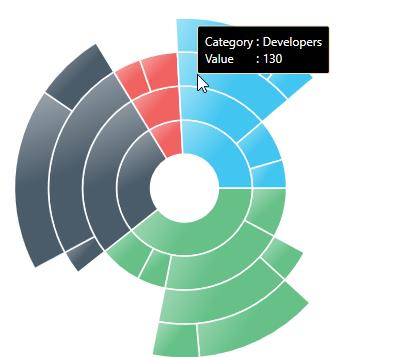
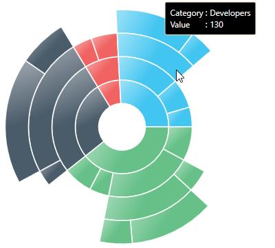

---

layout: post
title: Tooltip behavior of Sunburst.
description: This section explains the tooltip behavior of the SunburstChart.
platform: wpf 
control: SfSunburstChart 
documentation: ug

---

# ToolTip

ToolTip allows you to display any information over a sunburst segment. It appears when mouse hovered over or touch any chart segment. By default, it displays the corresponding segment category name and its value.





 <sunburst:SfSunburstChart.Behaviors>
             
           <sunburst:SunburstToolTipBehavior />
                
 </sunburst:SfSunburstChart.Behaviors>





SunburstToolTipBehavior tooltip = new SunburstToolTipBehavior();
tooltip.ShowToolTip = true;
chart.Behaviors.Add(tooltip);





## Aligning the ToolTip

The tooltip position can be aligned with respect to the cursor position by using [`HorizontalAlignment`](https://help.syncfusion.com/cr/cref_files/wpf/sfsunburstchart/Syncfusion.SfSunburstChart.WPF~Syncfusion.UI.Xaml.SunburstChart.SunburstToolTipBehavior~HorizontalAlignment.html) and [`VerticalAlignment`](https://help.syncfusion.com/cr/cref_files/wpf/sfsunburstchart/Syncfusion.SfSunburstChart.WPF~Syncfusion.UI.Xaml.SunburstChart.SunburstToolTipBehavior~VerticalAlignment.html) properties.

### HorizontalAlignment

The following code shows, how to position the tooltip to right of the cursor.





<sunburst:SfSunburstChart.Behaviors>

     <sunburst:SunburstToolTipBehavior HorizontalAlignment="Right"/>

</sunburst:SfSunburstChart.Behaviors>





SunburstToolTipBehavior tooltip = new SunburstToolTipBehavior();
tooltip.HorizontalAlignment = HorizontalAlignment.Right;
sunburstChart.Behaviors.Add(tooltip);





### VerticalAlignment

The following code shows, how to position the tooltip to bottom of the cursor.



<sunburst:SfSunburstChart.Behaviors>

     <sunburst:SunburstToolTipBehavior VerticalAlignment="Bottom"  />

</sunburst:SfSunburstChart.Behaviors>



## VerticalOffset and HorizontalOffset

The tooltip position can be customized to a custom position from the cursor using the [`HorizontalOffset`](https://help.syncfusion.com/cr/cref_files/wpf/sfsunburstchart/Syncfusion.SfSunburstChart.WPF~Syncfusion.UI.Xaml.SunburstChart.SunburstToolTipBehavior~HorizontalOffset.html) and [`VerticalOffset`](https://help.syncfusion.com/cr/cref_files/wpf/sfsunburstchart/Syncfusion.SfSunburstChart.WPF~Syncfusion.UI.Xaml.SunburstChart.SunburstToolTipBehavior~VerticalOffset.html) properties.





<sunburst:SfSunburstChart.Behaviors>

       <sunburst:SunburstToolTipBehavior HorizontalOffset="50"
                                         VerticalOffset="50"/>

</sunburst:SfSunburstChart.Behaviors>





SunburstToolTipBehavior tooltip = new SunburstToolTipBehavior();
tooltip.HorizontalOffset = 50;
tooltip.VerticalOffset = 50;
sunburstChart.Behaviors.Add(tooltip);





### TooltipDuration

You can set display duration for tooltip by using the [`ShowDuration`](https://help.syncfusion.com/cr/cref_files/wpf/sfsunburstchart/Syncfusion.SfSunburstChart.WPF~Syncfusion.UI.Xaml.SunburstChart.SunburstToolTipBehavior~ShowDuration.html) property.





<sunburst:SfSunburstChart.Behaviors>

            <sunburst:SunburstToolTipBehavior ShowDuration="6000"/>

</sunburst:SfSunburstChart.Behaviors>





SunburstToolTipBehavior tooltip = new SunburstToolTipBehavior();
tooltip.ShowDuration = 6000;
chart.Behaviors.Add(tooltip);





## Show Delay

We can set the initial display delay for Tooltip by using [`InitialShowDelay`](https://help.syncfusion.com/cr/cref_files/wpf/sfsunburstchart/Syncfusion.SfSunburstChart.WPF~Syncfusion.UI.Xaml.SunburstChart.SunburstToolTipBehavior~InitialShowDelay.html) property as like in below code. 





<sunburst:SfSunburstChart.Behaviors>

            <sunburst:SunburstToolTipBehavior InitialShowDelay="500"/>
                
</sunburst:SfSunburstChart.Behaviors>





SunburstToolTipBehavior tooltip = new SunburstToolTipBehavior();
tooltip.InitialShowDelay = 500;
sunburstChart.Behaviors.Add(tooltip);





## Animation for Tooltip

You can enable the translate animation for Tooltip by using [`EnableAnimation`](https://help.syncfusion.com/cr/cref_files/wpf/sfsunburstchart/Syncfusion.SfSunburstChart.WPF~Syncfusion.UI.Xaml.SunburstChart.SunburstToolTipBehavior~EnableAnimation.html) and [`AnimationDuration`](https://help.syncfusion.com/cr/cref_files/wpf/sfsunburstchart/Syncfusion.SfSunburstChart.WPF~Syncfusion.UI.Xaml.SunburstChart.SunburstToolTipBehavior~AnimationDuration.html) property.





<sunburst:SfSunburstChart.Behaviors>

     <sunburst:SunburstToolTipBehavior EnableAnimation="True" 
                                       AnimationDuration="5000"/>

</sunburst:SfSunburstChart.Behaviors>





SunburstToolTipBehavior tooltip = new SunburstToolTipBehavior();
tooltip.EnableAnimation = true;
tooltip.AnimationDuration = 5000;
sunburstChart.Behaviors.Add(tooltip);





## Customize the Tooltip

You can customize the default appearance of the tooltip by applying the [`TooltipTemplate`](https://help.syncfusion.com/cr/cref_files/wpf/sfsunburstchart/Syncfusion.SfSunburstChart.WPF~Syncfusion.UI.Xaml.SunburstChart.SunburstToolTipBehavior~ToolTipTemplate.html) property.



<sunburst:SunburstToolTipBehavior.ToolTipTemplate>
                        
        <DataTemplate>
                            
               <Border Background="{Binding Interior}"
                       BorderBrush="{Binding Interior}"
                       BorderThickness="4">
                       <StackPanel>
                           <StackPanel Orientation="Horizontal">
                               <TextBlock Text="Category : "/>
                               <TextBlock Text="{Binding Category}"/>
                            </StackPanel>
                            <StackPanel Orientation="Horizontal">
                                <TextBlock Text="Value : "/>
                                <TextBlock Text="{Binding Value}"/>
                            </StackPanel>
                        </StackPanel>
               </Border>
                            
       </DataTemplate>
                        
</sunburst:SunburstToolTipBehavior.ToolTipTemplate>



