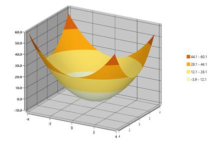

# Surface Types

Essential Surface Chart provides the following types to plot three dimensional data points.

* Surface
* WireframeSurface
* Contour 
* WireframeContour

### Surface

Surface charts are used to explore the relationship between three dimensional data. 

### WireframeSurface

You can draw the wireframe or mesh, for the surface chart.

### Contour

Viewing the surface chart from the top is called contour. It is a graphical technique that represents the three dimensional surface in a two dimensional format.  

### WireframeContour

You can draw the wireframe or mesh for the contour chart

