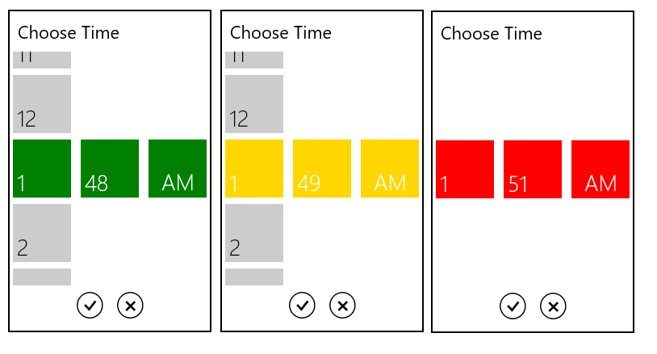

# Appearance and Styling

## Accent Brush

The AccentBrush property is used to decorate the hot spots of a control with a solid color.



	<Grid Background="{StaticResource ApplicationPageBackgroundThemeBrush}">

        <syncfusion:SfTimePicker  VerticalAlignment="Center"

                                HorizontalAlignment="Center"

                                Width="200"

                                AccentBrush="Green"/>

	</Grid>



The following images showcase the control with various Accent Brushes:

## Selected Foreground

The SelectedForeground property is used to change the foreground color of  the Selected Time



	<Grid Background="{StaticResource ApplicationPageBackgroundThemeBrush}">

       <syncfusion:SfTimePicker VerticalAlignment="Center"

                         HorizontalAlignment="Center"

                         Width="200">

            <syncfusion:SfTimePicker.SelectorStyle>

                

            </syncfusion:SfTimePicker.SelectorStyle>

      </syncfusion:SfTimePicker>

	</Grid>



