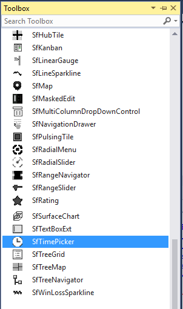

# Getting started

This section describes how to design a `SfTimePicker` control in a WPF application and overview of its basic functionalities.

# Creating simple application with SfTimePicker

The SfTimePicker control can be added to an application by using Visual Studio and Blend.

You can create the WPF application with SfTimePicker control as follows:

1. [Creating project](#creating-the-project)
2. [Adding control via designer](#adding-control-via-designer)
3. [Adding control manually in code](#adding-control-manually-in-code)

Create a WPF project in Visual Studio and refer to the following assemblies.

## Creating the project

The steps to create a SfTimePicker control by using Visual Studio in C# are as follows:

1.	Open Visual Studio.

2.	On the File menu, select New -> Project. This opens the New Project Dialog box.

## Adding control via designer

SfTimePicker control can be added to the application by dragging it from the toolbox and dropping it in a designer view. The following required assembly references will be added automatically:

* Syncfusion.SfInput.WPF
* Syncfusion.SfShared.WPF

## Adding control manually in code

The following code sample shows how to create the SfTimePicker from code-behind and XAML. 





	<Window x:Class="SfTimePicker_WPF"
        xmlns="http://schemas.microsoft.com/winfx/2006/xaml/presentation"
        xmlns:x="http://schemas.microsoft.com/winfx/2006/xaml"
        xmlns:local="clr-namespace:SfTimePicker_WPF" WindowState="Maximized"
        xmlns:input="http://schemas.syncfusion.com/wpf"
        Title="TimePicker" Height="300" Width="300">

    <Grid>
        <input:SfTimePicker x:Name="datePicker" VerticalAlignment="Center" Width="200" />
    </Grid>
    </Window>





	     SfTimePicker datepicker = new SfTimePicker();
         grid.Children.Add(timepicker);





Dim datepicker As SfTimePicker = New SfTimePicker
grid.Children.Add(timepicker)





## Formatting the display text

The SfTimePicker control allows users to format the display text in various ways.

The `FormatString` property determines the format specifier by which the display text has to be formatted.

The example below shows how to create a time picker with a [Long Time pattern](http://msdn.microsoft.com/en-us/library/system.globalization.datetimeformatinfo.longtimepattern(v=vs.71).aspx).





	<Grid Background="{StaticResource ApplicationPageBackgroundThemeBrush}">

            <syncfusion:SfTimePicker VerticalAlignment="Center" 

                                   Width="200" Margin="15"

                                   FormatString="HH:mm:ss"/>

	</Grid>





### Specifying format for the TimeSelector

The SelectorFormatString property used to specify format for the TimeSelector





	<Grid Background="{StaticResource ApplicationPageBackgroundThemeBrush}">

    <syncfusion:SfTimePicker HorizontalAlignment="Center" VerticalAlignment="Center" 

                                   Width="200" Margin="15"

                                   SelectorFormatString="HH:mm:ss"/>
	</Grid>





## Localization support

Localization is the process of making application as multi-lingual, by formatting the content according to cultures.

## Creating Resource file and adding value to the resource string based on Culture

Add a resource file(.resx) in the application and assign key values to the resource string based on the culture. Refer below screenshot,

## Assign a Current UI culture to the application

While initializing the application, CurrentCulture and CurrentUICulture should be mentioned in code, so that application will get the appropriate values provided in resource file.




 
 <syncfusion:SfTimePicker HorizontalAlignment="Center" VerticalAlignment="Center" FormatString="dddd, MMMM dd, yyyy h:mm:ss tt"/>





            CultureInfo culture = new System.Globalization.CultureInfo("ar-SA");
            culture.DateTimeFormat.AMDesignator = "صباحا";
            culture.DateTimeFormat.PMDesignator = "مساء";
            System.Threading.Thread.CurrentThread.CurrentCulture = culture;
            System.Threading.Thread.CurrentThread.CurrentUICulture = culture;





Dim culture As CultureInfo = New System.Globalization.CultureInfo("ar-SA")
culture.DateTimeFormat.AMDesignator = "5('-'"
culture.DateTimeFormat.PMDesignator = "E3'!"
System.Threading.Thread.CurrentThread.CurrentCulture = culture
System.Threading.Thread.CurrentThread.CurrentUICulture = culture





Value field of SfTimePicker is localized
{:.caption}

Display text "Choose Time" and Meridiem(AM/PM) is localized
{:.caption}