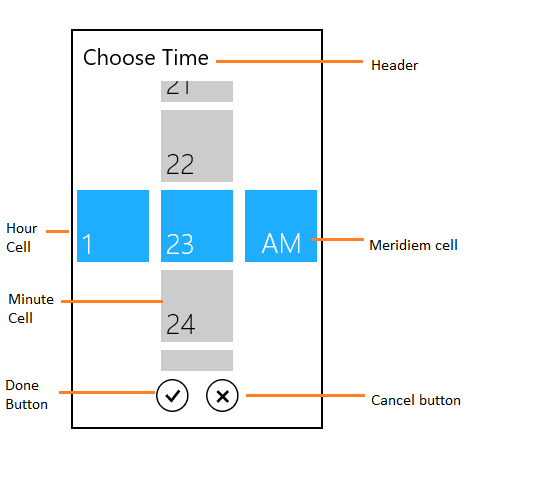
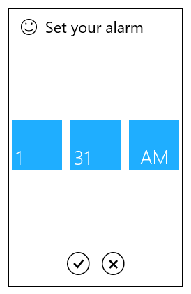
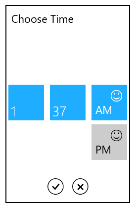

# SfTimeSelector

The SfTimeSelector control opens inside the popup window.

The visual elements of the time selector can be customized using the property SelectorStyle.

## Header

The header property defines the top part of the time selector.


	<syncfusion:SfTimePicker VerticalAlignment="Center"

                       HorizontalAlignment="Center"

                       Width="200">

       <syncfusion:SfTimePicker.SelectorStyle>

                

       </syncfusion:SfTimePicker.SelectorStyle>

	</syncfusion:SfTimePicker >



## HeaderTemplate

The HeaderTemplate property is used to decorate the header.



	<syncfusion:SfTimePicker VerticalAlignment="Center" 

                               HorizontalAlignment="Center"

                               Width="200">

            <syncfusion:SfTimePicker.SelectorStyle>

                

            </syncfusion:SfTimePicker.SelectorStyle>  
			</syncfusion:SfTimePicker>
			



## Cell template

The cell template property is used to decorate the selection box with custom visuals. 

N>  The DataContext of Selection box is Syncfusion.UI.Xaml.Primitives.DateTimeWrapper.

## HourCellTemplate

 The HourCellTemplate property is used to decorate the hour cell selection box.



	<syncfusion:SfTimePicker VerticalAlignment="Center"

                               HorizontalAlignment="Center"

                               Width="200">

            <syncfusion:SfTimePicker.SelectorStyle>

                

            </syncfusion:SfTimePicker.SelectorStyle>   
			</syncfusion:SfTimePicker>



## MinuteCellTemplate

The MinuteCellTemplate property is used to decorate the minute cell selection box



       
	<syncfusion:SfTimePicker VerticalAlignment="Center"

                               HorizontalAlignment="Center"

                               Width="200">

            <syncfusion:SfTimePicker.SelectorStyle>

                

            </syncfusion:SfTimePicker.SelectorStyle>   
			</syncfusion:SfTimePicker>



## MeridiemCellTemplate

The MeridiemCellTemplate property is used to decorate the meridiem cell selection box. 



	<syncfusion:SfTimePicker VerticalAlignment="Center"

                               HorizontalAlignment="Center"

                               Width="200">

            <syncfusion:SfTimePicker.SelectorStyle>

                

            </syncfusion:SfTimePicker.SelectorStyle>   
			</syncfusion:SfTimePicker>   



## Setting Incremental values

To set minute and second values in SfTimeSelector with incremental values, use MinuteInterval and SecondsInterval properties respectively.

### MinuteInterval

MinuteInterval property is used to set interval for minute values in SfTimeSelector.

### SecondsInterval

SecondsInterval property is used to set interval for second values in SfTimeSelector.




	<syncfusion:SfTimeSelector FormatString="hh:MM:ss tt" MinuteInterval="2" SecondsInterval="10"/>





	SfTimeSelector timeSelector = new SfTimeSelector();

	timeSelector.FormatString= "hh:MM:ss tt";

	timeSelector.MinuteInterval=2;

	timeSelector.SecondsInterval=10;





