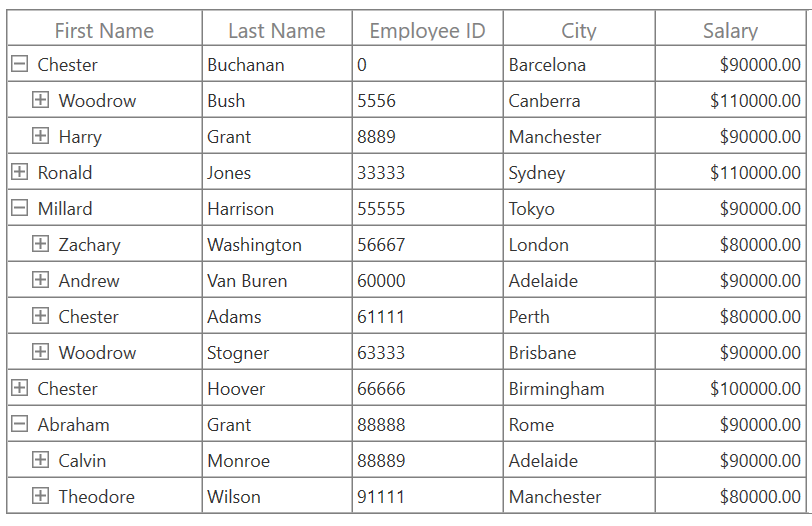
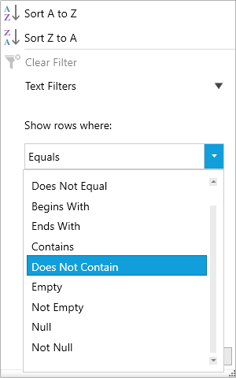
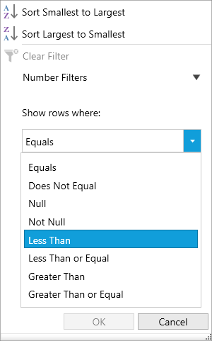
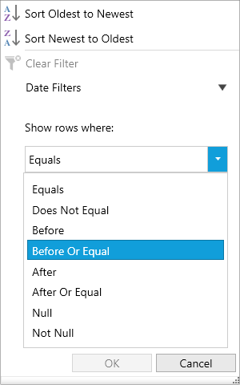
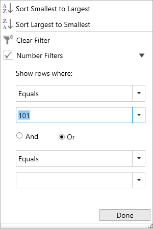
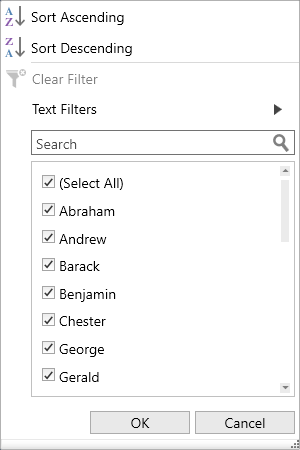
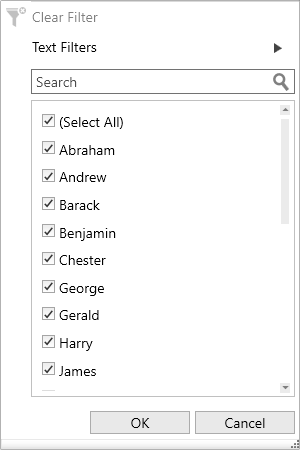
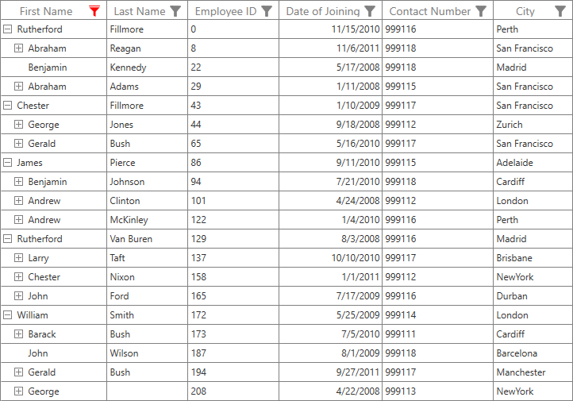

# Filtering

Filtering is the process of retrieving the values from the collection which satisfy the specified condition. In the SfTreeGrid, filtering can be applied though the UI as well as the programmatic filters.

## FilterLevel

You can filter the nodes based on level by using [SfTreeGrid.FilterLevel](https://help.syncfusion.com/cr/cref_files/wpf/Syncfusion.SfGrid.WPF~Syncfusion.UI.Xaml.TreeGrid.SfTreeGrid~FilterLevel.html) property.




treeGrid.FilterLevel = FilterLevel.All;




* Root - Filter will be applied to root nodes only in SfTreeGrid.

* All - Filter will be applied to all the nodes in SfTreeGrid.

* Extended - Filter will be applied to all the nodes. If a node matches the filter condition, it’s all ancestors will also be displayed, even though parent node does not match the filter condition.

**Root**

Filter will be applied to root nodes only in SfTreeGrid. For other nodes, `IsFiltered` value will be false and they always will be displayed in view.

**All**

Filter will be applied to all the nodes in SfTreeGrid. If the parent node does not match the filter condition, filter will not be applied for child nodes. Else, filter will be applied to its child nodes also.

**Extended**

Filter will be applied to all the nodes. If a node matches the filter condition, it’s all ancestors will also be displayed, even though parent node does not match the filter condition and parent node’s `IsFiltered` value will be set as false.

Note> It is also possible to change `FilterLevel` at runtime.

## Programmatic filtering

The programmatic filtering can be applied to the SfTreeGrid by using the following methods,

*	View Filtering

* 	Column Filtering

### View filtering

View filtering can be achieved by setting [SfTreeGrid.View.Filter](https://help.syncfusion.com/cr/cref_files/wpf/Syncfusion.SfGrid.WPF~Syncfusion.UI.Xaml.TreeGrid.TreeGridView~Filter.html) delegate and calling [SfTreeGrid.View.RefreshFilter](https://help.syncfusion.com/cr/cref_files/wpf/Syncfusion.SfGrid.WPF~Syncfusion.UI.Xaml.TreeGrid.TreeGridView~RefreshFilter.html) method.




public bool FilerNodes(object o)
{
    var data = o as Employee;

    if (data.Salary > 70000)
        return true;
    return false;
}

private void Button_Click(object sender, RoutedEventArgs e)
{
    treeGrid.View.Filter = FilerNodes;
    treeGrid.View.RefreshFilter();
}




Here, `FilterNodes` delegate filters the data based on Salary. `FilterNodes` delegate is assigned to [SfTreeGrid.View.Filter](https://help.syncfusion.com/cr/cref_files/wpf/Syncfusion.SfGrid.WPF~Syncfusion.UI.Xaml.TreeGrid.TreeGridView~Filter.html) predicate to filter the tree grid. After that, [SfTreeGrid.View.RefreshFilter](https://help.syncfusion.com/cr/cref_files/wpf/Syncfusion.SfGrid.WPF~Syncfusion.UI.Xaml.TreeGrid.TreeGridView~RefreshFilter.html) method is called to refresh the nodes. If the node satisfies the filter conditions, true will be returned. Else false will be returned.

While filtering, if the node satisfies filter condition, [IsFiltered](https://help.syncfusion.com/cr/cref_files/wpf/Syncfusion.SfGrid.WPF~Syncfusion.UI.Xaml.TreeGrid.TreeNode~IsFiltered.html) property of [TreeNode](https://help.syncfusion.com/cr/cref_files/wpf/Syncfusion.SfGrid.WPF~Syncfusion.UI.Xaml.TreeGrid.TreeNode.html) will be set as false. Else, it will be true. If `IsFiltered` value is True, the node will not be displayed in view, else it will be displayed in view.

N> SfTreeGrid refreshes the filtering on property change if [SfTreeGrid.LiveNodeUpdateMode ](https://help.syncfusion.com/cr/cref_files/wpf/Syncfusion.SfGrid.WPF~Syncfusion.UI.Xaml.TreeGrid.SfTreeGrid~LiveNodeUpdateMode.html)property is set as `AllowDataShaping`.

You can download the sample from [here](http://www.syncfusion.com/downloads/support/directtrac/general/ze/FilteringDemo-587565594).

### Clear filters

You can clear the view filters applied in tree grid by setting `SfTreeGrid.View.Filter` delegate as null and calling `SfTreeGrid.View.RefreshFilter` method.




treeGrid.View.Filter = null;
treeGrid.View.RefreshFilter();




**HasVisibleChildNodes**

You can find whether particular node has child node(s) displayed in a view (matches filtering criteria) or not by using [HasVisibleChildNodes](https://help.syncfusion.com/cr/cref_files/wpf/Syncfusion.SfGrid.WPF~Syncfusion.UI.Xaml.TreeGrid.TreeNode~HasVisibleChildNodes.html) property in [TreeNode](https://help.syncfusion.com/cr/cref_files/wpf/Syncfusion.SfGrid.WPF~Syncfusion.UI.Xaml.TreeGrid.TreeNode.html).




var treeNode=treeGrid.View.Nodes[0];
var hasVisibleChildNodes = treeNode.HasVisibleChildNodes;




### Column filtering

The column filtering can be achieved by adding the `FilterPredicate` to the [TreeGridColumn.FilterPredicates](https://help.syncfusion.com/cr/cref_files/wpf/Syncfusion.SfGrid.WPF~Syncfusion.UI.Xaml.TreeGrid.TreeGridColumn~FilterPredicates.html) property.




this.sfTreeGrid.Columns["FirstName"].FilterPredicates.Add(
  new Syncfusion.Data.FilterPredicate()
  {
      FilterType = Syncfusion.Data.FilterType.Equals,
      FilterValue = "Chester"
  });




#### Filter behavior
The [FilterBehavior](https://help.syncfusion.com/cr/cref_files/wpf/Syncfusion.Data.WPF~Syncfusion.Data.FilterPredicate~FilterBehavior.html) property is used to specify whether to consider the [FilterValue](https://help.syncfusion.com/cr/cref_files/wpf/Syncfusion.Data.WPF~Syncfusion.Data.FilterPredicate~FilterValue.html) as the string or specific data type.

*	StringTyped - Records are filtered without considering the type and it takes FilterValue type as string.
*	StronglyTyped - Records are filtered by considering the FilterValue underlying type.

#### Clear filtering

The Filters applied to the SfTreeGrid can be removed by clearing the `FilterPredicates` added for the columns. This can be achieved by using the following methods,

*	[SfTreeGrid.ClearFilters](https://help.syncfusion.com/cr/cref_files/wpf/Syncfusion.SfGrid.WPF~Syncfusion.UI.Xaml.TreeGrid.SfTreeGrid~ClearFilters.html) - Clears filters for all the columns programmatically.
*	[SfTreeGrid.ClearFilter(String columnName)](https://help.syncfusion.com/cr/cref_files/wpf/Syncfusion.SfGrid.WPF~Syncfusion.UI.Xaml.TreeGrid.SfTreeGrid~ClearFilter(String).html) - Clears the filter for a specific column that has the columnName as MappingName.
*	[SfTreeGrid.ClearFilter(TreeGridColumn column)](https://help.syncfusion.com/cr/cref_files/wpf/Syncfusion.SfGrid.WPF~Syncfusion.UI.Xaml.TreeGrid.SfTreeGrid~ClearFilter(TreeGridColumn).html) - Clears the filter for a specific column alone.




this.sfTreeGrid.ClearFilters();
this.sfTreeGrid.ClearFilter("FirstName");
this.sfTreeGrid.ClearFilter(this.sfTreeGrid.Columns["FirstName"]);




#### Adding multiple filter predicates for a column

The [PredicateType](https://help.syncfusion.com/cr/cref_files/wpf/Syncfusion.Data.WPF~Syncfusion.Data.FilterPredicate~PredicateType.html) property is used to apply multiple FilterPredicates for a column.

*	And : Performs And operation in filters.
*	AndAlso : Performs AndAlso operation in filters.
*	Or : Performs Or operation in filters.
*	OrElse : Performs OrElse operation in filters.




this.sfTreeGrid.Columns["FirstName"].FilterPredicates.Add(
  new Syncfusion.Data.FilterPredicate()
  {
      FilterType = Syncfusion.Data.FilterType.Equals,
      FilterValue = "Chester",
      PredicateType = Syncfusion.Data.PredicateType.Or
  });

this.sfTreeGrid.Columns["FirstName"].FilterPredicates.Add(
    new Syncfusion.Data.FilterPredicate()
    {
        FilterType = Syncfusion.Data.FilterType.Equals,
        FilterValue = "Martin",
        PredicateType = Syncfusion.Data.PredicateType.Or
    });




#### Filter DateColumn with range between two dates

A [TreeGridDateTimeColumn](https://help.syncfusion.com/cr/cref_files/wpf/Syncfusion.SfGrid.WPF~Syncfusion.UI.Xaml.TreeGrid.TreeGridDateTimeColumn.html) can be filtered with range between two dates by applying two FilterPredicate for the same column. The [FilterType](https://help.syncfusion.com/cr/cref_files/wpf/Syncfusion.Data.WPF~Syncfusion.Data.FilterPredicate~FilterType.html) for the FilterPredicate with start date should be `GreaterThanOrEqual` and end date should be `LessThanOrEqual`.

## UI filtering

SfTreeGrid provides excel like filtering UI and advanced filter UI to filter the data easily. UI filtering can be enabled by setting [SfTreeGrid.AllowFiltering](https://help.syncfusion.com/cr/cref_files/wpf/Syncfusion.SfGrid.WPF~Syncfusion.UI.Xaml.TreeGrid.SfTreeGrid~AllowFiltering.html) property to `true`. This allows to open the filter UI by clicking on the filter icon on the column header to filter the nodes.

The filtering can be enabled or disabled for a specific column by setting [TreeGridColumn.AllowFiltering](https://help.syncfusion.com/cr/cref_files/wpf/Syncfusion.SfGrid.WPF~Syncfusion.UI.Xaml.TreeGrid.TreeGridColumn~AllowFiltering.html) property.




// Enable the UI filtering for the SfTreeGrid.
this.sfTreeGrid.AllowFiltering = true;

// Enable the UI filtering for the EmployeeID column.
this.sfTreeGrid.Columns["EmployeeID"].AllowFiltering = true;




N> `TreeGridColumn.AllowFiltering` has higher priority than `SfTreeGrid.AllowFiltering` property.

###Built-in UI views

The SfTreeGrid provides the following types of Filter popup modes,

Checkbox Filter - Provides excel like filter interface with list of checkboxes.

Advanced Filter - Provides advanced filter options to filter the data.

Both - Both Checkbox filter and Advanced filter are loaded while opening the filter pop-up. 

By default, the filter popup mode of the column is set as Both. The checkbox and the advanced filter can be switched by using the Advanced Filter button.

#### Checkbox filtering UI

#### Advanced filtering UI

## Changing filter UI for grid

Filter UI view can be changed for all the columns in grid by changing [FilterMode](https://help.syncfusion.com/cr/cref_files/wpf/Syncfusion.SfGrid.WPF~Syncfusion.UI.Xaml.TreeGrid.Filtering.TreeGridFilterControl~FilterMode.html) in [TreeGridFilterControl](https://help.syncfusion.com/cr/cref_files/wpf/Syncfusion.SfGrid.WPF~Syncfusion.UI.Xaml.TreeGrid.Filtering.TreeGridFilterControl.html) by writing style and assign it to [SfTreeGrid.FilterPopupStyle](https://help.syncfusion.com/cr/cref_files/wpf/Syncfusion.SfGrid.WPF~Syncfusion.UI.Xaml.TreeGrid.SfTreeGrid~FilterPopupStyle.html).




<syncfusion:SfTreeGrid Name="sfTreeGrid"
                           FilterPopupStyle="{StaticResource filterControlStyle}"
                           AllowFiltering="True”
                           ItemsSource="{Binding EmployeeDetails}" />




## Changing filter UI for column

Filter UI view can be changed for a specific column by changing [FilterMode](https://help.syncfusion.com/cr/cref_files/wpf/Syncfusion.SfGrid.WPF~Syncfusion.UI.Xaml.TreeGrid.Filtering.TreeGridFilterControl~FilterMode.html) in [TreeGridFilterControl](https://help.syncfusion.com/cr/cref_files/wpf/Syncfusion.SfGrid.WPF~Syncfusion.UI.Xaml.TreeGrid.Filtering.TreeGridFilterControl.html) by writing style and assign it to [TreeGridColumn.FilterPopupStyle](https://help.syncfusion.com/cr/cref_files/wpf/Syncfusion.SfGrid.WPF~Syncfusion.UI.Xaml.TreeGrid.TreeGridColumn~FilterPopupStyle.html).




<syncfusion:TreeGridTextColumn MappingName="FirstName"
                               FilterPopupStyle="{StaticResource filterControlStyle}"/>




## Setting Default Filter popup style for a specific column

You can skip the [TreeGridFilterControl](https://help.syncfusion.com/cr/cref_files/wpf/Syncfusion.SfGrid.WPF~Syncfusion.UI.Xaml.TreeGrid.Filtering.TreeGridFilterControl.html) styling for a specific column in [SfTreeGrid.FilterPopupStyle](https://help.syncfusion.com/cr/cref_files/wpf/Syncfusion.SfGrid.WPF~Syncfusion.UI.Xaml.TreeGrid.SfTreeGrid~FilterPopupStyle.html) by setting [TreeGridColumn.FilterPopupStyle](https://help.syncfusion.com/cr/cref_files/wpf/Syncfusion.SfGrid.WPF~Syncfusion.UI.Xaml.TreeGrid.TreeGridColumn~FilterPopupStyle.html) to null.




<syncfusion:SfTreeGrid Name="sfTreeGrid"
                           FilterPopupStyle="{StaticResource filterControlStyle}"
                           AllowFiltering="True”
                           ItemsSource="{Binding EmployeeDetails}" />

<syncfusion:TreeGridTextColumn MappingName="LastName" FilterPopupStyle="{x:Null}"/>




## Checkbox filtering

The Checkbox filtering is same as the Excel like filter popup which displays a search textbox and a list of checkboxes with unique items from the expanded tree nodes.
The items which are in the checked state will be visible in the view and the other items will be filtered out of the view. 

This filtering operation will be performed based on the value of [SfTreeGrid.FilterLevel](https://help.syncfusion.com/cr/cref_files/wpf/Syncfusion.SfGrid.WPF~Syncfusion.UI.Xaml.TreeGrid.SfTreeGrid~FilterLevel.html) property.

## Advanced filtering

Advanced filter UI provides multiple filter options to filter the data easily. Filter menu options are loaded based on advanced filter type by automatically detecting the underlying date type.

Below are the built-in filter types supported.

*	Text Filters - Loads various menu options to filter the display text effectively.

*	Number Filters - Loads various menu options to filter the numeric data.

*	Date Filters - Loads various menu options and [DatePicker](https://msdn.microsoft.com/en-in/library/system.windows.controls.datepicker.aspx) to filter DateTime type column.

<table>
<tr>
<th>
Text Filters
</th>
<th>
Number Filters
</th>
<th>
Date Filters
</th>
</tr>
<tr>
<td>
When the string value is bound to the {{'[TreeGridColumn](https://help.syncfusion.com/cr/cref_files/wpf/Syncfusion.SfGrid.WPF~Syncfusion.UI.Xaml.TreeGrid.TreeGridColumn.html)'| markdownify }} or the items source is {{'[dynamic](https://docs.microsoft.com/en-us/dotnet/csharp/language-reference/keywords/dynamic)'| markdownify}}, then `TextFilters` are loaded in {{'[TreeGridAdvancedFilterControl](https://help.syncfusion.com/cr/cref_files/wpf/Syncfusion.SfGrid.WPF~Syncfusion.UI.Xaml.TreeGrid.Filtering.TreeGridAdvancedFilterControl.html)'|markdownify}}.
</td>
<td>
When integer, double, short, decimal, byte or long are bound to the {{'[TreeGridColumn](https://help.syncfusion.com/cr/cref_files/wpf/Syncfusion.SfGrid.WPF~Syncfusion.UI.Xaml.TreeGrid.TreeGridColumn.html)'|markdownify}} then `Number Filters` are loaded in {{'[TreeGridAdvancedFilterControl](https://help.syncfusion.com/cr/cref_files/wpf/Syncfusion.SfGrid.WPF~Syncfusion.UI.Xaml.TreeGrid.Filtering.TreeGridAdvancedFilterControl.html)'|markdownify}}.
</td>
<td>
When the DateTime type value is bound to the {{'[TreeGridColumn](https://help.syncfusion.com/cr/cref_files/wpf/Syncfusion.SfGrid.WPF~Syncfusion.UI.Xaml.TreeGrid.TreeGridColumn.html)'|markdownify}}, then `Date Filters` are loaded in {{'[TreeGridAdvancedFilterControl](https://help.syncfusion.com/cr/cref_files/wpf/Syncfusion.SfGrid.WPF~Syncfusion.UI.Xaml.TreeGrid.Filtering.TreeGridAdvancedFilterControl.html)'|markdownify}}.
</td>
</tr>
<tr>
<td>

</td>
<td>

</td>
<td>

</td>
</tr>
<tr>
<td>
  
<b>Filter menu options</b>
<ol>
<li>Equals</li>
<li>Does Not Equal</li>
<li>Begins With</li> 
<li>Ends With</li> 
<li>Contains</li> 
<li>Does Not Contain</li>
<li>Empty</li> 
<li>Not Empty</li>
<li>Null</li> 
<li>Not Null</li> 
</ol>
</td>
<td>
<b>Filter menu options</b>
<ol>
<li>Equals</li>
<li>Does Not Equal</li>
<li>Null</li>
<li>Not Null</li>
<li>Less Than</li>
<li>Less Than or Equal</li>
<li>Greater Than</li>
<li>Greater Than or Equal</li>
</ol>
</td>
<td>
<b>Filter menu options</b>
<ol>
<li>Equals</li>
<li>Does Not Equal</li>
<li>Before</li>
<li>Before Or Equal</li>
<li>After</li>
<li>After Or Equal</li>
<li>Null</li>
<li>Not Null</li>
</ol>
</td>
</tr>
</table>

N> `Null` and `Not Null` options are available only when `AllowBlankFilters` is set to `True`.

## Instant filtering

By default, filters are applied to the columns when OK button is clicked in UI filtering. If you want to update the filters immediately whenever update in filter popup, you need to set [TreeGridColumn.ImmediateUpdateColumnFilter](https://help.syncfusion.com/cr/cref_files/wpf/Syncfusion.SfGrid.WPF~Syncfusion.UI.Xaml.TreeGrid.TreeGridColumn~ImmediateUpdateColumnFilter.html) as True.




<syncfusion:TreeGridTextColumn MappingName="EmployeeID" 
                               ImmediateUpdateColumnFilter="True"/>







this.sfTreeGrid.Columns["EmployeeID"].ImmediateUpdateColumnFilter = true;




Here, the OK and Cancel buttons are unavailable and Done button is available to just close the popup.

Checkbox filter when `ImmediateUpdateColumnFilter` is true

Advanced filter when `ImmediateUpdateColumnFilter` is true

N> In Checkbox Filter, the `SelectAll` option is not reflected in the filter updates if [ImmediateUpdateColumnFilter](https://help.syncfusion.com/cr/cref_files/wpf/Syncfusion.SfGrid.WPF~Syncfusion.UI.Xaml.TreeGrid.TreeGridColumn~ImmediateUpdateColumnFilter.html) is true.

## Filtering null values

To filter the null values, [TreeGridColumn.AllowBlankFilters](https://help.syncfusion.com/cr/cref_files/wpf/Syncfusion.SfGrid.WPF~Syncfusion.UI.Xaml.TreeGrid.TreeGridColumn~AllowBlankFilters.html) property should be enabled. Enabling `AllowBlankFilters` will include null values into the filter items list. 




<syncfusion:TreeGridTextColumn MappingName="FirstName" AllowBlankFilters="True"/>







this.sfTreeGrid.Columns["FirstName"].AllowBlankFilters = true;




Checkbox filter when `AllowBlankFilters` is true

Advanced Filter when `AllowBlankFilters` is true

## Changing AdvancedFilter type while loading dynamic ItemsSource

By default, text filters will be loaded for the columns if `ItemsSource` is [dynamic](https://msdn.microsoft.com/en-us/library/dd264741.aspx). [TreeGridColumn.ColumnMemberType](https://help.syncfusion.com/cr/cref_files/wpf/Syncfusion.SfGrid.WPF~Syncfusion.UI.Xaml.TreeGrid.TreeGridColumn~ColumnMemberType.html) property can be used to load number filters or date filters based on the column values.




this.sfTreeGrid.Columns["EmployeeID"].ColumnMemberType = typeof(double);




## Customization using events

### Loading text filter for Number or Date Column

[SfTreeGrid.FilterItemsPopulating](https://help.syncfusion.com/cr/cref_files/wpf/Syncfusion.SfGrid.WPF~Syncfusion.UI.Xaml.TreeGrid.SfTreeGrid~FilterItemsPopulating_EV.html) event can be used to load text filters for the columns that have number or date value as underlying type by setting the value of `TreeGridFilterItemsPopulatingEventArgs.FilterControl.AdvancedFilterType` property as `AdvancedFilterType.TextFilter`.




this.sfTreeGrid.FilterItemsPopulating += OnSfTreeGridFilterItemsPopulating;

private void OnSfTreeGridFilterItemsPopulating(object sender, TreeGridFilterItemsPopulatingEventArgs e)
 {
     if (e.Column.MappingName == "EmployeeID")
         e.FilterControl.AdvancedFilterType = AdvancedFilterType.TextFilter;
 }




### Customizing filter predicates

The filter predicates can be customized by using the [SfTreeGrid.FilterChanging](https://help.syncfusion.com/cr/cref_files/wpf/Syncfusion.SfGrid.WPF~Syncfusion.UI.Xaml.TreeGrid.SfTreeGrid~FilterChanging_EV.html) event. This event will be raised while applying filter using the filter control. Here [FilterValue](https://help.syncfusion.com/cr/cref_files/wpf/Syncfusion.Data.WPF~Syncfusion.Data.FilterPredicate~FilterValue.html) is changes based on some conditions.




this.sfTreeGrid.FilterChanging += OnSfTreeGridFilterChanging;

private void OnSfTreeGridFilterChanging(object sender, TreeGridFilterChangingEventArgs e)
{
    if (e.FilterPredicates == null || e.Column.MappingName != "FirstName")
        return;

    if (e.FilterPredicates[0].FilterValue.Equals("Chester"))
        e.FilterPredicates[0].FilterValue = "Abraham";
}




### Customizing Excel-like filter ItemsSource

[TreeGridFilterControl](https://help.syncfusion.com/cr/cref_files/wpf/Syncfusion.SfGrid.WPF~Syncfusion.UI.Xaml.TreeGrid.Filtering.TreeGridFilterControl.html) `ItemsSource` can be customized to restrict some data from filtering by using [SfTreeGrid.FilterItemsPopulated](https://help.syncfusion.com/cr/cref_files/wpf/Syncfusion.SfGrid.WPF~Syncfusion.UI.Xaml.TreeGrid.SfTreeGrid~FilterItemsPopulated_EV.html) event. Here [FilterElement](https://help.syncfusion.com/cr/cref_files/wpf/Syncfusion.SfGrid.WPF~Syncfusion.UI.Xaml.Grid.FilterElement.html) which has actual value as 0 is removed from the `ItemsSource`.




this.sfTreeGrid.FilterItemsPopulated += OnSfTreeGridFilterItemsPopulated;

private void OnSfTreeGridFilterItemsPopulated(object sender, TreeGridFilterItemsPopulatedEventArgs e)
{
    if (e.Column.MappingName == "EmployeeID")
    {
        var itemsSource = e.ItemsSource as List<FilterElement>;

        //Get the FilterElement to Remove from itemsSource.
        var filterElement = itemsSource.FirstOrDefault(items => items.ActualValue.Equals(0));

        //Remove the FilterElement from itemsSource.
        itemsSource.Remove(filterElement);
    }
}




### Changing filter UI

Filter UI can be changed either for all the columns or for a specific column in SfTreeGrid by changing the [FilterMode](https://help.syncfusion.com/cr/cref_files/wpf/Syncfusion.SfGrid.WPF~Syncfusion.UI.Xaml.TreeGrid.Filtering.TreeGridFilterControl~FilterMode.html) property value using [SfTreeGrid.FilterItemsPopulating](https://help.syncfusion.com/cr/cref_files/wpf/Syncfusion.SfGrid.WPF~Syncfusion.UI.Xaml.TreeGrid.SfTreeGrid~FilterItemsPopulating_EV.html) event.

Here filter UI is changes to `AdvancedFilter` only for `EmployeeID` column.




this.sfTreeGrid.FilterItemsPopulating += SfTreeGrid_FilterItemsPopulating;

private void SfTreeGrid_FilterItemsPopulating(object sender, TreeGridFilterItemsPopulatingEventArgs e)
{
    if (e.Column.MappingName == "EmployeeID")
        e.FilterControl.FilterMode = FilterMode.AdvancedFilter;
}




### Customizing sort options text

Sort Options text can be customized by changing the value of [AscendingSortString](https://help.syncfusion.com/cr/cref_files/wpf/Syncfusion.SfGrid.WPF~Syncfusion.UI.Xaml.TreeGrid.Filtering.TreeGridFilterControl~AscendingSortString.html) and [DescendingSortString](https://help.syncfusion.com/cr/cref_files/wpf/Syncfusion.SfGrid.WPF~Syncfusion.UI.Xaml.TreeGrid.Filtering.TreeGridFilterControl~DescendingSortString.html) properties in [TreeGridFilterControl](https://help.syncfusion.com/cr/cref_files/wpf/Syncfusion.SfGrid.WPF~Syncfusion.UI.Xaml.TreeGrid.Filtering.TreeGridFilterControl.html) using [SfTreeGrid.FilterItemsPopulating](https://help.syncfusion.com/cr/cref_files/wpf/Syncfusion.SfGrid.WPF~Syncfusion.UI.Xaml.TreeGrid.SfTreeGrid~FilterItemsPopulating_EV.html) event.




this.sfTreeGrid.FilterItemsPopulating += OnSfTreeGridFilterItemsPopulating;

private void OnSfTreeGridFilterItemsPopulating(object sender, TreeGridFilterItemsPopulatingEventArgs e)
{
    if (e.Column.MappingName == "FirstName")
    {
        e.FilterControl.AscendingSortString = "Sort Ascending";
        e.FilterControl.DescendingSortString = "Sort Descending";
    }
}




## Appearance

### Hiding sort options

Sort Options can be collapsed by setting [SortOptionVisibility](https://help.syncfusion.com/cr/cref_files/wpf/Syncfusion.SfGrid.WPF~Syncfusion.UI.Xaml.TreeGrid.Filtering.TreeGridFilterControl~SortOptionVisibility.html) property in [TreeGridFilterControl](https://help.syncfusion.com/cr/cref_files/wpf/Syncfusion.SfGrid.WPF~Syncfusion.UI.Xaml.TreeGrid.Filtering.TreeGridFilterControl.html).




<syncfusion:SfTreeGrid Name="sfTreeGrid"
                           FilterPopupStyle="{StaticResource filterControlStyle}"
                           AllowFiltering="True”
                           ItemsSource="{Binding EmployeeDetails}" />




### Customizing the filter popup size 

The size of the filter popup can be changed by using properties [FilterPopupHeight](https://help.syncfusion.com/cr/cref_files/wpf/Syncfusion.SfGrid.WPF~Syncfusion.UI.Xaml.TreeGrid.Filtering.TreeGridFilterControl~FilterPopupHeight.html) and [FilterPopupWidth](https://help.syncfusion.com/cr/cref_files/wpf/Syncfusion.SfGrid.WPF~Syncfusion.UI.Xaml.TreeGrid.Filtering.TreeGridFilterControl~FilterPopupWidth.html) in [TreeGridFilterControl](https://help.syncfusion.com/cr/cref_files/wpf/Syncfusion.SfGrid.WPF~Syncfusion.UI.Xaml.TreeGrid.Filtering.TreeGridFilterControl.html).




<Window.Resources>
    
</Window.Resources>




### Changing filter icon style after applying filters

The filter icon style can be changed by writing style with TargetType as [FilterToggleButton](http://help.syncfusion.com/cr/cref_files/wpf/Syncfusion.SfGrid.WPF~Syncfusion.UI.Xaml.Grid.FilterToggleButton.html).







