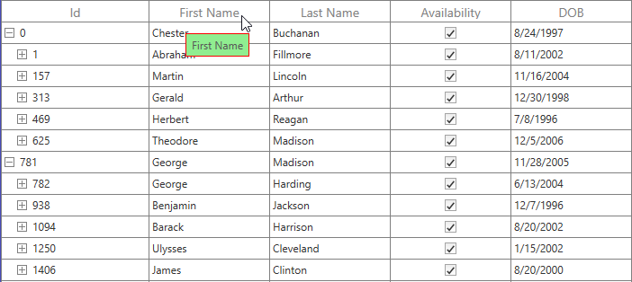

# Interactive Feature

## ToolTip

SfTreeGrid provides support to display tooltip for record and header cells when hover the cells.

### Record Cell ToolTip

You can enable or disable default tooltip for record cells by setting [SfTreeGrid.ShowToolTip](https://help.syncfusion.com/cr/cref_files/wpf/sfdatagrid/Syncfusion.SfGrid.WPF~Syncfusion.UI.Xaml.Grid.GridColumnBase~ShowToolTipProperty.html) as `true`.




<syncfusion:SfTreeGrid Name="treeGrid" 
                        AutoExpandMode="RootNodesExpanded"
                        AutoGenerateColumns="False"
                        ShowToolTip="True"
                        ChildPropertyName="Children"    ItemsSource="{Binding EmployeeDetails}">	




this.treeGrid.ShowToolTip = true;




You can enable the tooltip for the particular column by setting the [TreeGridColumn.ShowToolTip](https://help.syncfusion.com/cr/cref_files/wpf/sfdatagrid/Syncfusion.SfGrid.WPF~Syncfusion.UI.Xaml.TreeGrid.TreeGridColumn_properties.html) as `true`.




<syncfusion:TreeGridTextColumn HeaderText="First Name" MappingName="FirstName" ShowToolTip="True" />
<syncfusion:TreeGridTextColumn HeaderText="Last Name" MappingName="LastName" ShowToolTip="True" />	




this.treeGrid.Columns["FirstName"].ShowToolTip = true;
this.treeGrid.Columns["LastName"].ShowToolTip = true;




N> It takes higher priority than `SfTreeGrid.ShowToolTip`.

### Header ToolTip

You can enable the tooltip for the header cell by setting the [TreeGridColumn.ShowHeaderToolTip](https://help.syncfusion.com/cr/cref_files/wpf/sfdatagrid/Syncfusion.SfGrid.WPF~Syncfusion.UI.Xaml.Grid.GridColumnBase~ShowHeaderToolTip.html) as `true`.




<syncfusion:SfTreeGrid.Columns>
    <syncfusion:TreeGridTextColumn HeaderText="First Name" MappingName="FirstName" ShowHeaderToolTip="True" />
</syncfusion:SfTreeGrid.Columns>




this.treeGrid.Columns["FirstName"].ShowHeaderToolTip = true;




## Templating ToolTip

You can customize the template of cell tooltip and header tooltip.

Cell ToolTipTemplate receives underlying data object as DataContext by default. You can set [TreeGridColumn.SetCellBoundToolTip](https://help.syncfusion.com/cr/cref_files/wpf/sfdatagrid/Syncfusion.SfGrid.WPF~Syncfusion.UI.Xaml.Grid.GridColumnBase~SetCellBoundToolTip.html) as `true` to change the DataContext of tooltip template where it sets the DataContext as DataContextHelper. [TreeGridDataContextHelper](https://help.syncfusion.com/cr/cref_files/wpf/sfdatagrid/Syncfusion.SfGrid.WPF~Syncfusion.UI.Xaml.TreeGrid.Cells.TreeGridDataContextHelper.html) has below properties to re-use the same template for all columns. 
 <ul>  
 <li><b> [Record](https://help.syncfusion.com/cr/cref_files/wpf/sfdatagrid/Syncfusion.SfGrid.WPF~Syncfusion.UI.Xaml.Grid.Cells.DataContextHelper~Record.html) : </b> Gets the underlying data record of row which has the cell.  </li>
 <li><b> [Value](https://help.syncfusion.com/cr/cref_files/wpf/sfdatagrid/Syncfusion.SfGrid.WPF~Syncfusion.UI.Xaml.Grid.Cells.DataContextHelper~Value.html) :  </b> Gets the underlying value of cell. </li> 
 </ul>
 
### Templating Cell ToolTip

You can customize the appearance of the tooltip for particular column by setting [TreeGridColumn.ToolTipTemplate](http://help.syncfusion.com/cr/cref_files/wpf/sfdatagrid/Syncfusion.SfGrid.WPF~Syncfusion.UI.Xaml.Grid.GridColumnBase~ToolTipTemplate.html). `ToolTipTemplate` receives underlying data object as DataContext. 




<Window.Resources>
    <local:StringToImageConverter x:Key="ImageConverter" />
    <DataTemplate x:Key="TemplateToolTip">
        <Grid>
            <Grid.RowDefinitions>
                <RowDefinition Height="*"/>
                <RowDefinition Height="*"/>
            </Grid.RowDefinitions>
            <Image Height="100" Width="100" Source="{Binding LastName,Converter={StaticResource ImageConverter}}" />
            <TextBlock Grid.Row="1" Text="{Binding LastName}" HorizontalAlignment="Center"/>
        </Grid>
    </DataTemplate>
</Window.Resources>

<syncfusion:SfTreeGrid.Columns>    
    <syncfusion:TreeGridTextColumn HeaderText="Last Name" MappingName="LastName" ToolTipTemplate="{StaticResource TemplateToolTip}" ShowToolTip="True" />
</syncfusion:SfTreeGrid.Columns>




public class StringToImageConverter : IValueConverter
{
    public object Convert(object value, Type targetType, object parameter, System.Globalization.CultureInfo culture)
    {
        string imagename = value.ToString();
        return @"..\..\Assets\" + imagename + @".png";
    }

    public object ConvertBack(object value, Type targetType, object parameter, System.Globalization.CultureInfo culture)
    {
        return value;
    }
}




You can get the sample from [here](http://www.syncfusion.com/downloads/support/directtrac/general/ze/ToolTipTemplateDemo-1415306479.zip).

### Conditionally Load Template for Cell ToolTip

You can customize the template of tooltip conditionally by using the 
[TreeGridColumn.ToolTipTemplateSelector](http://help.syncfusion.com/cr/cref_files/wpf/sfdatagrid/Syncfusion.SfGrid.WPF~Syncfusion.UI.Xaml.Grid.GridColumnBase~ToolTipTemplateSelector.html) property. 

The different tooltip template can be loaded in a same column conditionally based on data by setting `TreeGridColumn.ToolTipTemplateSelector`. `ToolTipTemplateSelector` receives underlying data object as DataContext.You can set [TreeGridColumn.SetCellBoundToolTip](https://help.syncfusion.com/cr/cref_files/wpf/sfdatagrid/Syncfusion.SfGrid.WPF~Syncfusion.UI.Xaml.Grid.GridColumnBase~SetCellBoundToolTip.html) as `true` to change the DataContext of tooltip template where it sets the DataContext as [TreeGridDataContextHelper](https://help.syncfusion.com/cr/cref_files/wpf/sfdatagrid/Syncfusion.SfGrid.WPF~Syncfusion.UI.Xaml.TreeGrid.Cells.TreeGridDataContextHelper.html). `TreeGridDataContextHelper` has below properties to re-use the same template for all columns. 
 <ul>  
 <li><b>Record: </b> Gets the record of hovered cell in the SfTreeGrid.  </li>
 <li><b>Value:  </b> Gets the underlying value of hovered cell. </li> 
 </ul>
You can set `SetCellBoundToolTip` as `true`, when you want to bind with underlying cell value directly.




<Window.Resources>
    <DataTemplate x:Key="ToolTip1">
        <Grid>                
            <TextBlock Text="{Binding Record.Id}" FontWeight="Bold" Foreground="Red" />
        </Grid>
    </DataTemplate>
    <DataTemplate x:Key="ToolTip2">
        <Grid>
            <TextBlock Text="{Binding Record.Id}" FontWeight="Bold" Foreground="Green"/>                
        </Grid>
    </DataTemplate>      
</Window.Resources>

<syncfusion:SfTreeGrid.Columns>
    <syncfusion:TreeGridTextColumn HeaderText="Person ID" MappingName="Id" ShowToolTip="True" >
        <syncfusion:TreeGridTextColumn.ToolTipTemplateSelector>
            <syncfusion:TreeGridTextColumn HeaderText="Person ID" MappingName="Id" 
                                               DisplayBinding="{Binding Path=Id, StringFormat=c}"
                                               ShowToolTip="True" SetCellBoundToolTip="True" >
        </syncfusion:TreeGridTextColumn.ToolTipTemplateSelector>
    </syncfusion:TreeGridTextColumn>
</syncfusion:SfTreeGrid.Columns>




public class ToolTipTemplateSelector : DataTemplateSelector
{
    private DataTemplate _defaultTemplate;

    /// 

    /// Gets or sets DefaultTemplate.
    /// 

    public DataTemplate DefaultTemplate
    {
        get { return _defaultTemplate; }
        set { _defaultTemplate = value; }
    }

    private DataTemplate _alternateTemplate;

    /// 

    /// Gets or Sets AlternateTemplate.
    /// 

    public DataTemplate AlternateTemplate
    {
        get { return _alternateTemplate; }
        set { _alternateTemplate = value; }
    }

    public override System.Windows.DataTemplate SelectTemplate(object item, System.Windows.DependencyObject container)
    {
        var treeGridData = item as TreeGridDataContextHelper;
        if (treeGridData == null)
            return this.DefaultTemplate;
        // To see what template needs to be select according to the specified property value.
        if ((treeGridData.Record as Employee).Id == (int)treeGridData.Value && ((int)treeGridData.Value % 2) == 0)
            return this.AlternateTemplate;
        else
            return this.DefaultTemplate;
    }
}




Refer the below image, the DataTemplate of Tooltip1 style are applied through `ToolTipTemplateSelector` and shown tooltip content as Red color. 

Refer the below image, the DataTemplate of Tooltip2 style are applied through `ToolTipTemplateSelector` and shown tooltip content as Green color. 

You can get the sample from [here](http://www.syncfusion.com/downloads/support/directtrac/general/ze/ToolTipTemplateSelectorDemo1909534526.zip).

### Templating Header ToolTip

You can customize the appearance of header tooltip for particular column by [TreeGridColumn.HeaderToolTipTemplate](http://help.syncfusion.com/cr/cref_files/wpf/sfdatagrid/Syncfusion.SfGrid.WPF~Syncfusion.UI.Xaml.Grid.GridColumnBase~HeaderToolTipTemplate.html) property. `HeaderToolTipTemplate` receives TreeGridColumn associated with header as DataContext.




<Window.Resources>
    <local:StringToImageConverter x:Key="ImageConverter" />
    <DataTemplate x:Key="headerToolTipTemplate">
        <Grid>
            <Grid.ColumnDefinitions>
                <ColumnDefinition Width="*"/>
                <ColumnDefinition Width="*"/>
            </Grid.ColumnDefinitions>
            <Image Height="30" Width="40" Source="\Assets\heading.png" />
            <TextBlock Grid.Column="1" Text="{Binding HeaderText}" HorizontalAlignment="Center"/>
        </Grid>
    </DataTemplate>
</Window.Resources>

<syncfusion:SfTreeGrid.Columns>
    <syncfusion:TreeGridTextColumn HeaderText="Last Name" MappingName="LastName"  HeaderToolTipTemplate="{StaticResource headerToolTipTemplate}" ShowHeaderToolTip="True" />
</syncfusion:SfTreeGrid.Columns>
	



## ToolTip Customization

You can change the appearance of the tooltip by customizing the style with TargetType as `ToolTip`.




<Window.Resources>        
    
</Window.Resources>

<syncfusion:SfTreeGrid.Columns>
    <syncfusion:TreeGridTextColumn HeaderText="First Name" MappingName="FirstName" ShowToolTip="True" />
</syncfusion:SfTreeGrid.Columns>
	



## Events

### CellToolTipOpening Event

[CellToolTipOpening](https://help.syncfusion.com/cr/cref_files/wpf/sfdatagrid/Syncfusion.SfGrid.WPF~Syncfusion.UI.Xaml.TreeGrid.SfTreeGrid~CellToolTipOpening_EV.html) event occurs when any tooltip on the cell is opened.

<ul>
<li> [Column](https://help.syncfusion.com/cr/cref_files/wpf/sfdatagrid/Syncfusion.SfGrid.WPF~Syncfusion.UI.Xaml.Grid.CellToolTipOpeningEventArgs~Column.html) Gets the Column of hovered cell in the SfTreeGrid.</li>
<li> [Node](https://help.syncfusion.com/cr/cref_files/wpf/sfdatagrid/Syncfusion.SfGrid.WPF~Syncfusion.UI.Xaml.TreeGrid.TreeGridCellToolTipOpeningEventArgs~Node.html) Gets the Node of hovered cell.</li>
<li> [Record](https://help.syncfusion.com/cr/cref_files/wpf/sfdatagrid/Syncfusion.SfGrid.WPF~Syncfusion.UI.Xaml.Grid.CellToolTipOpeningEventArgs~Record.html) Gets the data context of hovered cell.</li>
<li> [RowColumnIndex](https://help.syncfusion.com/cr/cref_files/wpf/sfdatagrid/Syncfusion.SfGrid.WPF~Syncfusion.UI.Xaml.Grid.CellToolTipOpeningEventArgs~RowColumnIndex.html) Gets the Row,Column index of hovered cell.</li>
<li> [ToolTip](https://help.syncfusion.com/cr/cref_files/wpf/sfdatagrid/Syncfusion.SfGrid.WPF~Syncfusion.UI.Xaml.Grid.CellToolTipOpeningEventArgs~ToolTip.html) Gets the tooltip of hovered cells</li>
</ul>



<syncfusion:SfTreeGrid Name="treeGrid"  
                        AutoExpandMode="RootNodesExpanded" 
                        CellToolTipOpening="TreeGrid_CellToolTipOpening"
                        AutoGenerateColumns="False"
                        ChildPropertyName="Children"
                        ColumnSizer="Star"
                        ExpanderColumn="Id"
                        ItemsSource="{Binding PersonDetails}">


this.treeGrid.CellToolTipOpening += TreeGrid_CellToolTipOpening;

private void TreeGrid_CellToolTipOpening(object sender, Syncfusion.UI.Xaml.TreeGrid.TreeGridCellToolTipOpeningEventArgs e)
{
           
}

