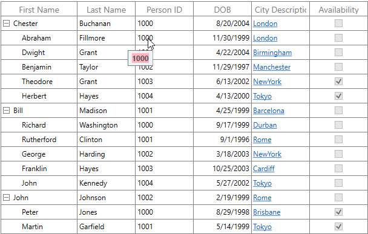
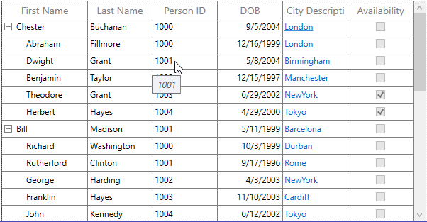

# Interactive Features

## Tooltip

Tooltip supports showing the pop-up window that displays the information when the mouse hovers over a cell of the SfTreeGrid.

### Record cell tooltip

You can enable tooltip for the TreeGridCell by setting the [SfTreeGrid.ShowToolTip](http://help.syncfusion.com/cr/cref_files/wpf/Syncfusion.SfGrid.WPF~Syncfusion.UI.Xaml.Grid.SfGridBase~ShowToolTip.html) property to `true`.




<syncfusion:SfTreeGrid Name="treeGrid" 
                        AutoExpandMode="RootNodesExpanded"
                        AutoGenerateColumns="False"
                        ShowToolTip="True"
                        ChildPropertyName="Children"    ItemsSource="{Binding EmployeeDetails}">	




this.treeGrid.ShowToolTip = true;




You can enable the tooltip of a particular column by setting the [TreeGridColumn.ShowToolTip](http://help.syncfusion.com/cr/cref_files/wpf/Syncfusion.SfGrid.WPF~Syncfusion.UI.Xaml.Grid.GridColumnBase~ShowToolTip.html) property to `true`.




<syncfusion:TreeGridTextColumn HeaderText="First Name" MappingName="FirstName" ShowToolTip="True" />
<syncfusion:TreeGridTextColumn HeaderText="Last Name" MappingName="LastName" ShowToolTip="True" />	




this.treeGrid.Columns["FirstName"].ShowToolTip = true;
this.treeGrid.Columns["LastName"].ShowToolTip = true;




N> It has higher priority than [SfTreeGrid.ShowToolTip](http://help.syncfusion.com/cr/cref_files/wpf/Syncfusion.SfGrid.WPF~Syncfusion.UI.Xaml.Grid.SfGridBase~ShowToolTip.html).

### Header tooltip

You can enable the tooltip of a header cell by setting the [TreeGridColumn.ShowHeaderToolTip](https://help.syncfusion.com/cr/cref_files/wpf/Syncfusion.SfGrid.WPF~Syncfusion.UI.Xaml.Grid.GridColumnBase~ShowHeaderToolTip.html) property to `true`.




<syncfusion:SfTreeGrid.Columns>
    <syncfusion:TreeGridTextColumn HeaderText="First Name" MappingName="FirstName" ShowHeaderToolTip="True" />
</syncfusion:SfTreeGrid.Columns>




this.treeGrid.Columns["FirstName"].ShowHeaderToolTip = true;




### Tooltip customization

You can change appearance of the tooltip by customizing the style with TargetType as ToolTip.




<Window.Resources>        
    
</Window.Resources>

<syncfusion:SfTreeGrid.Columns>
    <syncfusion:TreeGridTextColumn HeaderText="First Name" MappingName="FirstName" ShowToolTip="True" />
</syncfusion:SfTreeGrid.Columns>
	



You can customize the template of the tooltip by using the [TreeGridColumn.ToolTipTemplate](http://help.syncfusion.com/cr/cref_files/wpf/Syncfusion.SfGrid.WPF~Syncfusion.UI.Xaml.Grid.GridColumnBase~ToolTipTemplate.html) and [TreeGridColumn.ToolTipTemplateSelector](http://help.syncfusion.com/cr/cref_files/wpf/Syncfusion.SfGrid.WPF~Syncfusion.UI.Xaml.Grid.GridColumnBase~ToolTipTemplateSelector.html) properties. 

#### Customize the tooltip using ToolTipTemplate

You can customize appearance of the tooltip of a particular column by setting the `TreeGridColumn.ToolTipTemplate`. You can also customize appearance of the header tooltip of a particular column by using the [TreeGridColumn.HeaderToolTipTemplate](http://help.syncfusion.com/cr/cref_files/wpf/Syncfusion.SfGrid.WPF~Syncfusion.UI.Xaml.Grid.GridColumnBase~HeaderToolTipTemplate.html) property.

The ToolTipTemplate receives the underlying data object as DataContext by default. You can set the [TreeGridColumn.SetCellBoundToolTip](https://help.syncfusion.com/cr/cref_files/wpf/Syncfusion.SfGrid.WPF~Syncfusion.UI.Xaml.Grid.GridColumnBase~SetCellBoundToolTip.html) to `true` to change the DataContext of the tooltip template where it sets the DataContext as DataContextHelper. The [TreeGridDataContextHelper](https://help.syncfusion.com/cr/cref_files/wpf/Syncfusion.SfGrid.WPF~Syncfusion.UI.Xaml.TreeGrid.Cells.TreeGridDataContextHelper.html) has the following properties to reuse the same template for all the columns: 

 <ul>  
 <li><b> [Record](https://help.syncfusion.com/cr/cref_files/wpf/Syncfusion.SfGrid.WPF~Syncfusion.UI.Xaml.Grid.Cells.DataContextHelper~Record.html): </b> Gets the underlying data record of a row which has the cell.  </li>
 <li><b> [Value](https://help.syncfusion.com/cr/cref_files/wpf/Syncfusion.SfGrid.WPF~Syncfusion.UI.Xaml.Grid.Cells.DataContextHelper~Value.html):  </b> Gets the underlying value of a cell. </li> 
 </ul>




<Window.Resources>
    <local:StringToImageConverter x:Key="ImageConverter" />
    <DataTemplate x:Key="TemplateToolTip">
        <Grid>
            <Grid.RowDefinitions>
                <RowDefinition Height="*"/>
                <RowDefinition Height="*"/>
            </Grid.RowDefinitions>
            <Image Height="100" Width="100" Source="{Binding LastName,Converter={StaticResource ImageConverter}}" />
            <TextBlock Grid.Row="1" Text="{Binding LastName}" HorizontalAlignment="Center"/>
        </Grid>
    </DataTemplate>
</Window.Resources>

<syncfusion:SfTreeGrid.Columns>    
    <syncfusion:TreeGridTextColumn HeaderText="Last Name" MappingName="LastName" ToolTipTemplate="{StaticResource TemplateToolTip}" ShowToolTip="True" />
</syncfusion:SfTreeGrid.Columns>




public class StringToImageConverter : IValueConverter
{
    public object Convert(object value, Type targetType, object parameter, System.Globalization.CultureInfo culture)
    {
        string imagename = value.ToString();
        return @"..\..\Assets\" + imagename + @".png";
    }

    public object ConvertBack(object value, Type targetType, object parameter, System.Globalization.CultureInfo culture)
    {
        return value;
    }
}




You can get the sample [here](http://www.syncfusion.com/downloads/support/directtrac/general/ze/ToolTipTemplateDemo-1415306479.zip).

#### Customize the ToolTip with ToolTipTemplateSelector

Different tooltip templates can be loaded conditionally in same column based on the data by setting the [TreeGridColumn.ToolTipTemplateSelector](http://help.syncfusion.com/cr/cref_files/wpf/Syncfusion.SfGrid.WPF~Syncfusion.UI.Xaml.Grid.GridColumnBase~ToolTipTemplateSelector.html) property. 




<Window.Resources>
    <DataTemplate x:Key="ToolTip1">
        <Grid>                
            <TextBlock Text="{Binding Record.Id}" FontWeight="Bold" Foreground="Red" />
        </Grid>
    </DataTemplate>
    <DataTemplate x:Key="ToolTip2">
        <Grid>
            <TextBlock Text="{Binding Record.Id}" FontWeight="Bold" Foreground="Green"/>                
        </Grid>
    </DataTemplate>      
</Window.Resources>

<syncfusion:SfTreeGrid.Columns>
    <syncfusion:TreeGridTextColumn HeaderText="Person ID" MappingName="Id" ShowToolTip="True" >
        <syncfusion:TreeGridTextColumn.ToolTipTemplateSelector>
            <syncfusion:TreeGridTextColumn HeaderText="Person ID" MappingName="Id" 
                                               DisplayBinding="{Binding Path=Id, StringFormat=c}"
                                               ShowToolTip="True" SetCellBoundToolTip="True" >
        </syncfusion:TreeGridTextColumn.ToolTipTemplateSelector>
    </syncfusion:TreeGridTextColumn>
</syncfusion:SfTreeGrid.Columns>




public class ToolTipTemplateSelector : DataTemplateSelector
{
    private DataTemplate _defaultTemplate;

    /// 

    /// Gets or sets DefaultTemplate.
    /// 

    public DataTemplate DefaultTemplate
    {
        get { return _defaultTemplate; }
        set { _defaultTemplate = value; }
    }

    private DataTemplate _alternateTemplate;

    /// 

    /// Gets or Sets AlternateTemplate.
    /// 

    public DataTemplate AlternateTemplate
    {
        get { return _alternateTemplate; }
        set { _alternateTemplate = value; }
    }

    public override System.Windows.DataTemplate SelectTemplate(object item, System.Windows.DependencyObject container)
    {
        var treeGridData = item as TreeGridDataContextHelper;
        if (treeGridData == null)
            return this.DefaultTemplate;
        // To see what template needs to be select according to the specified property value.
        if ((treeGridData.Record as Employee).Id == (int)treeGridData.Value && ((int)treeGridData.Value % 2) == 0)
            return this.AlternateTemplate;
        else
            return this.DefaultTemplate;
    }
}




The following image shows the DefaultTemplate applied through ToolTipTemplateSelector.

The following image shows the AlternateTemplate applied through ToolTipTemplateSelector.

You can get the sample [here](http://www.syncfusion.com/downloads/support/directtrac/general/ze/ToolTipTemplateSelectorDemo1909534526.zip).

## Events

### CellToolTipOpening event

The [CellToolTipOpening](https://help.syncfusion.com/cr/cref_files/wpf/Syncfusion.SfGrid.WPF~Syncfusion.UI.Xaml.TreeGrid.SfTreeGrid~CellToolTipOpening_EV.html) event occurs when any tooltip of the cell is opened. The `CellToolTipOpening` event receives the [TreeGridCellToolTipOpeningEventArgs](https://help.syncfusion.com/cr/cref_files/wpf/Syncfusion.SfGrid.WPF~Syncfusion.UI.Xaml.TreeGrid.TreeGridCellToolTipOpeningEventArgs.html) as argument which has the following properties:

<ul>
<li> [Column](https://help.syncfusion.com/cr/cref_files/wpf/Syncfusion.SfGrid.WPF~Syncfusion.UI.Xaml.Grid.CellToolTipOpeningEventArgs~Column.html): Gets the hovered cell column in the SfTreeGrid.</li>
<li> [Node](https://help.syncfusion.com/cr/cref_files/wpf/Syncfusion.SfGrid.WPF~Syncfusion.UI.Xaml.TreeGrid.TreeGridCellToolTipOpeningEventArgs~Node.html): Gets the hovered cell node.</li>
<li> [Record](https://help.syncfusion.com/cr/cref_files/wpf/Syncfusion.SfGrid.WPF~Syncfusion.UI.Xaml.Grid.CellToolTipOpeningEventArgs~Record.html): Gets the data context of hovered cell.</li>
<li> [RowColumnIndex](https://help.syncfusion.com/cr/cref_files/wpf/Syncfusion.SfGrid.WPF~Syncfusion.UI.Xaml.Grid.CellToolTipOpeningEventArgs~RowColumnIndex.html): Gets the row and column index of the hovered cell.</li>
<li> [ToolTip](https://help.syncfusion.com/cr/cref_files/wpf/Syncfusion.SfGrid.WPF~Syncfusion.UI.Xaml.Grid.CellToolTipOpeningEventArgs~ToolTip.html): Gets the tooltip of the hovered cells.</li>
</ul>



<syncfusion:SfTreeGrid Name="treeGrid"  
                        AutoExpandMode="RootNodesExpanded" 
                        CellToolTipOpening="TreeGrid_CellToolTipOpening"
                        AutoGenerateColumns="False"
                        ChildPropertyName="Children"
                        ColumnSizer="Star"
                        ExpanderColumn="Id"
                        ItemsSource="{Binding PersonDetails}">


this.treeGrid.CellToolTipOpening += TreeGrid_CellToolTipOpening;

private void TreeGrid_CellToolTipOpening(object sender, Syncfusion.UI.Xaml.TreeGrid.TreeGridCellToolTipOpeningEventArgs e)
{
           
}



## Row Drag-and-Drop

### Overview

#### Enabling Drag-and-Drop

You can allow end-users to drag-and-drop the rows in SfTreeGrid, between two SfTreeGrid's by setting [SfTreeGrid.AllowDraggingRows](https://help.syncfusion.com/cr/cref_files/wpf/sfdatagrid/Syncfusion.SfGrid.wpf~Syncfusion.UI.Xaml.TreeGrid.SfTreeGrid~AllowDraggingRows.html) and [AllowDrop](https://help.syncfusion.com/cr/cref_files/wpf/Syncfusion.SfGrid.WPF~Syncfusion.UI.Xaml.TreeGrid.SfTreeGrid_members.html#) to `true`.  It's also possible to drag-and-drop from SfTreeGrid to any other control. 




<syncfusion:SfTreeGrid Name="sfTreeGrid" 
					   AllowDraggingRows="True" 
					   AllowDrop="True" 
					   ChildPropertyName="ReportsTo" 
					   ItemsSource="{Binding Employees}">



 
sfTreeGrid.AllowDraggingRows = true;
sfTreeGrid.AllowDrop = true;
 



While dropping, the dragged node(s) can be added above or below or as a child node based on its drop position. For example, if you drop at the bottom of node, it will be added below the node and if you are dropping over the node, it will be added as child of that node.

N> Row Drag-and-Drop for SfTreeGrid support provided from Volume 2 2018 release (v16.2.0.41).

#### Dragging Multiple Nodes

SfTreeGrid allows user to drag multiple selected nodes. You can enable multiple selection by setting SfTreeGrid.SelectionMode as `Multiple` or `Extended`.

### Drag-and-Drop Options

The SfTreeGrid control has below set of API's which is allow to control the drag-and-drop options manually.

<table>
<tr>
<th>
Properties
</th>
<th>
Description
</th>
</tr>

<tr>
<td>
[SfTreeGrid.AllowDragginRows]      (https://help.syncfusion.com/cr/cref_files/wpf/sfdatagrid/Syncfusion.SfGrid.wpf~Syncfusion.UI.Xaml.TreeGrid.SfTreeGrid~AllowDraggingRows.html)
</td>
<td>
Gets or sets whether end-users can drag the nodes in SfTreeGrid.
</td>
</tr>

<tr>
<td>
[SfTreeGrid.AllowDrop](https://help.syncfusion.com/cr/cref_files/wpf/Syncfusion.SfGrid.WPF~Syncfusion.UI.Xaml.TreeGrid.SfTreeGrid_members.html#)
</td>
<td>
Gets or sets whether end-users can drop the nodes in SfTreeGrid.
</td>
</tr>

<tr>
<td>
[SfTreeGrid.RowDragDropTemplate](https://help.syncfusion.com/cr/cref_files/wpf/Syncfusion.SfGrid.WPF~Syncfusion.UI.Xaml.TreeGrid.SfTreeGrid~RowDragDropTemplate.html)
</td>
<td>
Gets or sets the custom Row Drag Popup data template.
</td>
</tr>

<tr>
<td>
[SfTreeGrid.RowDragDropController.CanAutoExpand](https://help.syncfusion.com/cr/cref_files/wpf/Syncfusion.SfGrid.WPF~Syncfusion.UI.Xaml.TreeGrid.TreeGridRowDragDropController~CanAutoExpand.html)
</td>
<td>
Gets or sets whether end-users can expand the collapsed nodes while dragging. 
</td>
</tr>

<tr>
<td>
[SfTreeGrid.RowDragDropController.AutoExpandDelay](https://help.syncfusion.com/cr/cref_files/wpf/Syncfusion.SfGrid.WPF~Syncfusion.UI.Xaml.TreeGrid.TreeGridRowDragDropController~AutoExpandDelay.html)
</td>
<td>
Gets or sets the time delay for expanding the collapsed nodes while dragging. 
</td>
</tr>

</table>

<table>
<tr>
<th>
Events
</th>
<th>
Description
</th>
</tr>

<tr>
<td>
[SfTreeGrid.RowDragDropController.DragStart](https://help.syncfusion.com/cr/cref_files/wpf/Syncfusion.SfGrid.WPF~Syncfusion.UI.Xaml.TreeGrid.TreeGridRowDragDropController~DragStart_EV.html)
</td>
<td>
This event occurs when drag-and-drop operation is started.  
</td>
</tr>

<tr>
<td>
[SfTreeGrid.RowDragDropController.DragOver](https://help.syncfusion.com/cr/cref_files/wpf/Syncfusion.SfGrid.WPF~Syncfusion.UI.Xaml.TreeGrid.TreeGridRowDragDropController~DragOver_EV.html)
</td>
<td>
This event occurs continuously while node is dragged within the drop target's(SfTreeGrid) boundary.   
</td>
</tr>

<tr>
<td>
[SfTreeGrid.RowDragDropController.DragLeave](https://help.syncfusion.com/cr/cref_files/wpf/Syncfusion.SfGrid.WPF~Syncfusion.UI.Xaml.TreeGrid.TreeGridRowDragDropController~DragLeave_EV.html)
</td>
<td>
This event occurs when node is dragged out of the drop target's(SfTreeGrid) boundary. 
</td>
</tr>

<tr>
<td>
[SfTreeGrid.RowDragDropController.Drop](https://help.syncfusion.com/cr/cref_files/wpf/Syncfusion.SfGrid.WPF~Syncfusion.UI.Xaml.TreeGrid.TreeGridRowDragDropController~Drop_EV.html)
</td>
<td>
This event occurs while dropping the record in drop target (SfTreeGrid).
</td>
</tr>

<tr>
<td>
[SfTreeGrid.RowDragDropController.Dropped](https://help.syncfusion.com/cr/cref_files/wpf/Syncfusion.SfGrid.WPF~Syncfusion.UI.Xaml.TreeGrid.TreeGridRowDragDropController~Dropped_EV.html)
</td>
<td>
This event occurs when nodes are dropped in drop target(SfTreeGrid). 
</td>
</tr>

</table>

### Drag-and-Drop between TreeGrids

SfTreeGrid provides built in support for Drag-and-Drop nodes between SfTreeGrid's. The following image illustrate to implement the drag-and-drop nodes between SfTreeGrid's. 

<Screenshot-Gif>

Follow the below steps to implement drag-and-drop between SfTreeGrid's. 

1. Add the SfTreeGrid controls to your project.
2. Set [AllowDraggingRows](https://help.syncfusion.com/cr/cref_files/wpf/sfdatagrid/Syncfusion.SfGrid.wpf~Syncfusion.UI.Xaml.TreeGrid.SfTreeGrid~AllowDraggingRows.html) and [AllowDrop](https://help.syncfusion.com/cr/cref_files/wpf/Syncfusion.SfGrid.WPF~Syncfusion.UI.Xaml.TreeGrid.SfTreeGrid_members.html#) API's to `true` to enable the drag-and-drop functionality in both SfTreeGrid controls.




<syncfusion:SfTreeGrid Name="sfTreeGrid1" 
					   AllowDraggingRows="True" 
					   AllowDrop="True" 
					   Grid.Column="0" 
					   ChildPropertyName="ReportsTo" 
					   ItemsSource="{Binding EmployeesHR}">

<syncfusion:SfTreeGrid Name="sfTreeGrid2" 
					   AllowDraggingRows="True" 
					   AllowDrop="True" 
					   Grid.Column="1" 
					   ChildPropertyName="ReportsTo" 
					   ItemsSource="{Binding EmployeesAccounts}">




3. Now you can drag-and-drop nodes between both SfTreeGrid controls. You can download the sample from [here](http://www.syncfusion.com/downloads/support/directtrac/general/ze/DRAGAN~1-710537123.zip).

### Customizing Row Drag-and-Drop

#### Auto Expanding the Node on Drag Over

While dragging over the tree node, if drop position set as 'Drop as child', SfTreeGrid can auto expand the corresponding tree node by setting [TreeGridRowDragDropController.CanAutoExpand](https://help.syncfusion.com/cr/cref_files/wpf/Syncfusion.SfGrid.WPF~Syncfusion.UI.Xaml.TreeGrid.TreeGridRowDragDropController~CanAutoExpand.html) as `true`. It is also possible to control the delay in expanding the node when drag over using [TreeGridRowDragDropController.AutoExpandDelay](https://help.syncfusion.com/cr/cref_files/wpf/Syncfusion.SfGrid.WPF~Syncfusion.UI.Xaml.TreeGrid.TreeGridRowDragDropController~AutoExpandDelay.html) property. Its default value is 3 sec.




treeGrid.RowDragDropController.CanAutoExpand = true;
treeGrid.RowDragDropController.AutoExpandDelay = new TimeSpan(0, 0, 2);
					   



#### Customizing Default Drag UI

You can customize the default drag UI by setting [SfTreeGrid.RowDragDropTemplate](https://help.syncfusion.com/cr/wpf/Syncfusion.SfGrid.WPF~Syncfusion.UI.Xaml.TreeGrid.SfTreeGrid~RowDragDropTemplate.html) as your customized Data Template. 




<syncfusion:SfTreeGrid Name="sfTreeGrid" 
					   AllowDraggingRows="True" 
					   AllowDrop="True" 
					   ChildPropertyName="ReportsTo" 
					   ItemsSource="{Binding Employees}" 
					   RowDragDropTemplate="{StaticResource  SampleDragDropTemplate}>
					   



Resources should have DataTemplate definition which we have mentioned in RowDragDropTemplate. 




<Window.Resources>
        <DataTemplate x:Key="SampleDragDropTemplate ">
            <Border Height="100" Width="300" Background="Red"/>
        </DataTemplate>
</Window.Resources>
					   



#### Disable the Dragging of Certain Node

You can disable the dragging functionality of specific nodes. To handle this, you need to raise the [RowDragandDropController.DragStart](https://help.syncfusion.com/cr/cref_files/wpf/Syncfusion.SfGrid.WPF~Syncfusion.UI.Xaml.TreeGrid.TreeGridRowDragDropController~DragStart_EV.html) event.  




private void RowDragDropController_DragStart(object sender, Syncfusion.UI.Xaml.TreeGrid.TreeGridRowDragStartEventArgs e)
{
	ObservableCollection<TreeNode> draggingNodes = e.DraggingNodes;
	var item = draggingNodes[0].Item as EmployeeInfo;
    if(item.FirstName.StartsWith("Andrew"))
    {
		e.Handled = true;
    }
}




#### Disable Drop Over Certain Node

You can disable the dropping functionality of specific nodes. To handle this, you need to raise the RowDragandDropController.Drop event.  




private void RowDragDropController_Drop(object sender, TreeGridRowDropEventArgs e)
{
  TreeNode targetNode = e.TargetNode;
  var item = targetNode.Item as EmployeeInfo;
  if (item.FirstName.StartsWith("Andrew"))
  {
     e.Handled = true;
  }
}




#### Disable Default Drag UI

You can disable the dropping functionality of specific nodes. To handle this, you need to raise the [RowDragandDropController.Drop](https://help.syncfusion.com/cr/cref_files/wpf/Syncfusion.SfGrid.WPF~Syncfusion.UI.Xaml.TreeGrid.TreeGridRowDragDropController~Drop_EV.html) event.  




private void RowDragDropController_DragOver(object sender, TreeGridRowDragOverEventArgs e)
{
    e.ShowDragUI = false;
}


